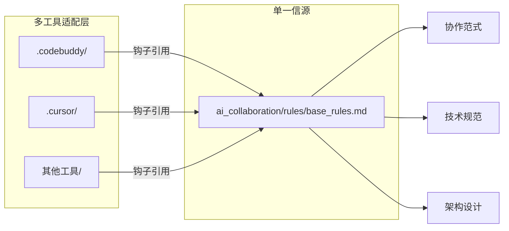

# CodeBuddy 工具适配层

## 概述

本目录是 **CodeBuddy AIIDE 工具的专用适配层**，用于实现与 Sunflower 脚手架核心规则的对接。通过"入口钩子"机制，确保工具能够自动加载并遵循脚手架定义的协作规范。

## 设计理念

### 单一信源原则

本适配层遵循**单一信源（Single Source of Truth）**原则，核心设计思想如下：



**核心价值**：
- ✅ **规则统一管理**：所有协作规则集中在 `ai_collaboration/rules/` 统一维护
- ✅ **避免重复定义**：不同工具通过适配层引用同一套规则，无需重复编写
- ✅ **版本一致性**：规则更新时，所有工具自动同步最新版本
- ✅ **工具无关性**：切换工具时，只需创建对应的适配层，无需重写规则

### 入口钩子机制

本目录下的 `rules/meta_rule.mdc` 文件定义了**入口钩子**：

```
执行所有动作前，都阅读下 rules/base_rules.md 中的内容，
根据其路由逻辑指示，再进一步获取相应系统提示词或背景上下文
```

**工作机制**：

1. **工具启动** → CodeBuddy 自动加载 `meta_rule.mdc`
2. **钩子触发** → 立即读取 `ai_collaboration/rules/base_rules.md`
3. **路由决策** → 根据意图识别，加载对应的规范和模板
4. **执行任务** → 按照协作范式完成开发任务

## 目录结构

```
.codebuddy/
├── README.md              # 本文档（适配层说明）
└── rules/
    └── meta_rule.mdc      # 入口钩子（指向 base_rules.md）
```

## 扩展指南

### 新增工具适配

当需要支持其他 AIIDE 工具时，只需创建对应的适配层目录：

```
.cursor/
├── README.md
└── rules/
    └── meta_rule.mdc  # 同样指向 base_rules.md

.copilot/
├── README.md
└── rules/
    └── meta_rule.mdc  # 同样指向 base_rules.md
```

### 钩子规则编写

入口钩子文件应遵循以下模式：

1. **明确指向单一信源**：统一引用 `ai_collaboration/rules/base_rules.md`
2. **声明加载时机**：通常为"执行所有动作前"
3. **定义加载行为**：读取规则并根据路由逻辑进一步加载上下文

## 相关文档

- 核心规则入口：`ai_collaboration/rules/base_rules.md`
- 协作范式说明：项目根目录 `README.md`
- 工具特定配置：遵循各工具的使用规范

---

**注意**：本目录内容仅供工具内部调用，不建议手动修改。如需调整协作规则，请直接修改 `ai_collaboration/rules/` 下的相关文档。
