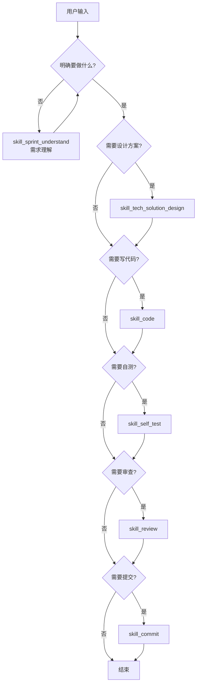
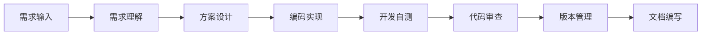
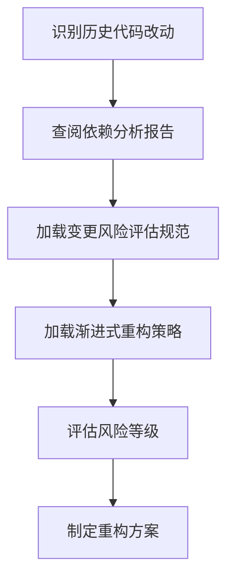

# Sunflower（向日葵）- AI研发协作脚手架 v2.0

> 一套结构化的 AI 协作编程规范体系，通过渐进式加载、Skill 驱动、工作流编排，实现高效、规范的 AI 辅助开发体验。

---

## 概述

本脚手架为 AI 辅助编程提供完整的规范体系和协作框架。通过分层架构设计，将开发过程分解为多个可独立执行的 Skill（技能），并定义了标准的工作流编排规则，确保 AI 在理解需求、设计方案、编码实现、测试验证等各阶段都能输出符合规范的高质量结果。

### 核心特性

- **🎯 Skill 驱动**：基于意图识别自动路由到对应的工作区，7个核心技能覆盖完整开发流程
- **📊 渐进式加载**：四层架构按需加载规范文档，避免上下文过载
- **🔄 工作流编排**：支持单 Skill 执行和多 Skill 协作，预定义标准工作流
- **📝 历史代码支持**：针对遗留系统的风险评估和渐进式重构策略
- **🔧 端侧规范分离**：后端/Web/移动端技术规范独立管理
- **📈 Mermaid 统一图例**：所有文档图表使用 Mermaid 语法

---

## 快速开始

### 1. 了解协作流程

AI 首先加载 `ai_collaboration/rules/base_rules.md`，根据用户输入识别意图：



### 2. 执行协作流程

识别意图后，加载对应 Skill 的 `SKILL.md`，按流程执行：

1. **执行前检查** - 确认前置条件
2. **按流程执行** - 遵循 Skill 定义的步骤
3. **引用公共规范** - 按需加载技术规范
4. **按需加载 references** - 加载明细规范
5. **输出工件** - 生成标准化的文档或代码

---

## 目录结构

```
ai_powered_coding_scaffold/
├── ai_collaboration/           # AI协作框架核心 ✨
│   ├── docs/                   # 文档资料区
│   │   ├── detail_solutions/   # 详细技术方案
│   │   ├── api_docs/           # 接口定义文档
│   │   ├── sprints/            # 冲刺需求说明
│   │   └── reports/            # 分析报告 ✨
│   ├── rules/                  # 规范约束区
│   │   ├── base_rules.md       # 入口：意图路由
│   │   ├── workflow.md         # 工作流编排
│   │   ├── common/             # 公共规范
│   │   └── skills/             # Skill 工作区 ✨
│   ├── tasks/                  # 任务规划区
│   └── scripts/                # 脚本工具区
├── backend/                    # 后端工程
├── web/                        # Web前端工程
└── mobile/                     # 移动端工程
```

---

## 核心概念

### Skill 体系

7个核心 Skill 覆盖完整开发流程：

| Skill | 触发关键词 | 核心职责 | 输出工件 |
|-------|-----------|----------|----------|
| `skill_sprint_understand` | 需求分析、理解需求 | 冲刺需求理解与分析 | 需求分析文档 |
| `skill_tech_solution_design` | 设计方案、技术设计 | 技术方案设计（含历史代码评估） | 设计方案文档 |
| `skill_code` | 编码、实现、开发 | 编码实现 | 代码、任务列表 |
| `skill_self_test` | 自测、单元测试 | 开发自测 | 测试代码 |
| `skill_review` | 审查、Code Review | 代码审查 | 审查报告 |
| `skill_commit` | 提交、commit | 版本管理 | 提交记录 |
| `skill_docs` | 文档、README | 文档编写 | 文档文件 |

### 渐进式加载架构

四层架构实现按需加载，避免上下文膨胀：

| 层级 | 加载时机 | 内容 | 说明 |
|------|----------|------|------|
| 第一层 | 始终加载 | `base_rules.md` | 静态索引层，意图路由 |
| 第二层 | 意图识别后 | Skill 的 `SKILL.md` | 协作流程、检查点 |
| 第三层 | 执行过程中 | Skill 内的 `references/` | 详细规范、示例 |
| 第四层 | 涉及端侧时 | `tech_structure_*.md` | 后端/Web/移动端技术规范 |

### 标准工作流



### 历史代码改动流程

针对遗留系统，额外执行风险评估：



---

## 路径引用规范

**所有路径都以 `ai_collaboration/` 为基准目录**：

| 访问目标 | 路径示例 |
|----------|----------|
| 设计方案 | `ai_collaboration/docs/detail_solutions/xxx.md` |
| 分析报告 | `ai_collaboration/docs/reports/xxx.md` |
| 任务列表 | `ai_collaboration/tasks/xxx.md` |
| Skill 文档 | `ai_collaboration/rules/skills/skill_xxx/SKILL.md` |

---

## 快速导航

| 我想... | 查看文档 |
|---------|----------|
| 了解协作流程 | [`ai_collaboration/rules/base_rules.md`](ai_collaboration/rules/base_rules.md) |
| 查看框架详细说明 | [`ai_collaboration/README.md`](ai_collaboration/README.md) |
| 设计技术方案 | [`ai_collaboration/rules/skills/skill_tech_solution_design/SKILL.md`](ai_collaboration/rules/skills/skill_tech_solution_design/SKILL.md) |
| 编写代码 | [`ai_collaboration/rules/skills/skill_code/SKILL.md`](ai_collaboration/rules/skills/skill_code/SKILL.md) |
| 理解需求 | [`ai_collaboration/rules/skills/skill_sprint_understand/SKILL.md`](ai_collaboration/rules/skills/skill_sprint_understand/SKILL.md) |
| 修改历史代码 | [`ai_collaboration/rules/skills/skill_tech_solution_design/references/dependency_analysis.md`](ai_collaboration/rules/skills/skill_tech_solution_design/references/dependency_analysis.md) |
| 查看架构规范 | [`ai_collaboration/rules/common/arch_solutions.md`](ai_collaboration/rules/common/arch_solutions.md) |

---

## 版本记录

| 版本 | 日期 | 说明 |
|------|------|------|
| v2.0 | 2026-03 | Skill驱动、渐进式加载、历史代码支持、统一路径规范 |
| v1.0 | 2026-01 | 初始版本，定义核心架构和 Skill 体系 |

---

## 许可证

MIT License
