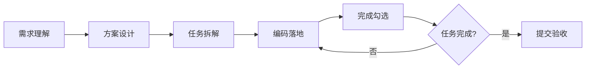

# Sunflower - 向日葵AI研发协作脚手架 v1.1

> 版本: v1.1  
> 让AI像向日葵追光一样，高效协作完成研发任务

---

## 项目简介

**Sunflower（向日葵）** 是一套结构化的 AI 协作编程规范体系，旨在为 AI 辅助编程提供完整的规范框架和协作流程。通过"方案先行、任务拆解、逐步落地"的协作范式，确保 AI 与开发人员高效协作，输出符合规范的高质量代码。

---

## 设计理念

### 核心思想

向日葵追光的特性隐喻了 AI 协作的理想状态——**目标明确、路径清晰、持续追踪**：

- **🎯 目标明确**：从需求理解开始，明确"要做什么"
- **📋 路径清晰**：详细设计方案先行，任务拆解规划
- **✅ 持续追踪**：完成一项勾选一项，全程留痕管理

### 协作范式



**核心原则**：
1. **设计方案先行**：每次落地编码前，先进行详细设计梳理和任务规划
2. **文档驱动**：生成设计方案、任务列表、接口文档，供开发人员确认
3. **留痕管理**：完成一个任务勾选一项，确保进度可追踪
4. **规范约束**：所有开发活动遵循技术规范和架构设计要求

---

## 项目结构

```
sunflower/
├── backend/              # 后端服务代码
├── web/                  # Web 端代码（管理后台）
├── mobile/               # 移动端代码（H5/小程序/App）
├── ai_collaboration/     # AI 协作框架（核心）
│   ├── docs/            # 文档资料区
│   │   ├── detail_solutions/   # 详细技术方案
│   │   ├── api_docs/           # 接口定义文档
│   │   ├── sprints/            # 冲刺需求说明
│   │   └── reports/            # 分析报告
│   ├── rules/           # 规范约束区
│   │   ├── base_rules.md       # 协作范式与路由逻辑
│   │   ├── arch_solutions.md   # 架构设计规范
│   │   ├── tech_structure_*.md # 各端技术规范
│   │   └── templates/          # 设计方案模板
│   ├── tasks/           # 任务规划区
│   └── scripts/         # 脚本工具区
└── README.md            # 本文档
```

---

## 快速开始

### 1. 理解协作范式

AI 协作遵循"设计方案先行、任务拆解落地"的范式：

- 阅读 `ai_collaboration/rules/base_rules.md` 了解协作流程
- 参考对应端的技术规范：`tech_structure_backend.md` / `tech_structure_web.md` / `tech_structure_mobile.md`
- 查看架构设计规范：`ai_collaboration/rules/arch_solutions.md`

### 2. 需求开发流程

#### 2.1 方案设计阶段

```
需求输入 → 查阅架构规范 → 生成详细设计方案 → 开发确认
```

**输出工件**：`ai_collaboration/docs/detail_solutions/*.md`

#### 2.2 任务拆解阶段

```
设计方案 → 任务列表规划 → 接口定义（如需） → 开发确认
```

**输出工件**：
- 任务列表：`ai_collaboration/tasks/*.md`
- 接口文档：`ai_collaboration/docs/api_docs/*.md`

#### 2.3 编码落地阶段

```
任务列表 → 逐项实现 → 完成勾选 → 全部完成
```

**执行原则**：完成一个勾选一个，确保进度可追踪

### 3. 历史代码修改

对于有一定历史积累的项目，修改代码时需注意：

1. **变更前评估**：参考 `dependency_analysis.md` 进行风险评估
2. **最小侵入原则**：优先新增代码，避免修改历史代码
3. **循环依赖处理**：参考 `legacy_refactor_strategy.md` 进行处理

---

## 技术栈概览（可随意变更各端技术栈 然后AI一键修改内部核心工件技术栈内容）

### 后端

| 组件 | 版本 | 说明 |
|------|------|------|
| Java | 17+ | 主语言 |
| Spring Boot | 3.x | 核心框架 |
| MyBatis-Plus | 3.5.5+ | ORM框架 |
| MySQL/PostgreSQL | 8.x+ / 12+ | 数据库 |

### Web 端

| 组件 | 版本 | 说明 |
|------|------|------|
| React | 18.x | UI框架 |
| TypeScript | 4.7+ | 类型安全 |
| Umi | 4.x | 企业级框架 |
| Ant Design | 5.x | UI组件库 |

### 移动端

| 组件 | 版本 | 说明 |
|------|------|------|
| Taro | 3.6+ | 多端框架 |
| React | 18.x | UI框架 |
| TypeScript | 4.x | 类型安全 |
| Taro UI | 3.x | UI组件库 |

---

## 核心文档索引

### 规范类文档

| 文档 | 路径 | 说明 |
|------|------|------|
| 协作范式 | `ai_collaboration/rules/base_rules.md` | AI协作流程与路由逻辑 |
| 架构设计 | `ai_collaboration/rules/arch_solutions.md` | 系统架构设计规范 |
| 后端技术规范 | `ai_collaboration/rules/tech_structure_backend.md` | 后端技术栈与工程规范 |
| Web端技术规范 | `ai_collaboration/rules/tech_structure_web.md` | Web端技术栈与工程规范 |
| 移动端技术规范 | `ai_collaboration/rules/tech_structure_mobile.md` | 移动端技术栈与工程规范 |

### 模板类文档

| 文档 | 路径 | 说明 |
|------|------|------|
| 详细设计方案模板 | `ai_collaboration/rules/templates/detail_solution_template.md` | 方案设计标准格式 |
| 变更风险评估 | `ai_collaboration/rules/templates/dependency_analysis.md` | 代码修改风险评估 |
| 渐进式重构策略 | `ai_collaboration/rules/templates/legacy_refactor_strategy.md` | 历史代码重构方案 |

### 输出工件目录

| 目录 | 路径 | 说明 |
|------|------|------|
| 详细设计方案 | `ai_collaboration/docs/detail_solutions/` | 存放技术方案文档 |
| 接口定义文档 | `ai_collaboration/docs/api_docs/` | 存放接口定义 |
| 任务列表 | `ai_collaboration/tasks/` | 存放任务规划文档 |
| 需求说明 | `ai_collaboration/docs/sprints/` | 存放冲刺需求 |

---

## 版本管理

### 分支策略

```
feature/功能名 → dev → test → master
```

- `feature/*`：本地开发分支
- `dev`：开发环境分支
- `test`：测试环境分支
- `master`：生产分支

### 版本号规范

- **主版本号**：重大架构变更，不向下兼容
- **次版本号**：功能新增，向下兼容
- **修订号**：Bug修复，向下兼容

---

## 质量保障

### 测试策略

| 测试类型 | 工具 | 覆盖率要求 |
|---------|------|------------|
| 后端单元测试 | JUnit 5 | >80% |
| 前端单元测试 | Jest | >70% |

### 代码审查

涉及核心业务模块的修改，必须经过代码审查后方可合并。

---

## 协作边界

AI协作适用于大部分常规开发场景，但在某些复杂场景下需要人工介入：

- 核心架构设计决策
- 复杂性能优化问题
- 跨系统依赖梳理
- 业务规则冲突判断

详细说明请参阅：`ai_collaboration/rules/ai_collaboration_boundary.md`

---

## 许可证

MIT License

---

## 版本记录

| 版本 | 日期 | 说明 |
|------|------|------|
| v1.1 | 2026-03 | 当前版本，优化协作流程和文档结构 |
| v1.0 | 2026-01 | 初始版本，定义核心架构和协作范式 |
