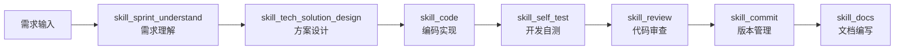
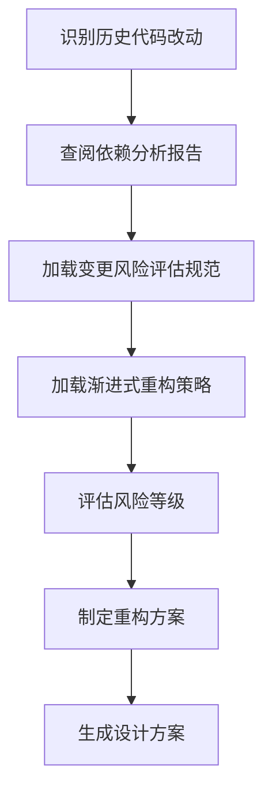
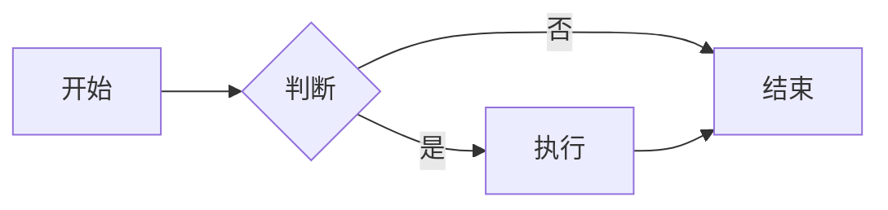

# Sunflower（向日葵）AI 研发协作脚手架 v2.0

## 概述

本目录是 **Sunflower（向日葵）AI 研发协作脚手架 v2.0** 的核心支撑模块，集中管理项目的需求文档、技术规范、任务规划、协作流程和辅助脚本等资源。通过标准化的文档结构、渐进式加载机制和 Skill 驱动的协作流程，实现 AI 与开发人员的高效协作。

### 核心特性

- **🎯 Skill 驱动**：基于意图识别自动路由到对应的 Skill 工作区
- **📊 渐进式加载**：按需加载规范文档，避免上下文过载
- **🔄 工作流编排**：支持多 Skill 协作的完整流程管理
- **📝 历史代码支持**：针对遗留系统的风险评估和渐进式重构策略

---

## 目录结构

```
ai_collaboration/
├── docs/                       # 文档资料区
│   ├── detail_solutions/       # 详细技术方案文档
│   ├── api_docs/               # 接口定义文档
│   ├── sprints/                # 冲刺需求说明文档
│   ├── reports/                # 各类分析报告 ✨
│   └── README.md               # 文档管理说明
├── rules/                      # 规范约束区
│   ├── base_rules.md           # 基础规则与路由逻辑（静态索引层）
│   ├── workflow.md             # 工作流编排（动态编排层）
│   ├── common/                 # 公共规范
│   │   ├── arch_solutions.md       # 架构设计规范
│   │   ├── tech_structure_backend.md  # 后端技术栈规范
│   │   ├── tech_structure_web.md      # Web端技术栈规范
│   │   ├── tech_structure_mobile.md   # 移动端技术栈规范
│   │   ├── product.md             # 产品定义
│   │   └── templates/
│   │       └── detail_solution_template.md  # 详细设计方案模板
│   └── skills/                 # Skill 工作区 ✨
│       ├── skill_sprint_understand/     # 需求理解与分析
│       ├── skill_tech_solution_design/  # 技术方案设计
│       ├── skill_code/                  # 编码实现
│       ├── skill_self_test/             # 开发自测
│       ├── skill_review/                # 代码审查
│       ├── skill_commit/                # 版本管理
│       └── skill_docs/                  # 文档编写
├── tasks/                      # 任务规划区
│   └── README.md               # 任务管理说明
├── scripts/                    # 脚本工具区
│   ├── db/                     # 数据库变更脚本
│   └── README.md               # 脚本管理说明
└── README.md                   # 本文档
```

---

## 核心组件说明

### 1. 文档资料区（docs/）

集中存放项目的各类文档资料，支持 AI 协作过程中的知识传递和方案记录：

| 子目录 | 说明 |
|-------|------|
| `detail_solutions/` | 详细技术方案文档，用于需求落地的技术设计 |
| `api_docs/` | 接口定义文档，前后端对接的契约依据 |
| `sprints/` | 冲刺需求说明文档，迭代需求的详细描述 |
| `reports/` | 各类分析报告（依赖分析、风险清单、性能分析等）✨ |

**路径规范**：所有文档路径均相对于 `ai_collaboration/` 目录，例如：
- 设计方案：`ai_collaboration/docs/detail_solutions/xxx.md`
- 分析报告：`ai_collaboration/docs/reports/xxx.md`

### 2. 规范约束区（rules/）

定义项目的技术栈规范、架构设计和协作流程，采用**渐进式加载**机制：

#### 2.1 入口层

| 文件 | 说明 | 加载时机 |
|------|------|----------|
| `base_rules.md` | 基础规则与路由逻辑，定义协作范式的核心入口 | 始终加载 |
| `workflow.md` | 工作流编排，定义多 Skill 协作的执行顺序和条件分支 | 多 Skill 协作时加载 |

#### 2.2 公共规范层（common/）

| 文件/目录 | 说明 | 加载时机 |
|----------|------|----------|
| `arch_solutions.md` | 架构设计规范 | 所有 Skill |
| `tech_structure_backend.md` | 后端技术栈及工程规范 | 涉及后端时 |
| `tech_structure_web.md` | Web 端技术栈及工程规范 | 涉及 Web 时 |
| `tech_structure_mobile.md` | 移动端技术栈及工程规范 | 涉及移动端时 |
| `product.md` | 产品定义 | 需求理解时 |
| `templates/detail_solution_template.md` | 详细设计方案模板 | 方案设计时 |

#### 2.3 Skill 工作区（skills/）✨

每个 Skill 定义了特定场景下的协作流程、规范引用和质量检查点：

| Skill | 核心职责 | 输出工件 |
|-------|----------|----------|
| `skill_sprint_understand` | 冲刺需求理解与分析 | 需求分析文档、问题清单 |
| `skill_tech_solution_design` | 技术方案设计 | `docs/detail_solutions/*.md` |
| `skill_code` | 编码实现 | 代码实现、任务列表、接口文档 |
| `skill_self_test` | 开发自测 | 测试代码、自测报告 |
| `skill_review` | 代码审查 | 审查报告 |
| `skill_commit` | 版本管理 | 提交记录、PR |
| `skill_docs` | 文档编写 | 文档文件 |

**Skill 结构**：
```
skill_xxx/
├── SKILL.md              # Skill 主文档（流程、检查点、输出示例）
└── references/           # 参考文档（详细规范、模板、示例）
    ├── xxx.md
    └── examples/
```

**加载顺序**：
1. **第一层**：始终加载 `base_rules.md`
2. **第二层**：意图识别后加载对应 Skill 的 `SKILL.md`
3. **第三层**：执行过程中按需加载 Skill 内的 `references/`
4. **第四层**：涉及端侧时加载对应的 `tech_structure_*.md`

### 3. 任务规划区（tasks/）

管理具体的落地开发任务拆解，支持分而治之的开发策略：

- 每次开发前进行任务细化拆解
- 任务列表支持勾选进度追踪
- 完成一个勾选一个，实现留痕管理

### 4. 脚本工具区（scripts/）

存放工程所需的各种脚本资源：

- 数据库变更脚本
- 初始化脚本
- 工具组件脚本

---

## 协作范式

### 快速开始

1. **阅读入口文档**：从 `rules/base_rules.md` 开始，了解意图路由机制
2. **识别协作场景**：根据意图关键词确定调用的 Skill
3. **执行协作流程**：按照 Skill 定义的流程逐步执行

### 标准工作流



### 历史代码改动流程 ✨

当涉及历史代码修改时，额外执行：



**关键文档**：
- 变更风险评估规范：`rules/skills/skill_tech_solution_design/references/dependency_analysis.md`
- 渐进式重构策略：`rules/skills/skill_tech_solution_design/references/legacy_refactor_strategy.md`
- 依赖分析报告：`docs/reports/模块依赖关系分析报告-*.md`

---

## 路径引用规范

### 统一规则

**所有路径都以 `ai_collaboration/` 为基准目录**，无论当前文档在哪个层级：

| 访问目标 | 路径示例 |
|----------|----------|
| 设计方案文档 | `ai_collaboration/docs/detail_solutions/xxx.md` |
| API接口文档 | `ai_collaboration/docs/api_docs/xxx.md` |
| 分析报告 | `ai_collaboration/docs/reports/xxx.md` |
| 任务列表 | `ai_collaboration/tasks/xxx.md` |
| 数据库脚本 | `ai_collaboration/scripts/db/xxx.sql` |
| 公共规范 | `ai_collaboration/rules/common/xxx.md` |
| Skill 文档 | `ai_collaboration/rules/skills/skill_xxx/SKILL.md` |

### 优势

- ✅ 路径清晰明确，无需计算相对层级
- ✅ 文档移动不影响路径引用
- ✅ 易于理解和维护

---

## Mermaid 图例语法规范

**强制要求**：整个工程中，所有文档如果涉及流程图/设计图/架构图等，统一使用 **Mermaid 语法** 作为统一图例语法。

**适用范围**：
- 工作区结构概览
- 架构设计图
- 流程图
- 时序图
- 类图
- 状态图
- 甘特图

**示例**：


---

## 版本说明

### v2.0 新特性 ✨

1. **Skill 体系**：引入 Skill 驱动的协作模式，每个场景有独立的协作流程
2. **渐进式加载**：按需加载规范文档，避免上下文过载
3. **工作流编排**：支持多 Skill 协作的复杂场景
4. **历史代码支持**：新增依赖分析、风险评估、渐进式重构策略
5. **统一路径规范**：所有路径以 `ai_collaboration/` 为基准，清晰明确
6. **reports 目录**：新增分析报告存放区域

---

## 相关文档

- 基础规则：`rules/base_rules.md`
- 工作流编排：`rules/workflow.md`
- 文档管理：`docs/README.md`
- 任务管理：`tasks/README.md`
- 脚本管理：`scripts/README.md`

---

## 快速导航

| 我想... | 查看文档 |
|---------|----------|
| 了解协作流程 | `rules/base_rules.md` |
| 设计技术方案 | `rules/skills/skill_tech_solution_design/SKILL.md` |
| 编写代码 | `rules/skills/skill_code/SKILL.md` |
| 理解需求 | `rules/skills/skill_sprint_understand/SKILL.md` |
| 修改历史代码 | `rules/skills/skill_tech_solution_design/references/dependency_analysis.md` |
| 查看架构规范 | `rules/common/arch_solutions.md` |
