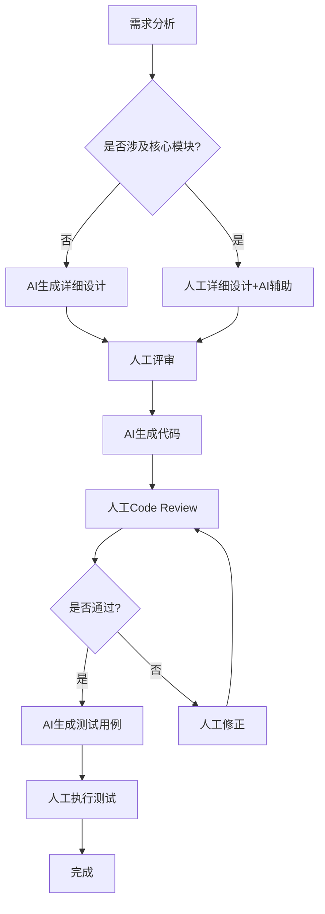

# AI协作边界说明

本文档定义了AI编程协作在本项目中的适用场景、注意事项和边界，帮助开发人员合理使用AI辅助工具。

## 1. AI协作适用场景

### ✅ 高效场景（优先使用AI）

以下场景AI协作效率高，建议优先使用：

| 场景 | 说明 | AI优势 |
|------|------|-------|
| 新增独立功能模块 | 不涉及核心模块的新功能 | 快速生成代码框架和实现 |
| 新增API接口 | 不涉及核心Service修改的接口 | 快速生成Controller、Service、Mapper |
| 编写单元测试 | 为已有代码编写测试 | 自动生成测试用例和mock |
| 生成接口文档 | 根据代码生成文档 | 自动提取接口信息 |
| 代码注释和文档补充 | 为代码添加注释 | 理解代码后生成注释 |
| 代码优化建议 | 分析代码质量问题 | 提供优化建议 |
| 日志分析 | 分析错误日志 | 快速定位问题 |

### ⚠️ 需谨慎场景（需人工深度参与）

以下场景需要人工深度参与，AI辅助为辅：

| 场景 | 风险点 | 人工参与要点 |
|------|-------|-------------|
| 修改核心Service | OrderService/DistributionService/SkuService | 架构师评审，全量测试 |
| 修改核心Mapper的SQL | 影响数据正确性 | DBA审核，数据验证 |
| 修改anpin-common工具类 | 影响范围广 | 全局影响评估 |
| 解决循环依赖问题 | 架构层面变更 | 详细设计方案 |
| 性能优化 | 需要深入分析 | 性能测试验证 |
| 安全相关修改 | 安全风险 | 安全专家审核 |

### 🚫 暂不适用场景（建议人工主导）

以下场景建议以人工为主，AI仅提供辅助建议：

| 场景 | 原因 | 建议做法 |
|------|------|---------|
| 数据库表结构变更 | 涉及存量数据迁移 | DBA主导，AI辅助生成脚本 |
| 核心业务流程重构 | 业务逻辑复杂，影响大 | 架构师主导，AI辅助分析 |
| 认证授权模块修改 | 安全敏感 | 安全团队主导 |
| 跨模块大范围重构 | 影响面广 | 详细规划，分步实施 |
| 紧急Bug修复 | 时间紧迫，风险高 | 快速定位后人工修复 |

## 2. AI协作工作流程

### 2.1 标准流程



### 2.2 核心模块修改流程

当涉及核心模块修改时，必须遵循以下流程：

1. **风险评估**：参考 `./ai_collaboration/rules/dependency_analysis.md`
2. **详细设计**：人工编写详细设计文档
3. **架构评审**：提交架构师评审
4. **分步实施**：小步迭代，每步验证
5. **全量测试**：执行回归测试
6. **灰度发布**：逐步上线，监控异常

## 3. AI协作注意事项

### 3.1 代码质量检查

AI生成的代码需要检查以下方面：

- [ ] 是否符合项目编码规范
- [ ] 是否正确处理异常
- [ ] 是否有适当的日志记录
- [ ] 是否考虑了边界条件
- [ ] 是否有必要的注释
- [ ] 是否遵循了分层架构

### 3.2 安全检查

- [ ] 是否有SQL注入风险
- [ ] 是否正确处理敏感数据
- [ ] 是否有适当的权限校验
- [ ] 输入参数是否有校验

### 3.3 性能检查

- [ ] 是否有N+1查询问题
- [ ] 是否合理使用缓存
- [ ] 是否有慢查询风险
- [ ] 是否考虑了并发场景

## 4. 提示词建议

### 4.1 新增功能

```
请参考以下规范实现新功能：
- 技术规范：./ai_collaboration/rules/tech_structure_backend.md
- 设计模板：./ai_collaboration/rules/detail_solution_template.md

需求说明：[具体需求]
涉及模块：[模块名称]
```

### 4.2 修改历史代码

```
请参考以下规范修改历史代码：
- 变更风险评估：./ai_collaboration/rules/dependency_analysis.md
- 重构策略：./ai_collaboration/rules/legacy_refactor_strategy.md

修改目标：[具体目标]
当前代码：[代码片段]
注意事项：[特别注意点]
```

### 4.3 问题排查

```
请帮我分析以下问题：

错误信息：[错误日志或异常信息]
相关代码：[代码片段]
运行环境：[环境信息]
```

## 5. 持续改进

### 5.1 反馈收集

定期收集AI协作的使用反馈：

- 生成的代码质量如何
- 哪些场景效果不好
- 有哪些改进建议

### 5.2 规范更新

根据反馈更新本规范：

- 调整适用场景范围
- 补充注意事项
- 优化提示词建议
