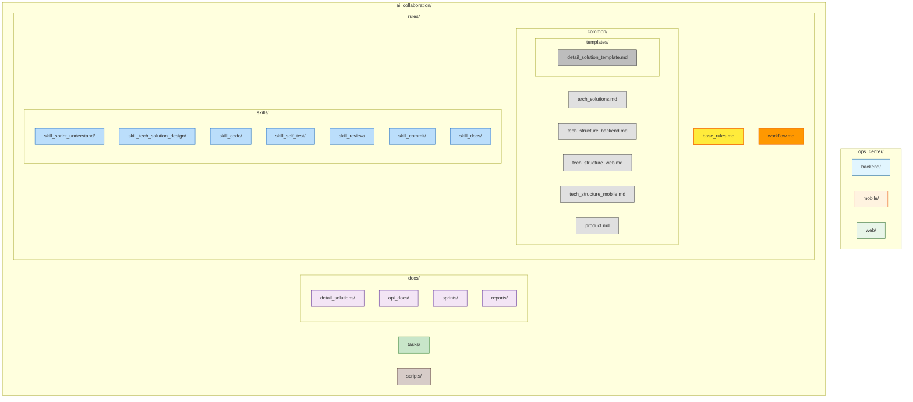
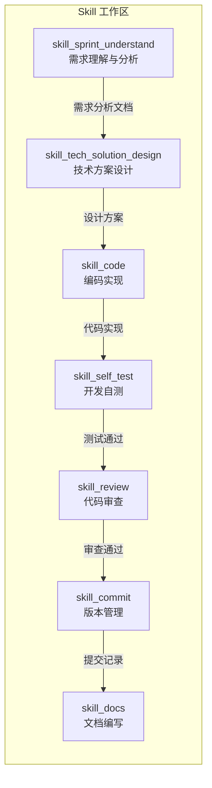
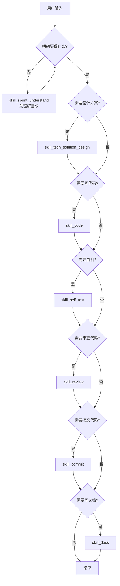
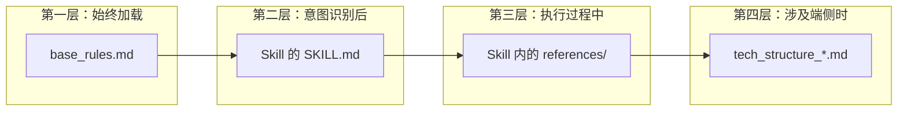
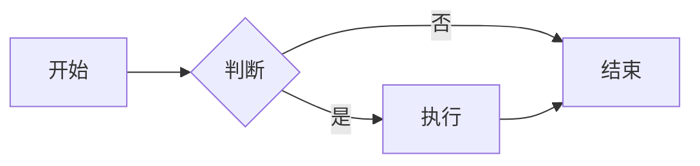

# AI协作规则路由枢纽

> 本文档作为**静态索引层**，负责意图识别和 Skill 路由。
> 详细执行逻辑由各 Skill 工作区渐进式加载。

---

## 1. 工作区结构概览

---

## 2. 意图路由表

当识别到用户意图时，按以下规则调度对应 Skill：

| 意图关键词 | 调度 Skill | 说明 |
|-----------|-----------|------|
| 需求分析、理解需求、分析一下、看下需求 | `skill_sprint_understand` | 冲刺需求理解与澄清 |
| 设计方案、技术设计、架构设计、详细设计、重构设计 | `skill_tech_solution_design` | 技术方案设计（含历史代码改动评估） |
| 编码、实现、开发、写代码 | `skill_code` | 编码实现 |
| 自测、单元测试、测试用例、测试 | `skill_self_test` | 开发自测 |
| 审查、Code Review、检查代码 | `skill_review` | 代码审查 |
| 提交、commit、分支、PR | `skill_commit` | 版本管理 |
| 文档、README、接口文档 | `skill_docs` | 文档编写 |

---

## 3. Skill 索引

| Skill | 入口路径 | 核心职责 | 输出工件 |
|-------|----------|----------|----------|
| `skill_sprint_understand` | `./rules/skills/skill_sprint_understand/SKILL.md` | 冲刺需求理解与分析 | 需求分析文档 |
| `skill_tech_solution_design` | `./rules/skills/skill_tech_solution_design/SKILL.md` | 技术方案设计 | `../docs/detail_solutions/*.md` |
| `skill_code` | `./rules/skills/skill_code/SKILL.md` | 编码实现 | 代码 + 任务列表 |
| `skill_self_test` | `./rules/skills/skill_self_test/SKILL.md` | 开发自测 | 测试代码 |
| `skill_review` | `./rules/skills/skill_review/SKILL.md` | 代码审查 | 审查报告 |
| `skill_commit` | `./rules/skills/skill_commit/SKILL.md` | 版本管理 | 提交记录 |
| `skill_docs` | `./rules/skills/skill_docs/SKILL.md` | 文档编写 | 文档文件 |

---

## 4. 公共规范索引

执行各 Skill 时，按需加载以下公共规范：

| 规范类型 | 路径 | 适用场景 |
|----------|------|----------|
| 架构设计规范 | `./rules/common/arch_solutions.md` | 所有 Skill |
| 后端技术规范 | `./rules/common/tech_structure_backend.md` | 涉及后端时 |
| Web端技术规范 | `./rules/common/tech_structure_web.md` | 涉及Web时 |
| 移动端技术规范 | `./rules/common/tech_structure_mobile.md` | 涉及移动端时 |
| 产品定义 | `./rules/common/product.md` | 需求理解时 |
| 设计方案模板 | `./rules/common/templates/detail_solution_template.md` | 方案设计时 |

---

## 5. 快速决策树

---

## 6. 渐进式加载原则

1. **始终加载**：本文件（base_rules.md）
2. **意图识别后**：加载对应 Skill 的 SKILL.md
3. **执行过程中**：按需加载 Skill 内的 references/
4. **涉及端侧时**：加载对应的 tech_structure_*.md

---

## 7. 统一规则

### 7.1 Mermaid 图例语法规范

**强制要求**：整个工程中，所有文档如果涉及流程图/设计图/架构图等，统一使用 **Mermaid 语法** 作为统一图例语法。

**适用范围**：
- 工作区结构概览
- 架构设计图
- 流程图
- 时序图
- 类图
- 状态图
- 甘特图

**示例**：

### 7.2 文档路径引用规范

所有文档中的路径引用必须使用**最新路径**：

| 原路径 | 新路径 |
|--------|--------|
| `./rules/arch_solutions.md` | `./rules/common/arch_solutions.md` |
| `./rules/tech_structure_backend.md` | `./rules/common/tech_structure_backend.md` |
| `./rules/tech_structure_web.md` | `./rules/common/tech_structure_web.md` |
| `./rules/tech_structure_mobile.md` | `./rules/common/tech_structure_mobile.md` |
| `./rules/product.md` | `./rules/common/product.md` |
| `./rules/detail_solution_template.md` | `./rules/common/templates/detail_solution_template.md` |
