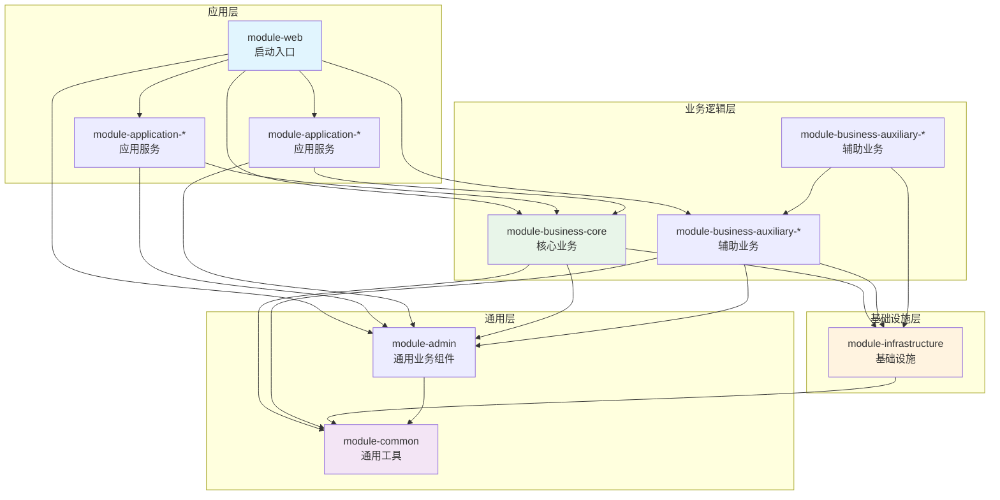
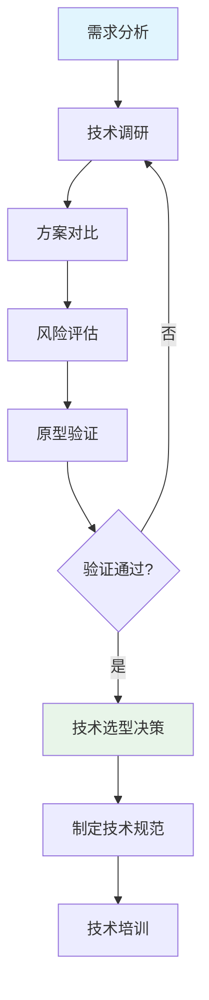
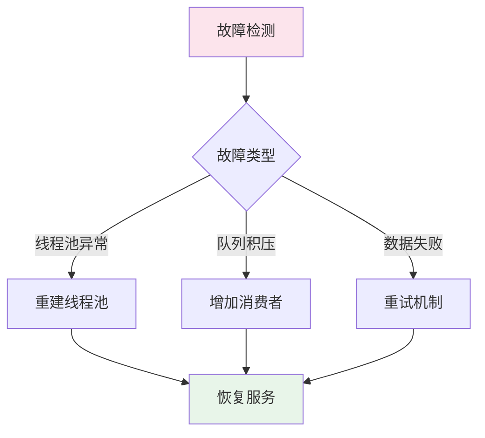
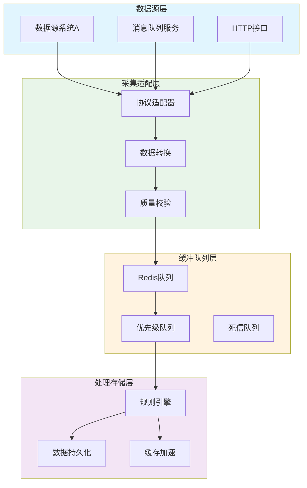

# 顶层内核架构方案（模板）

> 本文档隶属于**公共规范层**，负责统一整个工程的顶层业务模块分布，和领域/模块间配合关系和业务架构目标的认知。
> 详细的前后端技术选型/各端基础规范，需参考 `common/tech_structure_*.md`；
> 各skill所需的明细规范，需参考 `skills/skill_*/references/` 中的相关详细规范文档；

---

## 文档版本信息

* **文档版本**: v1.0（通用架构设计规范）
    
* **创建日期**: 2026-01-29
    
* **更新说明**: 基于通用架构设计原则，定义模块划分、技术选型、高并发高可用设计规范
    
* **架构模式**: 单体应用 + 模块化设计 + 渐进式演进
    
* **技术栈**: Spring Boot 3.4 + GraalVM JavaScript引擎 + Redis队列 + MySQL 8.x


## 1. 架构设计原则

### 1.1 核心设计原则

**分层架构原则**：
- 严格的分层调用，上层调用下层，禁止反向调用
- 每层职责清晰，避免跨层调用
- 层与层之间通过接口解耦

**模块化设计原则**：
- 高内聚低耦合：模块内部高度聚合，模块之间松散耦合
- 单一职责：每个模块只负责一个业务领域
- 接口隔离：模块间通过明确的接口交互

**渐进式演进原则**：
- 初期采用单体多模块，快速验证业务价值
- 预留拆分接口，支持后续微服务演进
- 避免过度设计，优先保证当前需求

**轻量化选型原则**：
- 技术栈选择成熟、轻量、易维护的组件
- 避免引入重量级框架，降低学习成本
- 优先选择生产环境验证过的技术

### 1.2 模块划分原则

**按层次划分**：

```plaintext
应用层（Application Layer）
├── 面向用户的API服务
├── 应用编排逻辑
└── 跨模块协调

业务逻辑层（Business Layer）
├── 核心业务逻辑
├── 业务规则引擎
└── 领域服务

基础设施层（Infrastructure Layer）
├── 中间件封装
├── 通用技术服务
└── 外部系统集成

通用层（Common Layer）
├── 工具类
├── 公共枚举
└── 通用组件
```

**按业务领域划分**：
- 每个业务领域独立模块
- 模块间通过事件或接口解耦
- 支持业务领域的独立演进

---

## 2. 模块划分方法

### 2.1 模块分类与命名规范

#### 2.1.1 模块命名体系

如下为采用高度抽象的通用命名，仅为实例，实际使用时，需要替换为具体的业务模块名称：

| 层次 | 模块类型 | 通用命名 | 说明 | 典型内容 |
|------|---------|----------|------|---------|
| **业务逻辑层** | 核心业务模块 | `module-business-core` | 系统核心业务逻辑 | 核心数据处理、业务编排 |
| | 辅助业务模块 | `module-business-auxiliary-*` | 支撑性业务逻辑 | 业务辅助处理、扩展功能 |
| **基础设施层** | 基础设施模块 | `module-infrastructure` | 通用技术服务 | 消息队列、缓存、通知 |
| **应用层** | 应用服务模块 | `module-application-*` | 面向用户的API | 权限管理、报表服务 |
| **通用层** | 通用工具模块 | `module-common` | 纯工具类、枚举 | 工具类、公共枚举 |
| | 通用业务组件 | `module-admin` | 基础业务组件 | 用户管理、机构管理 |
| **启动层** | Web启动模块 | `module-web` | 应用启动入口 | 启动类、配置 |

#### 2.1.2 模块命名示例

**示例1：业务处理系统**

```plaintext
module-business-core              # 核心业务模块（示例：数据处理、核心逻辑）
module-business-auxiliary-process # 辅助业务模块（示例：流程处理）
module-business-auxiliary-analysis# 辅助业务模块（示例：数据分析）
module-infrastructure             # 基础设施模块（示例：消息队列、缓存）
module-application-permission     # 应用层模块（示例：权限管理）
module-application-report         # 应用层模块（示例：报表服务）
module-admin                      # 通用业务组件（示例：用户管理、机构管理）
module-common                     # 通用模块（示例：工具类、公共枚举）
module-web                        # Web启动模块（示例：启动类、配置）
```

**示例2：监控告警系统**

```plaintext
module-business-core              # 核心业务模块（示例：数据采集）
module-business-auxiliary-alert   # 辅助业务模块（示例：告警处理）
module-business-auxiliary-workflow# 辅助业务模块（示例：工单流程）
module-infrastructure             # 基础设施模块（示例：通知服务、缓存）
module-application-permission     # 应用层模块（示例：权限管理）
module-application-dashboard      # 应用层模块（示例：仪表盘）
module-admin                      # 通用业务组件
module-common                     # 通用模块
module-web                        # Web启动模块
```

### 2.2 工程目录结构映射

```plaintext
project-root/                     # 工程根目录
├── pom.xml                       # 父POM（包管理）
├── module-common/                # 通用工具和枚举
├── module-infrastructure/        # 基础设施（缓存、消息、通知等）
├── module-business-core/         # 核心业务模块
├── module-business-auxiliary-*/  # 辅助业务模块（可多个）
├── module-application-*/         # 应用层模块（可多个）
├── module-admin/                 # 通用业务组件模块
└── module-web/                   # Web应用启动入口
```

### 2.3 模块依赖关系



**依赖原则**：
1. 上层模块可以依赖下层模块
2. 同层模块之间尽量避免直接依赖
3. 业务模块之间通过事件或接口解耦
4. 通用模块不依赖任何业务模块

### 2.4 特殊组件的模块归属

| 组件类型 | 工程模块归属 | 归属理由 |
|---------|-------------|----------|
| **消息通知服务** | module-infrastructure | 通用技术服务，与业务解耦 |
| **缓存服务** | module-infrastructure | 通用技术服务，与业务解耦 |
| **消息队列客户端** | module-infrastructure | 通用技术服务，与业务解耦 |
| **权限控制** | module-application-permission | 应用层服务，面向用户API |
| **用户/机构管理** | module-admin | 基础业务组件，多个模块共享 |
| **工具类/枚举** | module-common | 与业务无关，纯工具性质 |

---

## 3. 技术选型决策

### 3.1 技术选型决策流程



### 3.2 技术选型评估维度

| 维度 | 权重 | 说明 |
|------|------|------|
| **轻量化** | 25% | 资源占用小，启动快，无复杂依赖 |
| **易用性** | 20% | 学习成本低，使用简单，调试方便 |
| **性能** | 20% | 高并发处理能力，低延迟，多线程安全 |
| **扩展性** | 15% | 支持自定义扩展、热部署、版本管理 |
| **稳定性** | 15% | 生产环境验证，社区活跃，问题响应快 |
| **集成成本** | 5% | 与现有技术栈集成简单，配置灵活 |

### 3.3 规则引擎选型参考

**候选方案对比**：

| 方案 | 轻量化 | 易用性 | 性能 | 扩展性 | 稳定性 | 集成成本 | 综合评分 |
|------|--------|--------|------|--------|--------|----------|----------|
| **QLExpress（阿里）** | 高 | 高 | 高 | 高 | 高 | 低 | 90 |
| **GraalVM JS** | 中 | 高 | 中 | 高 | 中 | 中 | 80 |
| **Aviator** | 高 | 中 | 高 | 中 | 中 | 低 | 75 |
| **MVEL** | 高 | 中 | 高 | 中 | 中 | 低 | 70 |
| **Drools** | 低 | 中 | 高 | 高 | 高 | 中 | 65 |

**推荐方案**：QLExpress + JavaScript双引擎策略

**实施策略**：
1. **初期**：以QLExpress为主，实现基本规则
2. **扩展**：引入GraalVM JavaScript引擎，支持JS规则脚本
3. **管理**：提供统一规则管理界面，支持选择引擎类型

**性能保障措施**：
- 规则编译缓存：规则首次编译后缓存AST
- 线程池隔离：规则执行使用专用虚拟线程池
- 批量执行优化：支持批量数据匹配同一规则
- 监控统计：记录规则执行耗时、成功率

### 3.4 技术选型评估表模板

```markdown
## 技术选型评估表

### 选型背景
- **需求描述**：{需求描述}
- **技术约束**：{技术约束}
- **评估时间**：{评估时间}

### 候选方案

#### 方案1：{技术名称}
- **版本**：{版本号}
- **轻量化**：{评分} - {说明}
- **易用性**：{评分} - {说明}
- **性能**：{评分} - {说明}
- **扩展性**：{评分} - {说明}
- **稳定性**：{评分} - {说明}
- **集成成本**：{评分} - {说明}
- **综合评分**：{总分}

#### 方案2：{技术名称}
...

### 最终决策
- **选型结果**：{选型结果}
- **决策理由**：{决策理由}
- **风险评估**：{风险评估}
- **应对措施**：{应对措施}
```

---

## 4. 高并发设计

### 4.1 并发处理架构

#### 4.1.1 虚拟线程应用策略

**适用场景**：
- IO密集型任务（网络请求、数据库查询）
- 大量并发请求处理
- 需要高吞吐量的场景

**配置示例**：

```java
// 配置虚拟线程池（Java 21+）
@Configuration
public class VirtualThreadConfig {
    
    @Bean
    public TaskExecutor virtualThreadTaskExecutor() {
        return new TaskExecutorAdapter(Executors.newVirtualThreadPerTaskExecutor());
    }
}
```

#### 4.1.2 批量处理优化

**批量数据采集**：
- 单次请求批量获取数据
- 使用连接池复用连接
- 支持增量采集（仅采集变化数据）

**批量规则匹配**：
- 同一时间窗口的数据按规则分组，批量执行
- 使用缓存避免重复计算
- 支持流式处理，边采集边检测

### 4.2 并发处理流程


---

## 5. 高可用设计

### 5.1 稳定性保障措施

#### 5.1.1 监控告警体系

| 监控维度 | 监控指标 | 告警阈值 | 处理策略 |
|---------|---------|---------|---------|
| **系统资源** | CPU使用率 | >80%持续5分钟 | 扩容 |
| **内存使用** | 堆内存使用率 | >85% | GC优化/扩容 |
| **队列健康** | 队列长度 | >10,000 | 增加消费者/限流 |
| **处理延迟** | 数据处理时延 | >30秒 | 优化处理逻辑 |
| **错误率** | 处理失败率 | >5% | 检查数据源 |

#### 5.1.2 容错与降级

**容错机制**：
- 线程池定时检测，自动重建异常线程池
- 失败重试（最大3次），失败后进入死信队列
- 资源隔离，单模块故障不影响其他模块

**降级策略**：
- **一级降级**：非核心功能暂停
- **二级降级**：降低处理频率
- **三级降级**：只处理关键数据

#### 5.1.3 数据一致性保障

- **最终一致性**：队列缓冲，异步处理，允许短暂延迟
- **数据补偿**：定时任务检查缺失数据，自动补采
- **幂等设计**：基于唯一ID确保重复数据不重复处理

### 5.2 故障自愈机制



---

## 6. 数据流模型

### 6.1 数据处理流程



### 6.2 数据流关键节点

**数据采集**：
- 多数据源统一接入
- 数据格式归一化
- 数据质量校验

**数据缓冲**：
- Redis队列缓冲
- 优先级队列处理紧急数据
- 死信队列处理异常数据

**数据处理**：
- 规则引擎实时检测
- 数据持久化存储
- 缓存加速热点数据

---

## 7. 架构演进规划

### 7.1 三阶段演进路径

| 阶段 | 时间 | 核心目标 | 关键技术举措 |
|------|------|----------|--------------|
| **单体多模块** | 初期 | 快速验证业务价值 | 单体多模块、轻量级技术栈、快速迭代 |
| **模块独立部署** | 中期 | 提升性能和可维护性 | 模块拆分、RPC调用、独立扩容 |
| **微服务架构** | 远期 | 支持大规模部署 | 服务发现、配置中心、服务治理 |

### 7.2 演进决策依据

**何时从单体演进到微服务**：
1. 单体性能瓶颈明显，无法通过垂直扩展解决
2. 业务模块耦合度高，修改成本大
3. 团队规模扩大，需要独立开发部署
4. 不同模块的扩展需求差异大

**演进原则**：
- 演进而非重构：逐步拆分，而非一次性重构
- 业务优先：先拆分业务边界清晰的模块
- 降低风险：保留回滚能力，灰度发布

---

## 8. 架构评审检查清单

### 8.1 架构设计评审要点

```markdown
## 架构评审检查清单

### 模块划分
- [ ] 模块职责是否清晰？
- [ ] 模块间依赖是否合理？
- [ ] 是否符合高内聚低耦合原则？

### 技术选型
- [ ] 技术选型是否满足需求？
- [ ] 是否有原型验证？
- [ ] 是否有风险评估和应对措施？

### 性能设计
- [ ] 是否支持高并发？
- [ ] 是否有性能测试计划？
- [ ] 是否有性能监控方案？

### 可用性设计
- [ ] 是否有容错机制？
- [ ] 是否有降级方案？
- [ ] 是否有监控告警？

### 扩展性设计
- [ ] 是否支持水平扩展？
- [ ] 是否预留演进路径？
- [ ] 是否避免过度设计？

### 安全性设计
- [ ] 是否有认证授权机制？
- [ ] 是否有数据加密？
- [ ] 是否有安全审计？

### 数据一致性
- [ ] 是否有数据一致性保障方案？
- [ ] 是否有幂等设计？
- [ ] 是否有数据补偿机制？
```

---

## 9. 技术选型清单参考

### 9.1 核心框架

| 组件 | 技术选型 | 版本 | 选型理由 |
|------|---------|------|----------|
| **应用框架** | Spring Boot | 3.4.0+ | 生态成熟、开发效率高、支持虚拟线程 |
| **规则引擎** | QLExpress | 3.3.0+ | 轻量级、高性能、多线程安全 |
| **JavaScript引擎** | GraalVM JS | 23.0+ | 支持JS规则、热加载灵活 |
| **数据访问** | MyBatis-Plus | 3.5.5+ | 简化CRUD、支持Lambda查询 |

### 9.2 中间件

| 组件 | 技术选型 | 版本 | 用途 |
|------|---------|------|------|
| **缓存/队列** | Redis | 7.x+ | 数据缓冲、会话缓存、分布式锁 |
| **数据库** | MySQL | 8.x+ | 业务数据持久化 |
| **消息队列** | RabbitMQ/Kafka | - | 异步消息处理 |

### 9.3 工具与组件

| 组件 | 技术选型 | 版本 | 说明 |
|------|---------|------|------|
| **连接池** | HikariCP | 5.x+ | 高性能数据库连接池 |
| **JSON处理** | fastjson2 | 2.0+ | 数据序列化/反序列化 |
| **日期时间** | Java Time API | Java 21 | 现代化时间处理 |
| **日志框架** | Logback | 1.4+ | 高性能日志记录 |

---

**版本记录**
- v1.0：架构设计规范初始版本
- 创建日期：2026年1月29日
- 适用范围：所有架构设计工作
