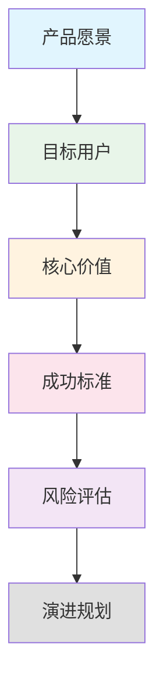
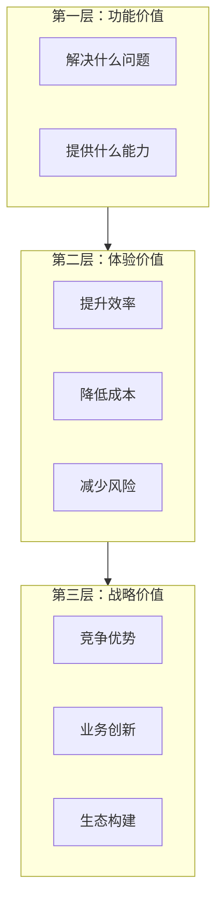
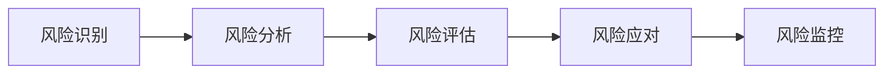

# 顶层产品定义（模板）

> 本文档隶属于**公共规范层**，负责提供产品业务的顶层定义说明。（具体产品定义说明，需根据本文中提供的产品定义方法论进行实例生成）
> 技术相关的顶层架构约束，需参考 `common/arch_solutions.md`；
> 详细的前后端技术选型/各端基础规范，需参考 `common/tech_structure_*.md`；
> 各skill所需的明细规范，需参考 `skills/skill_*/references/` 中的相关详细规范文档；

---

## 1. 产品定义方法论

### 1.1 产品定义框架

产品定义应遵循以下核心框架：



**核心要素**：
- **产品愿景**：产品要解决什么问题？为谁解决？为什么现在解决？
- **目标用户**：谁会使用这个产品？他们的特征是什么？
- **核心价值**：产品为用户提供什么独特价值？
- **成功标准**：如何衡量产品的成功？
- **风险评估**：可能面临哪些风险？如何应对？
- **演进规划**：产品如何分阶段发展？

### 1.2 产品命名规范

**命名原则**：
- 简洁明了，易于记忆
- 体现产品核心价值
- 避免使用具体业务词汇（保持通用性）

**示例**：
- ✅ 正确：智能运维平台、数据分析系统
- ❌ 错误：某某行业统一运维平台、某某公司管理系统

---

## 2. 用户分析

### 2.1 用户画像分析方法

**分析维度**：

| 维度 | 分析内容 | 示例 |
|------|----------|------|
| **基础属性** | 年龄、职业、地域 | 25-40岁，技术人员，一线城市 |
| **使用场景** | 何时、何地、如何使用 | 移动办公、日常巡检、远程支持 |
| **核心需求** | 主要痛点、期望目标 | 提高效率、降低成本、减少风险 |
| **行为特征** | 操作习惯、偏好 | 频繁出差、移动端使用为主 |
| **能力水平** | 技术能力、学习成本 | 技术背景深厚、快速学习能力 |

### 2.2 用户画像模板

```markdown
## 用户画像：{用户角色名称}

### 基础信息
- **年龄范围**：{年龄区间}
- **职业背景**：{职业描述}
- **工作场景**：{工作环境}

### 核心诉求
- **主要痛点**：{列举3-5个痛点}
- **期望目标**：{列举3-5个目标}

### 行为特征
- **使用习惯**：{描述使用习惯}
- **技术能力**：{描述技术能力}
- **决策权限**：{描述决策权限}

### 场景描述
**场景1**：{描述具体使用场景}
**场景2**：{描述具体使用场景}
```

---

## 3. 价值定义

### 3.1 价值定义框架

**价值三层次模型**：



**价值定义原则**：
1. **可量化**：尽量用数据说明价值（如提升X%、减少Y小时）
2. **可验证**：价值能够通过实际使用验证
3. **可对比**：与现状或竞品对比体现价值

### 3.2 价值画布模板

```markdown
## 价值画布

### 用户痛点
1. {痛点1} → 提供方案 → 价值：{量化价值}
2. {痛点2} → 提供方案 → 价值：{量化价值}
3. {痛点3} → 提供方案 → 价值：{量化价值}

### 核心价值主张
{一句话概括产品的核心价值}

### 价值验证
- **验证方式**：{如何验证价值实现}
- **成功指标**：{具体指标}
```

---

## 4. 成功标准

### 4.1 成功标准定义方法

**SMART原则**：
- **S**pecific（具体的）：标准明确具体
- **M**easurable（可衡量的）：能够量化或定性评估
- **A**chievable（可实现的）：在能力和资源范围内
- **R**elevant（相关的）：与产品目标直接相关
- **T**ime-bound（有时限的）：明确完成时间

**标准分类**：

| 维度 | 说明 | 示例 |
|------|------|------|
| **业务成功标准** | 业务目标达成情况 | 核心流程跑通，用户满意度≥80% |
| **技术成功标准** | 技术指标达成情况 | 系统可用性≥99.5%，响应时间≤1秒 |
| **用户体验标准** | 用户体验指标 | 主要功能3步内完成，新用户30分钟内上手 |

### 4.2 验收标准模板

```markdown
## 验收标准

### 业务验收标准
- [ ] {标准1}
- [ ] {标准2}
- [ ] {标准3}

### 技术验收标准
- [ ] {标准1}
- [ ] {标准2}
- [ ] {标准3}

### 用户体验验收标准
- [ ] {标准1}
- [ ] {标准2}
- [ ] {标准3}

### 验收方式
- **验收人**：{验收人员}
- **验收时间**：{验收时间}
- **验收方法**：{验收方法}
```

---

## 5. 风险评估

### 5.1 风险评估框架

**风险评估矩阵**：



**风险分类**：

| 风险类别 | 风险类型 | 典型示例 | 应对策略 |
|---------|---------|---------|---------|
| **技术风险** | 技术选型、性能瓶颈、集成风险 | 技术栈不成熟、系统性能不达标 | 技术预研、性能测试、降级方案 |
| **时间风险** | 进度延迟、资源不足 | 开发周期紧张、人员变动 | 范围控制、资源协调、敏捷开发 |
| **业务风险** | 需求变更、用户接受度 | 需求频繁变更、用户不认可 | 变更控制流程、用户参与测试 |
| **资源风险** | 人力、资金、设备 | 关键人员离职、预算不足 | 团队备份、预算规划、资源调配 |

### 5.2 风险评估清单模板

```markdown
## 风险评估清单

### 技术风险
| 风险描述 | 影响程度 | 发生概率 | 应对措施 | 负责人 |
|---------|---------|---------|---------|--------|
| {风险1} | 高/中/低 | 高/中/低 | {应对措施} | {负责人} |

### 时间风险
| 风险描述 | 影响程度 | 发生概率 | 应对措施 | 负责人 |
|---------|---------|---------|---------|--------|
| {风险1} | 高/中/低 | 高/中/低 | {应对措施} | {负责人} |

### 业务风险
| 风险描述 | 影响程度 | 发生概率 | 应对措施 | 负责人 |
|---------|---------|---------|---------|--------|
| {风险1} | 高/中/低 | 高/中/低 | {应对措施} | {负责人} |

### 资源风险
| 风险描述 | 影响程度 | 发生概率 | 应对措施 | 负责人 |
|---------|---------|---------|---------|--------|
| {风险1} | 高/中/低 | 高/中/低 | {应对措施} | {负责人} |
```

---

## 6. 演进规划

### 6.1 演进规划方法

**规划原则**：
1. **分阶段交付**：将产品拆分为多个阶段，逐步交付
2. **价值优先**：每个阶段都应交付可用的业务价值
3. **渐进增强**：先做核心功能，再逐步完善
4. **风险前置**：高风险功能尽早验证

**规划维度**：

| 维度 | 短期（0-3个月） | 中期（3-12个月） | 长期（1-3年） |
|------|----------------|------------------|---------------|
| **功能范围** | 核心功能 | 功能完善 | 生态扩展 |
| **技术架构** | MVP实现 | 性能优化 | 架构演进 |
| **用户规模** | 小范围试点 | 规模推广 | 行业覆盖 |
| **业务价值** | 验证价值 | 创造价值 | 扩大价值 |

### 6.2 演进规划模板

```markdown
## 产品演进规划

### 短期目标（0-3个月）
**阶段目标**：{阶段目标描述}

**核心功能**：
- {功能1}
- {功能2}

**技术重点**：
- {技术重点1}
- {技术重点2}

**成功标准**：
- {标准1}
- {标准2}

### 中期目标（3-12个月）
**阶段目标**：{阶段目标描述}

**核心功能**：
- {功能1}
- {功能2}

**技术重点**：
- {技术重点1}
- {技术重点2}

**成功标准**：
- {标准1}
- {标准2}

### 长期目标（1-3年）
**阶段目标**：{阶段目标描述}

**核心功能**：
- {功能1}
- {功能2}

**技术重点**：
- {技术重点1}
- {技术重点2}

**成功标准**：
- {标准1}
- {标准2}
```

---

## 7. 附录：产品定义文档模板

### 7.1 完整产品定义文档结构

```markdown
# {产品名称} - 产品定义文档

## 1. 产品概述
### 1.1 产品定位
### 1.2 产品愿景
### 1.3 核心价值

## 2. 目标用户
### 2.1 用户画像
### 2.2 用户需求
### 2.3 用户场景

## 3. 产品功能
### 3.1 功能范围
### 3.2 功能优先级
### 3.3 功能规划

## 4. 成功标准
### 4.1 业务成功标准
### 4.2 技术成功标准
### 4.3 用户体验标准

## 5. 风险控制
### 5.1 技术风险
### 5.2 时间风险
### 5.3 业务风险
### 5.4 资源风险

## 6. 演进规划
### 6.1 短期目标
### 6.2 中期目标
### 6.3 长期目标

## 7. 附录
### 7.1 术语表
### 7.2 参考资料
```

---

**版本记录**
- v1.0：产品定义规范初始版本
- 创建日期：2026年1月29日
- 适用范围：所有产品定义工作
