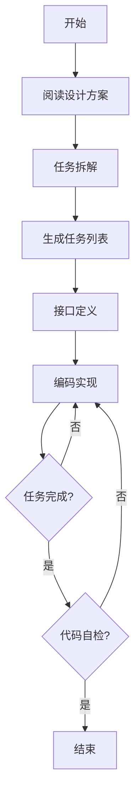
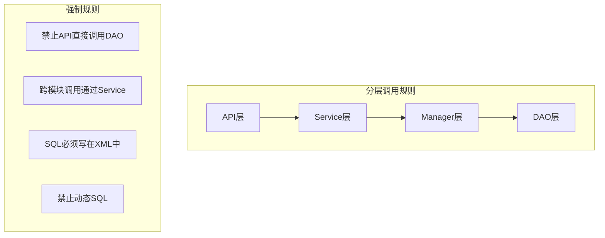
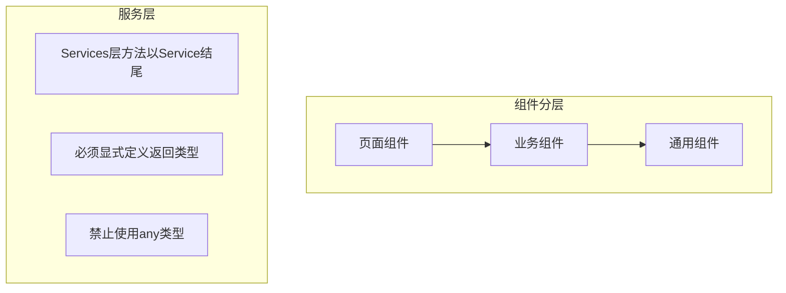

# 编码实现

> **触发场景**：基于设计方案进行具体编码实现
> **前置条件**：已有详细设计方案文档或用户明确方案说明
> **输出工件**：任务列表、接口文档、代码实现
> **路径基准**：本文档中所有路径均相对于 `ai_collaboration/` 目录

---

## 1. 执行前检查

- [ ] 确认设计方案文档：`ai_collaboration/docs/detail_solutions/`
- [ ] 加载对应端侧技术规范
- [ ] 了解现有代码结构

---

## 2. 执行流程



### Step 1: 任务拆解
1. 阅读设计方案，理解实现要点
2. 拆分为可执行的任务列表
3. 生成任务文档：`ai_collaboration/tasks/{task_name}.md`

### Step 2: 接口定义
1. 根据设计方案梳理接口
2. 生成接口文档：`ai_collaboration/docs/api_docs/{module_name}.md`
3. 定义请求/响应格式

### Step 3: 编码实现
1. 按任务列表顺序执行
2. 遵循技术规范编码
3. 每完成一项勾选一项

### Step 4: 完成确认
1. 检查所有任务项已完成
2. 自测基本功能可用
3. 更新任务列表状态

---

## 3. 任务列表模板

```markdown
# {需求名称} 任务列表

## 概述
- 设计方案：[链接到设计方案]
- 涉及端侧：后端 / Web / Mobile

## 任务清单

### 后端任务
- [ ] 数据库表结构变更
- [ ] Entity/DTO定义
- [ ] Service层实现
- [ ] Controller层实现
- [ ] 单元测试

### 前端任务
- [ ] API接口对接
- [ ] 页面组件开发
- [ ] 状态管理
- [ ] 样式实现

## 备注
- 依赖项：
- 注意事项：
```

---

## 4. 公共规范引用

本 Skill 直接引用公共规范文档，无需额外拆分：

| 端侧 | 规范路径 | 内容说明 |
|------|----------|----------|
| **后端** | `./rules/common/tech_structure_backend.md` | 分层架构、命名规范、DAO规范、接口规范 |
| **Web端** | `./rules/common/tech_structure_web.md` | 组件规范、Services层规范、样式规范 |
| **移动端** | `./rules/common/tech_structure_mobile.md` | Taro规范、跨平台适配 |

**说明**：编码时必须严格遵循对应端侧的技术规范文档中的规则。

---

## 5. References 文档索引

### 后端编码规范

| 文档 | 路径 | 内容侧重 |
|------|------|----------|
| 分层架构实现 | `./references/backend/layer_architecture.md` | API/Service/Manager/DAO层职责与调用规则 |
| 命名规范 | `./references/backend/naming_convention.md` | 类/方法/变量命名规范 |
| MyBatis使用规范 | `./references/backend/mybatis_guide.md` | SQL编写方式、XML规范、禁止事项 |
| 异常处理规范 | `./references/backend/exception_handling.md` | 自定义异常、全局异常处理器 |
| 日志规范 | `./references/backend/logging_standard.md` | 日志级别、日志内容、敏感数据脱敏 |
| 参数校验规范 | `./references/backend/validation_guide.md` | Jakarta Validation使用、自定义校验 |

### 前端编码规范

| 文档 | 路径 | 内容侧重 |
|------|------|----------|
| 组件结构规范 | `./references/frontend/component_structure.md` | 组件分类、目录结构、设计原则 |
| 状态管理规范 | `./references/frontend/state_management.md` | useState、useModel使用规范 |
| 样式规范 | `./references/frontend/style_guide.md` | Less编写、CSS Modules使用 |
| 自定义Hooks规范 | `./references/frontend/hooks_guide.md` | Hooks命名、常用自定义Hooks |
| Services层规范 | `./references/frontend/service_layer.md` | 接口定义、类型定义规范 |

### 移动端编码规范

| 文档 | 路径 | 内容侧重 |
|------|------|----------|
| Taro项目结构 | `./references/mobile/taro_structure.md` | 目录结构、页面规范、分包配置 |
| 跨平台兼容性 | `./references/mobile/cross_platform.md` | 平台差异、API适配、条件编译 |
| 小程序限制 | `./references/mobile/mini_program_limit.md` | 包大小、请求、存储、渲染限制 |

### 通用规范

| 文档 | 路径 | 内容侧重 |
|------|------|----------|
| 代码质量检查清单 | `./references/code_quality.md` | 代码审查前的自检清单 |

---

## 6. 编码规范要点

### 后端 (Java/Spring)



### 前端 (React/TypeScript)



---

## 7. 任务执行检查点

每完成一个任务项：
- [ ] 代码符合规范
- [ ] 无明显Bug
- [ ] 提交信息清晰
- [ ] 勾选任务列表

---

## 8. 输出示例

```
任务列表已生成：ai_collaboration/tasks/collector_management_task.md
接口文档已生成：ai_collaboration/docs/api_docs/collector_management.md

任务进度：
- [x] 数据库表结构变更
- [x] Entity/DTO定义
- [ ] Service层实现 (进行中)
- [ ] Controller层实现
- [ ] 单元测试

当前正在实现 Service 层...
```
