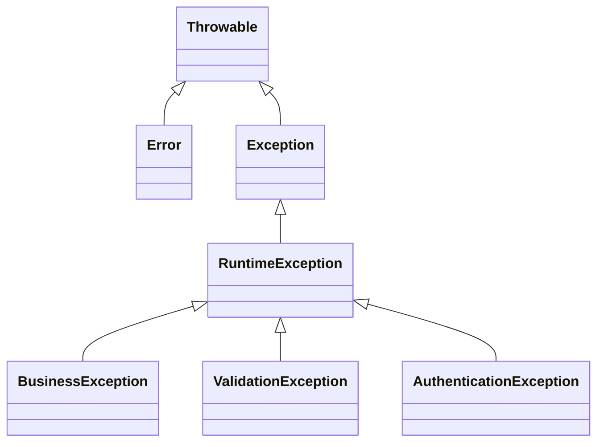
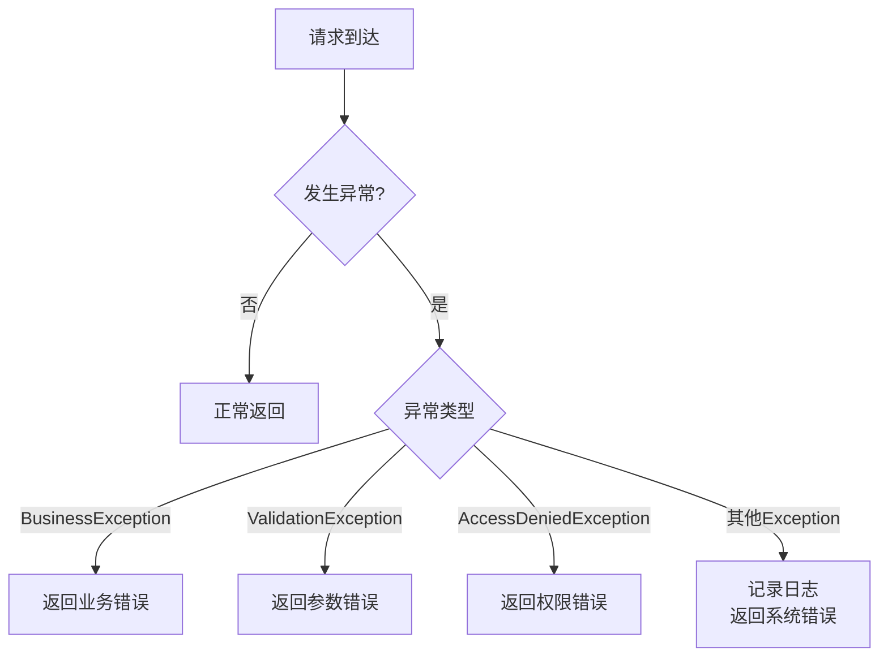

# 异常处理规范

## 1. 异常分类

### 1.1 异常层次结构



### 1.2 异常类型说明

| 异常类型 | 说明 | 处理方式 |
|----------|------|----------|
| Error | 系统级错误 | 不捕获，记录日志 |
| checked Exception | 编译期检查 | 声明抛出或捕获处理 |
| RuntimeException | 运行时异常 | 全局异常处理器处理 |
| BusinessException | 业务异常 | 返回错误信息给用户 |
| ValidationException | 参数校验异常 | 返回校验错误信息 |

---

## 2. 自定义异常

### 2.1 业务异常类

```java
/**
 * 业务异常
 */
public class BusinessException extends RuntimeException {
    
    /** 错误码 */
    private final Integer code;
    
    /** 错误信息 */
    private final String message;
    
    public BusinessException(String message) {
        super(message);
        this.code = 500;
        this.message = message;
    }
    
    public BusinessException(Integer code, String message) {
        super(message);
        this.code = code;
        this.message = message;
    }
    
    public BusinessException(ErrorCode errorCode) {
        super(errorCode.getMessage());
        this.code = errorCode.getCode();
        this.message = errorCode.getMessage();
    }
    
    // Getter methods
    public Integer getCode() {
        return code;
    }
    
    @Override
    public String getMessage() {
        return message;
    }
}
```

### 2.2 错误码枚举

```java
/**
 * 错误码定义
 */
public enum ErrorCode {
    
    // 通用错误 1xxxx
    SUCCESS(200, "操作成功"),
    PARAM_ERROR(400, "参数错误"),
    UNAUTHORIZED(401, "未授权"),
    FORBIDDEN(403, "无权限"),
    NOT_FOUND(404, "资源不存在"),
    INTERNAL_ERROR(500, "服务器内部错误"),
    
    // 采集模块 2xxxx
    COLLECTOR_NOT_FOUND(20001, "采集器不存在"),
    COLLECTOR_NAME_EXISTS(20002, "采集器名称已存在"),
    COLLECTOR_CONFIG_ERROR(20003, "采集器配置错误"),
    
    // 报警模块 3xxxx
    ALARM_RULE_NOT_FOUND(30001, "报警规则不存在"),
    ALARM_RULE_INVALID(30002, "报警规则无效");
    
    private final Integer code;
    private final String message;
    
    ErrorCode(Integer code, String message) {
        this.code = code;
        this.message = message;
    }
    
    public Integer getCode() {
        return code;
    }
    
    public String getMessage() {
        return message;
    }
}
```

---

## 3. 全局异常处理

### 3.1 异常处理器

```java
/**
 * 全局异常处理器
 */
@RestControllerAdvice
@Slf4j
public class GlobalExceptionHandler {
    
    /**
     * 处理业务异常
     */
    @ExceptionHandler(BusinessException.class)
    public CommonResponse<Void> handleBusinessException(BusinessException e) {
        log.warn("业务异常: code={}, message={}", e.getCode(), e.getMessage());
        return CommonResponse.error(e.getCode(), e.getMessage());
    }
    
    /**
     * 处理参数校验异常
     */
    @ExceptionHandler(MethodArgumentNotValidException.class)
    public CommonResponse<Void> handleValidationException(MethodArgumentNotValidException e) {
        String message = e.getBindingResult().getFieldErrors().stream()
            .map(FieldError::getDefaultMessage)
            .collect(Collectors.joining(", "));
        log.warn("参数校验失败: {}", message);
        return CommonResponse.error(400, message);
    }
    
    /**
     * 处理权限异常
     */
    @ExceptionHandler(AccessDeniedException.class)
    public CommonResponse<Void> handleAccessDeniedException(AccessDeniedException e) {
        log.warn("权限不足: {}", e.getMessage());
        return CommonResponse.error(403, "无权限访问");
    }
    
    /**
     * 处理未知异常
     */
    @ExceptionHandler(Exception.class)
    public CommonResponse<Void> handleException(Exception e) {
        log.error("系统异常: ", e);
        return CommonResponse.error(500, "系统异常，请稍后重试");
    }
}
```

### 3.2 异常处理流程



---

## 4. 异常使用规范

### 4.1 抛出异常

```java
// 推荐：使用错误码枚举
public Collector getCollectorById(Long id) {
    Collector collector = collectorMapper.selectById(id);
    if (collector == null) {
        throw new BusinessException(ErrorCode.COLLECTOR_NOT_FOUND);
    }
    return collector;
}

// 推荐：自定义错误信息
public void createCollector(CollectorCreateRequest request) {
    Collector existing = collectorMapper.selectByName(request.getName());
    if (existing != null) {
        throw new BusinessException(20002, "采集器名称已存在: " + request.getName());
    }
    // ...
}

// 不推荐：抛出原始Exception
public void badExample() throws Exception {
    throw new Exception("错误");  // 不推荐
}
```

### 4.2 捕获异常

```java
// 推荐：捕获具体异常
public void process() {
    try {
        // 业务逻辑
    } catch (BusinessException e) {
        // 业务异常向上抛出
        throw e;
    } catch (Exception e) {
        // 其他异常包装为业务异常
        log.error("处理失败", e);
        throw new BusinessException("处理失败: " + e.getMessage());
    }
}

// 不推荐：捕获所有异常后不做处理
public void badExample() {
    try {
        // 业务逻辑
    } catch (Exception e) {
        // 什么都不做，吞掉异常  // 不推荐
    }
}
```

### 4.3 异常与日志

```java
// 推荐：业务异常用warn，系统异常用error
public void example() {
    try {
        // 业务逻辑
    } catch (BusinessException e) {
        // 业务异常，用warn记录
        log.warn("业务处理失败: {}", e.getMessage());
        throw e;
    } catch (Exception e) {
        // 系统异常，用error记录堆栈
        log.error("系统异常: ", e);
        throw new BusinessException("系统异常，请稍后重试");
    }
}
```

---

## 5. 异常处理最佳实践

### 5.1 应该做的

- [ ] 使用自定义业务异常
- [ ] 定义清晰的错误码
- [ ] 异常信息对用户友好
- [ ] 记录异常日志
- [ ] 使用全局异常处理器

### 5.2 不应该做的

- [ ] 不要捕获异常后不处理
- [ ] 不要在finally块中返回值
- [ ] 不要抛出过于泛化的异常
- [ ] 不要在循环中频繁抛出异常
- [ ] 不要用异常做流程控制

### 5.3 异常信息规范

| 场景 | 信息示例 |
|------|----------|
| 资源不存在 | "采集器不存在: id=123" |
| 参数错误 | "参数错误: 名称不能为空" |
| 权限不足 | "无权限访问该资源" |
| 系统异常 | "系统异常，请稍后重试" |
