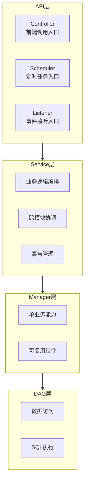
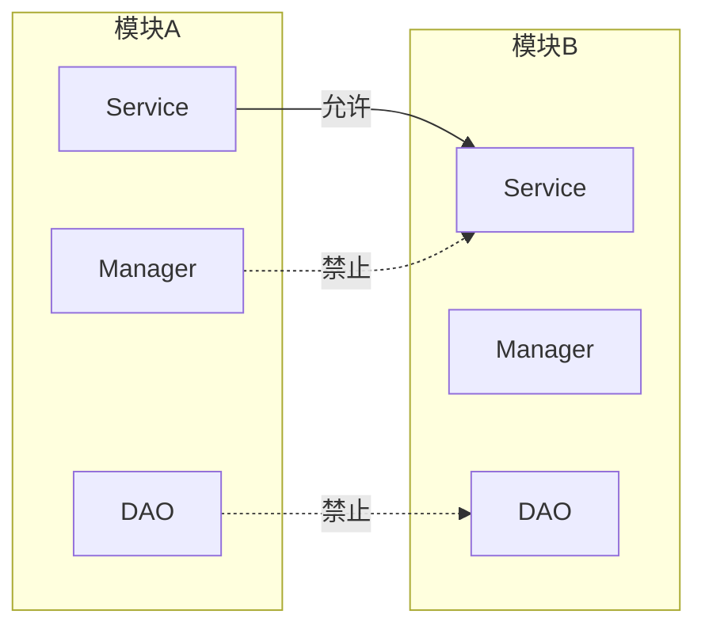

# 后端分层架构实现规范

## 1. 分层架构概览



---

## 2. 各层职责详解

### 2.1 API层

#### Controller（控制器）

**职责**：
- 接收前端请求
- 参数校验（配合@Valid）
- 调用Service层处理业务
- 封装响应结果

**命名规范**：`XXXController`

**示例**：
```java
@RestController
@RequestMapping("/api/collector")
@RequiredArgsConstructor
public class CollectorController {
    
    private final CollectorService collectorService;
    
    @PostMapping("/create")
    public CommonResponse<Void> create(@Valid @RequestBody CollectorCreateRequest request) {
        collectorService.createCollector(request);
        return CommonResponse.success();
    }
}
```

#### Scheduler（调度器）

**职责**：
- 定时任务入口
- 一般无需入参
- 调用Service层处理

**命名规范**：`XXXScheduler`

**示例**：
```java
@Component
@RequiredArgsConstructor
public class MetricCollectScheduler {
    
    private final CollectorService collectorService;
    
    @Scheduled(cron = "0 */5 * * * ?")
    public void collectMetrics() {
        collectorService.collectAndProcess();
    }
}
```

#### Listener（监听器）

**职责**：
- 事件监听入口
- 接收事件对象
- 调用Service层处理

**命名规范**：`XXXListener`

**示例**：
```java
@Component
@RequiredArgsConstructor
public class AlarmEventListener {
    
    private final AlarmService alarmService;
    
    @EventListener
    public void handleAlarmEvent(AlarmEvent event) {
        alarmService.processAlarm(event);
    }
}
```

---

### 2.2 Service层

**职责**：
- 复杂业务逻辑编排
- 跨模块协调（调用其他模块的Service）
- 事务管理
- 对外暴露能力入口

**命名规范**：`XXXService` / `XXXServiceImpl`

**调用规则**：
- 可调用同模块的其他Service
- 可调用其他模块的Service（跨模块入口）
- 主要调用Manager层
- 简单场景可直接调用DAO

**示例**：
```java
public interface CollectorService {
    void createCollector(CollectorCreateRequest request);
    void collectAndProcess();
}

@Service
@RequiredArgsConstructor
public class CollectorServiceImpl implements CollectorService {
    
    private final CollectorManager collectorManager;
    private final DataProcessManager dataProcessManager;
    
    @Override
    @Transactional(rollbackFor = Exception.class)
    public void createCollector(CollectorCreateRequest request) {
        // 业务逻辑编排
        collectorManager.validateConfig(request);
        collectorManager.saveCollector(request);
    }
}
```

---

### 2.3 Manager层

**职责**：
- 单一业务能力封装
- 可复用的业务组件
- 可调用DAO层
- 可调用同层其他Manager

**命名规范**：`XXXManager`

**调用规则**：
- 可调用同模块的其他Manager
- 可调用DAO层
- 禁止调用Service层（反向调用）
- 可使用common包中的工具类

**示例**：
```java
@Component
@RequiredArgsConstructor
public class CollectorManager {
    
    private final CollectorMapper collectorMapper;
    
    public void validateConfig(CollectorCreateRequest request) {
        // 参数校验逻辑
        if (request.getInterval() < 10) {
            throw new BusinessException("采集间隔不能小于10秒");
        }
    }
    
    public void saveCollector(CollectorCreateRequest request) {
        CollectorEntity entity = convertToEntity(request);
        collectorMapper.insert(entity);
    }
}
```

---

### 2.4 DAO层

**职责**：
- 数据访问
- SQL执行

**命名规范**：
- Mapper接口：`XXXMapper`
- Entity实体：`XXXEntity`
- XML文件：`XXXMapper.xml`

**调用规则**：
- 只引用资源文件（XML）
- 所有SQL必须通过XML定义
- 禁止使用函数式SQL拼装

**示例**：
```java
// Mapper接口
@Mapper
public interface CollectorMapper {
    void insert(CollectorEntity entity);
    CollectorEntity selectById(@Param("id") Long id);
    List<CollectorEntity> selectByCondition(CollectorQueryDTO dto);
}
```

```xml
<!-- XML映射文件 -->
<mapper namespace="com.zjnut.ops.collector.dao.mapper.CollectorMapper">
    <insert id="insert">
        INSERT INTO ops_collector (name, config, create_time)
        VALUES (#{name}, #{config}, #{createTime})
    </insert>
    
    <select id="selectById" resultType="com.zjnut.ops.collector.dao.entity.CollectorEntity">
        SELECT * FROM ops_collector WHERE id = #{id} AND del_flag = 0
    </select>
</mapper>
```

---

## 3. 跨模块调用规范



**规则**：
- 跨模块调用必须通过Service层
- 禁止直接调用其他模块的Manager或DAO
- 保证模块高内聚低耦合

---

## 4. 禁止事项

| 禁止行为 | 说明 |
|----------|------|
| API直接调用DAO | 必须通过Service或Manager |
| 反向调用 | Manager禁止调用Service |
| 函数式SQL | 所有SQL必须写在XML中 |
| 动态SQL | 避免if/choose等动态条件 |
| 物理删除 | 必须使用逻辑删除 |
| 跨模块调用DAO | 必须通过Service接口 |
