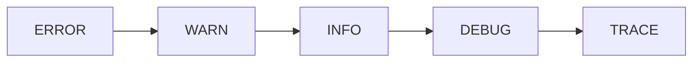
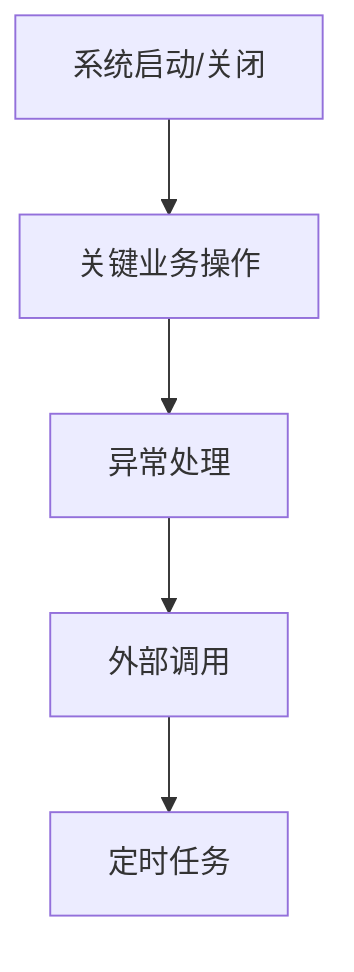

# 日志规范

## 1. 日志框架

### 1.1 使用 SLF4J + Logback

```java
// 推荐：使用 Lombok 注解
@Slf4j
@Service
public class CollectorService {
    
    public void createCollector(CollectorRequest request) {
        log.info("创建采集器: {}", request.getName());
    }
}

// 或者手动创建 Logger
public class CollectorService {
    private static final Logger log = LoggerFactory.getLogger(CollectorService.class);
}
```

---

## 2. 日志级别

### 2.1 级别定义



| 级别 | 说明 | 使用场景 |
|------|------|----------|
| ERROR | 错误 | 影响业务正常运行的问题 |
| WARN | 警告 | 潜在问题，但不影响运行 |
| INFO | 信息 | 关键业务节点信息 |
| DEBUG | 调试 | 开发调试信息 |
| TRACE | 追踪 | 详细追踪信息 |

### 2.2 级别使用规范

```java
// ERROR - 影响业务运行的问题
log.error("数据库连接失败: {}", e.getMessage(), e);

// WARN - 潜在问题
log.warn("配置项缺失，使用默认值: key={}", key);

// INFO - 关键业务节点
log.info("用户登录成功: userId={}", userId);

// DEBUG - 调试信息
log.debug("请求参数: {}", request);

// TRACE - 详细追踪
log.trace("方法执行开始: method={}, params={}", methodName, params);
```

---

## 3. 日志内容规范

### 3.1 日志格式

```
[时间] [级别] [线程] [类名] - 日志内容
```

示例：
```
2026-03-04 12:00:00.123 INFO [http-nio-8080-exec-1] c.z.o.c.s.CollectorService - 创建采集器: name=test
```

### 3.2 日志内容要求

| 要求 | 说明 |
|------|------|
| 包含关键信息 | 业务主键、用户ID等 |
| 信息可追踪 | 能通过日志定位问题 |
| 无敏感数据 | 密码、token等需脱敏 |
| 语言简洁 | 避免冗余信息 |

### 3.3 正确示例

```java
// 方法入口
public void createCollector(CollectorRequest request) {
    log.info("创建采集器开始: name={}, type={}", request.getName(), request.getType());
    
    try {
        // 业务逻辑
        Long id = doCreate(request);
        log.info("创建采集器成功: id={}, name={}", id, request.getName());
    } catch (Exception e) {
        log.error("创建采集器失败: name={}, error={}", request.getName(), e.getMessage(), e);
        throw e;
    }
}

// 关键分支
public void processAlarm(AlarmEvent event) {
    if (event.getLevel() == 1) {
        log.info("处理紧急报警: eventId={}, level={}", event.getId(), event.getLevel());
    } else {
        log.debug("处理普通报警: eventId={}, level={}", event.getId(), event.getLevel());
    }
}
```

### 3.4 错误示例

```java
// 错误：无关键信息
log.info("创建成功");

// 错误：敏感信息未脱敏
log.info("用户登录: password={}", password);

// 错误：日志内容过于简单
log.info("处理中");

// 错误：大量无用信息
log.info("处理请求: request=" + request.toString());  // 可能输出过多信息
```

---

## 4. 日志位置规范

### 4.1 必须记录日志的位置



| 位置 | 级别 | 内容 |
|------|------|------|
| 方法入口/出口 | DEBUG | 参数、返回值 |
| 关键业务操作 | INFO | 操作类型、关键数据 |
| 异常处理 | ERROR | 异常信息、堆栈 |
| 外部调用 | INFO | 调用目标、耗时 |
| 定时任务 | INFO | 开始/结束、处理数量 |

### 4.2 各层日志规范

```java
// Controller层
@PostMapping("/create")
public CommonResponse<Void> create(@RequestBody CollectorRequest request) {
    log.info("收到创建请求: name={}", request.getName());
    // ...
}

// Service层
public void createCollector(CollectorRequest request) {
    log.debug("开始创建采集器: request={}", request);
    // ...
    log.info("创建采集器成功: id={}", id);
}

// Manager层
public void saveCollector(CollectorEntity entity) {
    log.debug("保存采集器: entity={}", entity);
    // ...
}
```

---

## 5. 敏感数据脱敏

### 5.1 需要脱敏的数据

| 数据类型 | 示例 | 脱敏方式 |
|----------|------|----------|
| 密码 | password123 | ****** |
| 手机号 | 13800138000 | 138****8000 |
| 身份证 | 330102199001011234 | 330102********1234 |
| 银行卡 | 6222021234567890 | 6222****7890 |
| Token | eyJhbGciOi... | eyJ... |

### 5.2 脱敏工具类

```java
public class SensitiveDataUtil {
    
    /**
     * 手机号脱敏
     */
    public static String maskPhone(String phone) {
        if (phone == null || phone.length() < 7) {
            return phone;
        }
        return phone.substring(0, 3) + "****" + phone.substring(phone.length() - 4);
    }
    
    /**
     * 身份证脱敏
     */
    public static String maskIdCard(String idCard) {
        if (idCard == null || idCard.length() < 8) {
            return idCard;
        }
        return idCard.substring(0, 6) + "********" + idCard.substring(idCard.length() - 4);
    }
}

// 使用
log.info("用户注册: phone={}", SensitiveDataUtil.maskPhone(phone));
```

---

## 6. 日志性能优化

### 6.1 避免不必要的字符串拼接

```java
// 不推荐
log.info("处理结果: " + result.toString());

// 推荐：使用占位符
log.info("处理结果: {}", result);

// 推荐：条件判断
if (log.isDebugEnabled()) {
    log.debug("详细数据: {}", expensiveOperation());
}
```

### 6.2 异步日志配置

```xml
<!-- logback-spring.xml -->
<appender name="ASYNC_FILE" class="ch.qos.logback.classic.AsyncAppender">
    <appender-ref ref="FILE"/>
    <queueSize>512</queueSize>
    <discardingThreshold>0</discardingThreshold>
</appender>
```

---

## 7. 日志检查清单

- [ ] 使用正确的日志级别
- [ ] 日志内容包含关键信息
- [ ] 敏感数据已脱敏
- [ ] 异常日志包含堆栈
- [ ] 无不必要的日志
- [ ] 无System.out.println
- [ ] 无e.printStackTrace()
