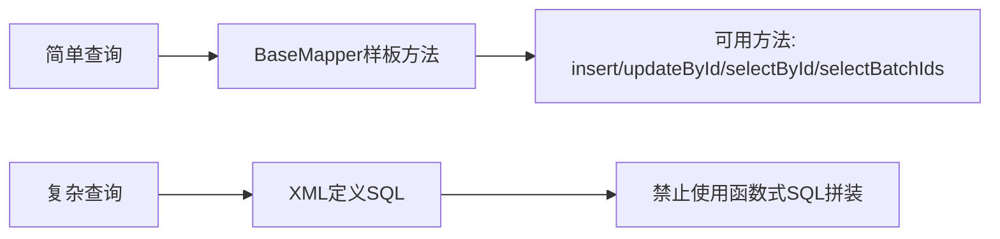
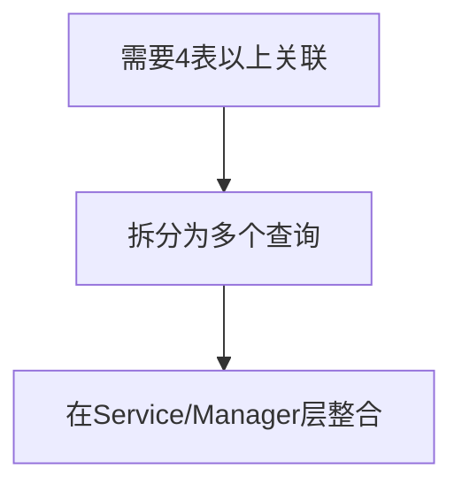

# MyBatis 使用规范

## 1. 基本原则

### 1.1 SQL编写方式优先级



### 1.2 可使用的BaseMapper方法

| 方法 | 说明 | 示例 |
|------|------|------|
| insert | 插入单条记录 | mapper.insert(entity) |
| updateById | 根据ID更新 | mapper.updateById(entity) |
| selectById | 根据ID查询 | mapper.selectById(id) |
| selectBatchIds | 根据ID列表批量查询 | mapper.selectBatchIds(idList) |

**注意**：其他BaseMapper方法禁止使用！

---

## 2. XML SQL编写规范

### 2.1 基本查询

```xml
<!-- 单条查询 -->
<select id="selectById" resultType="com.zjnut.ops.collector.dao.entity.CollectorEntity">
    SELECT id, name, config, status, create_time, modify_time
    FROM ops_collector
    WHERE id = #{id} AND del_flag = 0
</select>

<!-- 列表查询 -->
<select id="selectByCondition" resultType="com.zjnut.ops.collector.dao.entity.CollectorEntity">
    SELECT id, name, config, status, create_time
    FROM ops_collector
    WHERE del_flag = 0
    AND status = #{status}
    ORDER BY create_time DESC
</select>

<!-- 分页查询 -->
<select id="selectPage" resultType="com.zjnut.ops.collector.dao.entity.CollectorEntity">
    SELECT id, name, config, status
    FROM ops_collector
    WHERE del_flag = 0
    <if test="name != null and name != ''">
        AND name LIKE CONCAT('%', #{name}, '%')
    </if>
    ORDER BY create_time DESC
</select>
```

### 2.2 插入语句

```xml
<!-- 插入 -->
<insert id="insert" useGeneratedKeys="true" keyProperty="id">
    INSERT INTO ops_collector (
        name, config, status, create_time, modify_time, del_flag
    ) VALUES (
        #{name}, #{config}, #{status}, #{createTime}, #{modifyTime}, 0
    )
</insert>

<!-- 批量插入 -->
<insert id="batchInsert" useGeneratedKeys="true" keyProperty="id">
    INSERT INTO ops_collector (
        name, config, status, create_time, modify_time, del_flag
    ) VALUES
    <foreach collection="list" item="item" separator=",">
        (#{item.name}, #{item.config}, #{item.status}, #{item.createTime}, #{item.modifyTime}, 0)
    </foreach>
</insert>
```

### 2.3 更新语句

```xml
<!-- 更新 -->
<update id="updateById">
    UPDATE ops_collector
    SET name = #{name},
        config = #{config},
        status = #{status},
        modify_time = #{modifyTime}
    WHERE id = #{id} AND del_flag = 0
</update>

<!-- 逻辑删除 -->
<update id="deleteById">
    UPDATE ops_collector
    SET del_flag = 1,
        modify_time = #{modifyTime}
    WHERE id = #{id}
</update>
```

---

## 3. 禁止事项

### 3.1 禁止使用函数式SQL

```java
// 禁止！不要使用函数式SQL拼装
lambdaQuery()
    .eq(CollectorEntity::getStatus, 1)
    .like(CollectorEntity::getName, "test")
    .list();

// 禁止！不要使用QueryWrapper
new QueryWrapper<CollectorEntity>()
    .eq("status", 1)
    .like("name", "test");
```

### 3.2 禁止使用动态SQL（尽量避免）

```xml
<!-- 尽量避免！不要使用复杂的动态SQL -->
<select id="selectComplex" resultType="...">
    SELECT * FROM ops_collector
    WHERE del_flag = 0
    <if test="status != null">
        AND status = #{status}
    </if>
    <choose>
        <when test="type == 1">
            AND type = 'A'
        </when>
        <when test="type == 2">
            AND type = 'B'
        </when>
    </choose>
</select>
```

**说明**：动态SQL的逻辑应该在Service或Manager层处理，保持SQL简洁。

### 3.3 禁止物理删除

```xml
<!-- 禁止！不要使用物理删除 -->
<delete id="deleteById">
    DELETE FROM ops_collector WHERE id = #{id}
</delete>

<!-- 正确：使用逻辑删除 -->
<update id="deleteById">
    UPDATE ops_collector SET del_flag = 1 WHERE id = #{id}
</update>
```

---

## 4. 连表查询规范

### 4.1 最多支持3表关联

```xml
<!-- 允许：3表及以内 -->
<select id="selectWithRelated" resultType="...">
    SELECT a.*, b.name as relate_name, c.value as relate_value
    FROM ops_collector a
    LEFT JOIN ops_config b ON a.config_id = b.id
    LEFT JOIN ops_metric c ON a.metric_id = c.id
    WHERE a.del_flag = 0
</select>
```

### 4.2 超过3表需拆分



**示例**：
```java
// 拆分查询，在Manager层整合
public CollectorDetailBO getCollectorDetail(Long id) {
    CollectorEntity collector = collectorMapper.selectById(id);
    ConfigEntity config = configMapper.selectById(collector.getConfigId());
    List<MetricEntity> metrics = metricMapper.selectByCollectorId(id);
    
    return CollectorDetailBO.builder()
        .collector(collector)
        .config(config)
        .metrics(metrics)
        .build();
}
```

---

## 5. 索引使用建议

### 5.1 索引字段

```xml
<!-- 使用索引字段作为查询条件 -->
<select id="selectByStatus" resultType="...">
    SELECT * FROM ops_collector
    WHERE status = #{status}  <!-- status字段有索引 -->
    AND del_flag = 0
</select>
```

### 5.2 避免全表扫描

```xml
<!-- 避免：LIKE左侧通配符 -->
<select id="selectByName" resultType="...">
    SELECT * FROM ops_collector
    WHERE name LIKE CONCAT('%', #{name}, '%')  <!-- 无法使用索引 -->
</select>

<!-- 推荐：右侧通配符 -->
<select id="selectByName" resultType="...">
    SELECT * FROM ops_collector
    WHERE name LIKE CONCAT(#{name}, '%')  <!-- 可以使用索引 -->
</select>
```

---

## 6. 兼容性注意

### 6.1 MySQL与PostgreSQL兼容

| 项目 | MySQL | PostgreSQL | 建议 |
|------|-------|------------|------|
| 字符串连接 | CONCAT() | \|\| | 使用CONCAT() |
| 时间函数 | NOW() | NOW() | 兼容 |
| 分页 | LIMIT | LIMIT | 兼容 |
| 自增ID | AUTO_INCREMENT | SERIAL | 使用AUTO_INCREMENT |

### 6.2 避免不兼容用法

- 不使用存储过程
- 不使用数据库特定函数
- 不使用复杂的触发器
