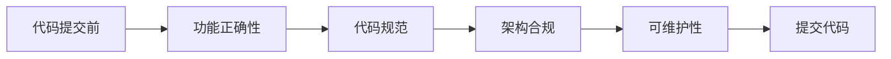

# 代码质量检查清单

## 1. 代码审查前自检

### 1.1 基础检查



### 1.2 检查清单

| 类别 | 检查项 | 是否通过 |
|------|--------|----------|
| **功能正确性** | 功能是否按预期工作 | ☐ |
| | 边界条件是否处理正确 | ☐ |
| | 异常情况是否处理 | ☐ |
| **代码规范** | 命名是否规范 | ☐ |
| | 注释是否完整 | ☐ |
| | 代码格式是否正确 | ☐ |
| **架构合规** | 分层调用是否正确 | ☐ |
| | 是否有反向调用 | ☐ |
| | 是否有跨层调用 | ☐ |
| **可维护性** | 代码是否易于理解 | ☐ |
| | 是否有重复代码 | ☐ |
| | 是否有硬编码 | ☐ |

---

## 2. 后端代码检查

### 2.1 分层架构检查

| 检查项 | 合规要求 | 检查方式 |
|--------|----------|----------|
| API → Service | 直接调用Service | 代码审查 |
| API → Manager | 简单场景可跳过Service | 代码审查 |
| API → DAO | **禁止** | 代码审查 + 依赖检查 |
| Service → Manager | 允许调用 | 代码审查 |
| Manager → Service | **禁止** | 代码审查 + 依赖检查 |

### 2.2 SQL检查

| 检查项 | 合规要求 | 检查方式 |
|--------|----------|----------|
| SQL位置 | 必须在XML中 | 文件检查 |
| 函数式SQL | **禁止** | 代码审查 |
| 动态SQL | 尽量避免 | 代码审查 |
| 连表数量 | ≤3个表 | SQL审查 |
| 物理删除 | **禁止** | SQL审查 |

### 2.3 命名检查

| 检查项 | 规范 | 示例 |
|--------|------|------|
| Controller | XXXController | AlarmRuleController |
| Service | XXXService / XXXServiceImpl | AlarmRuleService |
| Manager | XXXManager | AlarmEventManager |
| Entity | XXXEntity | AlarmRuleEntity |
| DTO | XXXDTO | AlarmEventDTO |
| BO | XXXBO | AlarmRuleModifyBO |

### 2.4 异常处理检查

```java
// 检查是否正确处理异常
try {
    // 业务逻辑
} catch (Exception e) {
    log.error("操作失败: {}", e.getMessage(), e);  // ✓ 日志记录
    throw new BusinessException("操作失败");        // ✓ 业务异常
}
```

---

## 3. 前端代码检查

### 3.1 Services层检查

| 检查项 | 合规要求 | 检查方式 |
|--------|----------|----------|
| 方法命名 | 以Service结尾 | 代码审查 |
| 返回类型 | 必须显式定义 | TypeScript检查 |
| 参数类型 | 必须显式定义，禁止any | TypeScript检查 |
| 类型定义 | 在data.d.ts中 | 文件检查 |

### 3.2 组件检查

| 检查项 | 合规要求 | 检查方式 |
|--------|----------|----------|
| 组件类型 | 函数组件 + Hooks | 代码审查 |
| 状态管理 | 使用Umi useModel | 代码审查 |
| 样式管理 | 使用Less | 文件检查 |
| 组件拆分 | 合理拆分，避免过大 | 代码审查 |

### 3.3 TypeScript检查

```typescript
// 禁止使用 any
const data: any = {};  // ✗

// 必须使用具体类型
interface DataType {
  name: string;
  value: number;
}
const data: DataType = { name: 'test', value: 1 };  // ✓
```

---

## 4. 通用检查

### 4.1 日志规范

| 场景 | 日志级别 | 要求 |
|------|----------|------|
| 方法入口 | DEBUG | 记录入参 |
| 业务分支 | INFO | 记录关键决策 |
| 异常处理 | ERROR | 记录异常堆栈 |
| 性能关键点 | INFO | 记录耗时 |

### 4.2 注释检查

| 类型 | 要求 | 示例 |
|------|------|------|
| 类注释 | 说明职责 | /&#42;&#42; 报警规则服务 &#42;/ |
| 方法注释 | 说明功能、参数、返回值 | JavaDoc格式 |
| 复杂逻辑 | 说明思路 | 行内注释 |
| TODO | 说明待办事项 | // TODO: 待实现xxx |

### 4.3 安全检查

| 检查项 | 要求 |
|--------|------|
| SQL注入 | 使用参数化查询 |
| XSS | 前端输入过滤 |
| 权限校验 | 接口添加权限注解 |
| 敏感数据 | 日志脱敏处理 |

---

## 5. 检查通过标准

### 5.1 必须通过的检查

- [ ] 功能正常运行
- [ ] 无编译错误/警告
- [ ] 无代码规范问题
- [ ] 无架构违规问题
- [ ] 无安全隐患

### 5.2 建议通过的检查

- [ ] 代码注释完整
- [ ] 无重复代码
- [ ] 无硬编码
- [ ] 有单元测试（核心逻辑）

---

## 6. 检查工具

| 工具 | 用途 | 配置文件 |
|------|------|----------|
| ESLint | 代码规范检查 | .eslintrc.js |
| Prettier | 代码格式化 | .prettierrc.js |
| TypeScript | 类型检查 | tsconfig.json |
| SonarQube | 代码质量分析 | sonar-project.properties |
