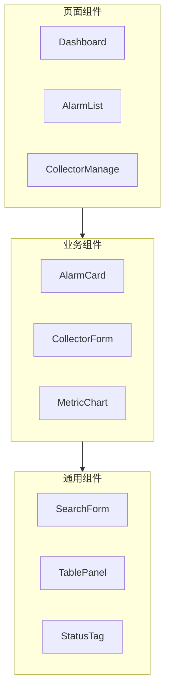
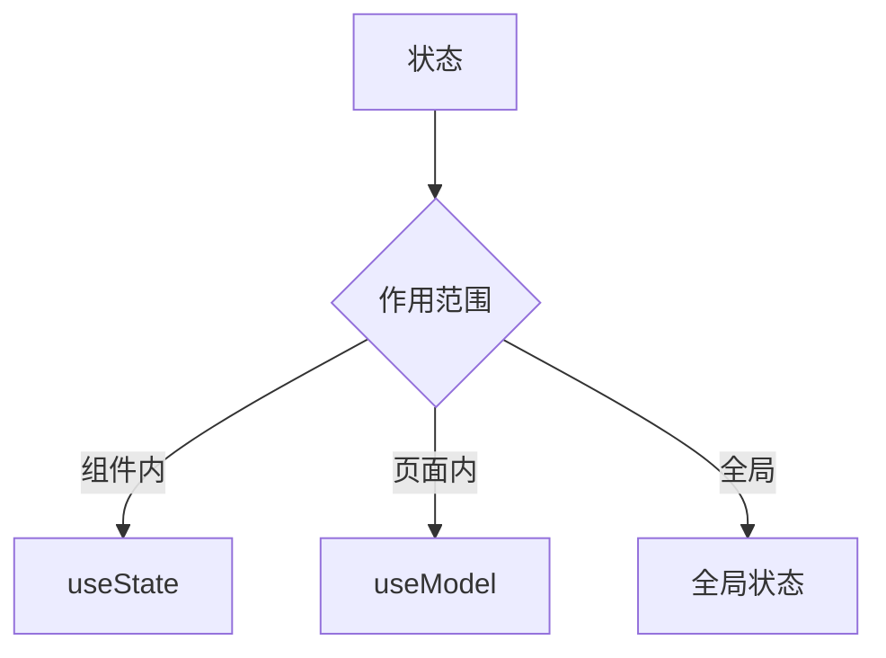

# 组件结构规范

## 1. 组件分类

### 1.1 组件层次结构



### 1.2 组件分类说明

| 类型 | 目录 | 说明 | 示例 |
|------|------|------|------|
| 页面组件 | pages/ | 路由级组件 | Dashboard、AlarmList |
| 业务组件 | components/business/ | 业务相关组件 | AlarmCard、CollectorForm |
| 通用组件 | components/common/ | 可复用基础组件 | SearchForm、StatusTag |
| 布局组件 | components/layout/ | 页面布局组件 | Header、Sidebar |

---

## 2. 组件目录结构

### 2.1 标准组件结构

```
src/components/
├── common/                        # 通用组件
│   ├── SearchForm/
│   │   ├── index.tsx             # 组件入口
│   │   ├── index.less            # 组件样式
│   │   └── types.d.ts            # 类型定义
│   └── StatusTag/
│       └── index.tsx
│
├── business/                      # 业务组件
│   ├── AlarmCard/
│   │   ├── index.tsx
│   │   ├── index.less
│   │   └── types.d.ts
│   └── CollectorForm/
│       └── index.tsx
│
└── layout/                        # 布局组件
    ├── Header/
    │   └── index.tsx
    └── Sidebar/
        └── index.tsx
```

### 2.2 页面组件结构

```
src/pages/
├── dashboard/                     # 首页仪表盘
│   ├── index.tsx                 # 页面入口
│   ├── index.less                # 页面样式
│   ├── components/               # 页面私有组件
│   │   └── MetricPanel/
│   │       └── index.tsx
│   └── hooks/                    # 页面私有Hooks
│       └── useDashboardData.ts
│
├── alarm/                         # 报警中心
│   ├── index.tsx
│   ├── index.less
│   └── components/
│       ├── AlarmList/
│       └── AlarmDetail/
│
└── collector/                     # 采集管理
    ├── index.tsx
    └── components/
```

---

## 3. 组件编码规范

### 3.1 组件模板

```typescript
// components/common/SearchForm/index.tsx
import React from 'react';
import { Form, Input, Button } from 'antd';
import type { SearchFormProps, SearchFormValues } from './types';
import './index.less';

/**
 * 通用搜索表单组件
 */
const SearchForm: React.FC<SearchFormProps> = ({
  fields,
  onSearch,
  onReset,
  loading = false,
}) => {
  const [form] = Form.useForm();

  const handleSearch = () => {
    const values = form.getFieldsValue();
    onSearch?.(values);
  };

  const handleReset = () => {
    form.resetFields();
    onReset?.();
  };

  return (
    <div className="search-form">
      <Form form={form} layout="inline">
        {fields.map((field) => (
          <Form.Item key={field.name} name={field.name} label={field.label}>
            <Input placeholder={field.placeholder} />
          </Form.Item>
        ))}
        <Form.Item>
          <Button type="primary" onClick={handleSearch} loading={loading}>
            搜索
          </Button>
          <Button onClick={handleReset} style={{ marginLeft: 8 }}>
            重置
          </Button>
        </Form.Item>
      </Form>
    </div>
  );
};

export default SearchForm;
```

### 3.2 类型定义

```typescript
// components/common/SearchForm/types.d.ts
import type { FormItemProps } from 'antd';

/**
 * 搜索字段配置
 */
export interface SearchField {
  /** 字段名 */
  name: string;
  /** 字段标签 */
  label: string;
  /** 占位文本 */
  placeholder?: string;
  /** 字段类型 */
  type?: 'input' | 'select' | 'date';
}

/**
 * 搜索表单属性
 */
export interface SearchFormProps {
  /** 搜索字段配置 */
  fields: SearchField[];
  /** 搜索回调 */
  onSearch?: (values: SearchFormValues) => void;
  /** 重置回调 */
  onReset?: () => void;
  /** 加载状态 */
  loading?: boolean;
}

/**
 * 搜索表单值
 */
export interface SearchFormValues {
  [key: string]: string | undefined;
}
```

---

## 4. 组件设计原则

### 4.1 单一职责


**示例**：
```typescript
// 推荐：职责单一
const UserAvatar: React.FC<{ url: string; size?: number }> = ({ url, size = 40 }) => {
  return ;
};

// 不推荐：职责过多
const UserInfoCard: React.FC = () => {
  // 包含头像、姓名、操作按钮、统计信息...
};
```

### 4.2 Props 设计

| 原则 | 说明 |
|------|------|
| 必填/可选明确 | 必填属性不加?，可选属性加? |
| 默认值合理 | 为可选属性提供合理默认值 |
| 类型准确 | 避免使用any，使用具体类型 |
| 命名清晰 | 属性名能表达含义 |

```typescript
interface ButtonProps {
  /** 按钮类型 - 必填 */
  type: 'primary' | 'default' | 'danger';
  /** 按钮文本 - 必填 */
  children: React.ReactNode;
  /** 是否禁用 - 可选，默认false */
  disabled?: boolean;
  /** 是否加载中 - 可选，默认false */
  loading?: boolean;
  /** 点击回调 - 可选 */
  onClick?: () => void;
}
```

### 4.3 状态管理



```typescript
// 组件内状态：使用 useState
const [visible, setVisible] = useState(false);

// 页面级状态：使用 useModel (Umi)
const { currentUser, setCurrentUser } = useModel('user');

// 避免：过度使用全局状态
```

---

## 5. 组件通信

### 5.1 父子组件通信


```typescript
// 父组件
const Parent: React.FC = () => {
  const [data, setData] = useState<string[]>([]);
  
  const handleAdd = (item: string) => {
    setData([...data, item]);
  };
  
  return <Child onAdd={handleAdd} />;
};

// 子组件
interface ChildProps {
  onAdd: (item: string) => void;
}

const Child: React.FC<ChildProps> = ({ onAdd }) => {
  return <Button onClick={() => onAdd('new')}>添加</Button>;
};
```

### 5.2 兄弟组件通信


```typescript
// 通过共同父组件传递状态
const Parent: React.FC = () => {
  const [value, setValue] = useState('');
  
  return (
    <>
      <ComponentA onChange={setValue} />
      <ComponentB value={value} />
    </>
  );
};
```

---

## 6. 组件检查清单

### 6.1 结构检查

- [ ] 组件目录结构规范
- [ ] 文件命名规范
- [ ] 类型定义完整

### 6.2 代码检查

- [ ] 使用函数组件 + Hooks
- [ ] Props 类型定义完整
- [ ] 无 any 类型
- [ ] 组件职责单一

### 6.3 性能检查

- [ ] 合理使用 useMemo
- [ ] 合理使用 useCallback
- [ ] 避免不必要的重渲染
