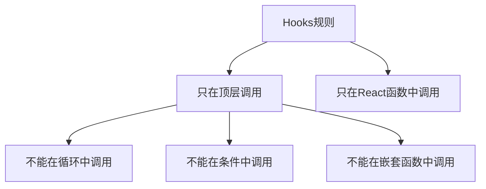

# 自定义 Hooks 规范

## 1. Hooks 基础

### 1.1 常用内置 Hooks

| Hook | 用途 | 说明 |
|------|------|------|
| useState | 状态管理 | 函数组件的状态 |
| useEffect | 副作用处理 | 替代生命周期 |
| useCallback | 函数缓存 | 避免函数重建 |
| useMemo | 值缓存 | 避免重复计算 |
| useRef | 引用管理 | 获取DOM或存储值 |
| useModel | 全局状态 | Umi状态管理 |

### 1.2 Hooks 使用规则



---

## 2. 自定义 Hook 规范

### 2.1 命名规范

```typescript
// 命名必须以 use 开头
function useUserList() { }
function useCollectorForm() { }
function useTableData() { }

// 不推荐：不以 use 开头
function getUserList() { }  // 不推荐
```

### 2.2 基础结构

```typescript
// src/hooks/useTableData.ts
import { useState, useCallback } from 'react';

interface UseTableDataOptions<T> {
  /** 数据获取函数 */
  fetchFn: (params: QueryParams) => Promise<PageResult<T>>;
  /** 默认分页参数 */
  defaultParams?: QueryParams;
}

interface UseTableDataResult<T> {
  /** 数据列表 */
  list: T[];
  /** 总数 */
  total: number;
  /** 加载状态 */
  loading: boolean;
  /** 当前页 */
  current: number;
  /** 每页条数 */
  pageSize: number;
  /** 刷新数据 */
  refresh: () => void;
  /** 翻页 */
  changePage: (page: number, pageSize: number) => void;
}

/**
 * 表格数据 Hook
 */
export function useTableData<T>(
  options: UseTableDataOptions<T>
): UseTableDataResult<T> {
  const { fetchFn, defaultParams = { current: 1, pageSize: 10 } } = options;

  const [list, setList] = useState<T[]>([]);
  const [total, setTotal] = useState(0);
  const [loading, setLoading] = useState(false);
  const [params, setParams] = useState<QueryParams>(defaultParams);

  const fetchData = useCallback(async () => {
    setLoading(true);
    try {
      const result = await fetchFn(params);
      setList(result.data.list);
      setTotal(result.data.total);
    } finally {
      setLoading(false);
    }
  }, [fetchFn, params]);

  useEffect(() => {
    fetchData();
  }, [fetchData]);

  const refresh = useCallback(() => {
    fetchData();
  }, [fetchData]);

  const changePage = useCallback((page: number, pageSize: number) => {
    setParams((prev) => ({ ...prev, current: page, pageSize }));
  }, []);

  return {
    list,
    total,
    loading,
    current: params.current,
    pageSize: params.pageSize,
    refresh,
    changePage,
  };
}
```

---

## 3. 常用自定义 Hooks

### 3.1 useRequest - 请求处理

```typescript
// src/hooks/useRequest.ts
import { useState, useCallback } from 'react';

interface UseRequestResult<T, P> {
  data: T | null;
  loading: boolean;
  error: Error | null;
  run: (params: P) => Promise<void>;
}

export function useRequest<T, P>(
  fetchFn: (params: P) => Promise<T>
): UseRequestResult<T, P> {
  const [data, setData] = useState<T | null>(null);
  const [loading, setLoading] = useState(false);
  const [error, setError] = useState<Error | null>(null);

  const run = useCallback(async (params: P) => {
    setLoading(true);
    setError(null);
    try {
      const result = await fetchFn(params);
      setData(result);
    } catch (e) {
      setError(e as Error);
    } finally {
      setLoading(false);
    }
  }, [fetchFn]);

  return { data, loading, error, run };
}

// 使用示例
const { data, loading, run } = useRequest(getUserDetailService);
```

### 3.2 useToggle - 开关状态

```typescript
// src/hooks/useToggle.ts
import { useState, useCallback } from 'react';

export function useToggle(
  initialValue = false
): [boolean, () => void, (value: boolean) => void] {
  const [value, setValue] = useState(initialValue);

  const toggle = useCallback(() => {
    setValue((v) => !v);
  }, []);

  const set = useCallback((v: boolean) => {
    setValue(v);
  }, []);

  return [value, toggle, set];
}

// 使用示例
const [visible, toggleVisible, setVisible] = useToggle();
```

### 3.3 useDebounce - 防抖

```typescript
// src/hooks/useDebounce.ts
import { useState, useEffect } from 'react';

export function useDebounce<T>(value: T, delay = 300): T {
  const [debouncedValue, setDebouncedValue] = useState<T>(value);

  useEffect(() => {
    const timer = setTimeout(() => {
      setDebouncedValue(value);
    }, delay);

    return () => {
      clearTimeout(timer);
    };
  }, [value, delay]);

  return debouncedValue;
}

// 使用示例
const [searchText, setSearchText] = useState('');
const debouncedText = useDebounce(searchText, 500);

useEffect(() => {
  if (debouncedText) {
    // 执行搜索
  }
}, [debouncedText]);
```

### 3.4 useLocalStorage - 本地存储

```typescript
// src/hooks/useLocalStorage.ts
import { useState, useCallback } from 'react';

export function useLocalStorage<T>(
  key: string,
  initialValue: T
): [T, (value: T) => void] {
  const [storedValue, setStoredValue] = useState<T>(() => {
    try {
      const item = localStorage.getItem(key);
      return item ? JSON.parse(item) : initialValue;
    } catch {
      return initialValue;
    }
  });

  const setValue = useCallback((value: T) => {
    setStoredValue(value);
    localStorage.setItem(key, JSON.stringify(value));
  }, [key]);

  return [storedValue, setValue];
}

// 使用示例
const [theme, setTheme] = useLocalStorage('theme', 'light');
```

---

## 4. Hooks 最佳实践

### 4.1 依赖数组

```typescript
// 推荐：正确声明依赖
useEffect(() => {
  fetchData(id);
}, [id, fetchData]);  // 包含所有依赖

// 不推荐：遗漏依赖
useEffect(() => {
  fetchData(id);
}, []);  // 缺少 id 依赖
```

### 4.2 清理副作用

```typescript
// 推荐：清理定时器、订阅等
useEffect(() => {
  const timer = setInterval(() => {
    // ...
  }, 1000);

  return () => {
    clearInterval(timer);  // 清理
  };
}, []);
```

### 4.3 避免过度使用

```typescript
// 不推荐：简单计算不需要 useMemo
const total = useMemo(() => a + b, [a, b]);

// 推荐：直接计算
const total = a + b;

// 推荐：复杂计算使用 useMemo
const sortedList = useMemo(() => {
  return [...list].sort(complexSortFn);
}, [list]);
```

---

## 5. Hooks 检查清单

### 5.1 使用规范

- [ ] 自定义 Hook 以 use 开头
- [ ] 只在顶层调用 Hooks
- [ ] 依赖数组完整

### 5.2 性能优化

- [ ] 合理使用 useMemo
- [ ] 合理使用 useCallback
- [ ] 及时清理副作用
