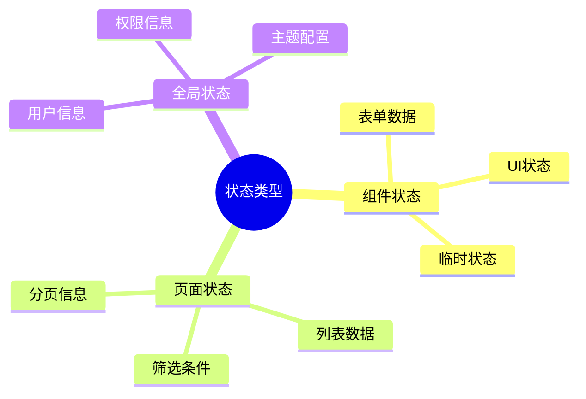

# 状态管理规范

## 1. 状态分类

### 1.1 状态类型



### 1.2 状态管理方案

| 状态类型 | 管理方案 | 说明 |
|----------|----------|------|
| 组件状态 | useState | 仅组件内部使用 |
| 页面状态 | useModel (Umi) | 页面级共享 |
| 全局状态 | useModel (Umi) | 跨页面共享 |

---

## 2. useState 使用规范

### 2.1 基础用法

```typescript
import { useState } from 'react';

const Counter: React.FC = () => {
  // 简单状态
  const [count, setCount] = useState<number>(0);
  
  // 对象状态
  const [user, setUser] = useState<User | null>(null);
  
  // 数组状态
  const [items, setItems] = useState<string[]>([]);
  
  return (
    <div>
      <p>Count: {count}</p>
      <Button onClick={() => setCount(count + 1)}>增加</Button>
    </div>
  );
};
```

### 2.2 对象状态更新

```typescript
// 推荐：使用展开运算符
setUser({
  ...user,
  name: '新名称',
});

// 推荐：使用函数式更新
setUser((prev) => ({
  ...prev,
  name: '新名称',
}));

// 不推荐：直接修改对象
user.name = '新名称';  // 不推荐
setUser(user);
```

### 2.3 数组状态更新

```typescript
// 添加元素
setItems([...items, newItem]);

// 删除元素
setItems(items.filter((_, index) => index !== removeIndex));

// 更新元素
setItems(items.map((item, index) => 
  index === updateIndex ? { ...item, name: '新名称' } : item
));

// 清空数组
setItems([]);
```

---

## 3. Umi useModel 使用规范

### 3.1 创建 Model

```typescript
// src/models/user.ts
import { useState, useCallback } from 'react';

interface User {
  id: number;
  name: string;
  role: string;
}

export default function useUser() {
  const [currentUser, setCurrentUser] = useState<User | null>(null);
  const [loading, setLoading] = useState(false);

  const fetchUser = useCallback(async (id: number) => {
    setLoading(true);
    try {
      const user = await getUserService(id);
      setCurrentUser(user);
    } finally {
      setLoading(false);
    }
  }, []);

  const logout = useCallback(() => {
    setCurrentUser(null);
  }, []);

  return {
    currentUser,
    loading,
    fetchUser,
    logout,
    setCurrentUser,
  };
}
```

### 3.2 使用 Model

```typescript
// 在组件中使用
import { useModel } from '@umijs/max';

const UserProfile: React.FC = () => {
  const { currentUser, loading, fetchUser, logout } = useModel('user');

  useEffect(() => {
    fetchUser(1);
  }, [fetchUser]);

  if (loading) return <Spin />;
  
  return (
    <div>
      <p>用户名: {currentUser?.name}</p>
      <Button onClick={logout}>退出登录</Button>
    </div>
  );
};
```

### 3.3 Model 最佳实践

```typescript
// 推荐：将相关状态放在一起
export default function useCollector() {
  const [list, setList] = useState<Collector[]>([]);
  const [total, setTotal] = useState(0);
  const [loading, setLoading] = useState(false);
  const [params, setParams] = useState<QueryParams>({
    current: 1,
    pageSize: 10,
  });

  // 封装业务逻辑
  const fetchList = useCallback(async () => {
    setLoading(true);
    try {
      const result = await getCollectorListService(params);
      setList(result.data.list);
      setTotal(result.data.total);
    } finally {
      setLoading(false);
    }
  }, [params]);

  // 封装操作方法
  const changePage = useCallback((page: number, pageSize: number) => {
    setParams((prev) => ({ ...prev, current: page, pageSize }));
  }, []);

  return {
    list,
    total,
    loading,
    params,
    fetchList,
    changePage,
  };
}
```

---

## 4. 性能优化

### 4.1 useMemo 使用

```typescript
import { useMemo } from 'react';

const Component: React.FC<{ items: Item[] }> = ({ items }) => {
  // 缓存计算结果
  const sortedItems = useMemo(() => {
    return [...items].sort((a, b) => a.name.localeCompare(b.name));
  }, [items]);

  // 缓存复杂计算
  const statistics = useMemo(() => {
    return {
      total: items.length,
      active: items.filter((i) => i.status === 1).length,
    };
  }, [items]);

  return <List items={sortedItems} />;
};
```

### 4.2 useCallback 使用

```typescript
import { useCallback } from 'react';

const Component: React.FC = () => {
  const [items, setItems] = useState<Item[]>([]);

  // 缓存回调函数
  const handleDelete = useCallback((id: number) => {
    setItems((prev) => prev.filter((item) => item.id !== id));
  }, []);

  // 依赖变化时重新创建
  const handleUpdate = useCallback(
    (id: number, data: Partial<Item>) => {
      setItems((prev) =>
        prev.map((item) =>
          item.id === id ? { ...item, ...data } : item
        )
      );
    },
    []
  );

  return <ItemList items={items} onDelete={handleDelete} onUpdate={handleUpdate} />;
};
```

### 4.3 避免不必要的状态

```typescript
// 不推荐：派生状态存入state
const [items, setItems] = useState<Item[]>([]);
const [activeCount, setActiveCount] = useState(0);

useEffect(() => {
  setActiveCount(items.filter((i) => i.status === 1).length);
}, [items]);

// 推荐：直接计算派生值
const [items, setItems] = useState<Item[]>([]);
const activeCount = items.filter((i) => i.status === 1).length;
```

---

## 5. 状态管理检查清单

### 5.1 选择正确的方案

- [ ] 组件内状态使用 useState
- [ ] 页面级状态使用 useModel
- [ ] 全局状态使用 useModel

### 5.2 避免的问题

- [ ] 无过度使用全局状态
- [ ] 无重复的状态定义
- [ ] 无不同步的状态
- [ ] 无不必要的派生状态

### 5.3 性能优化

- [ ] 合理使用 useMemo
- [ ] 合理使用 useCallback
- [ ] 避免在渲染中创建新对象/数组
