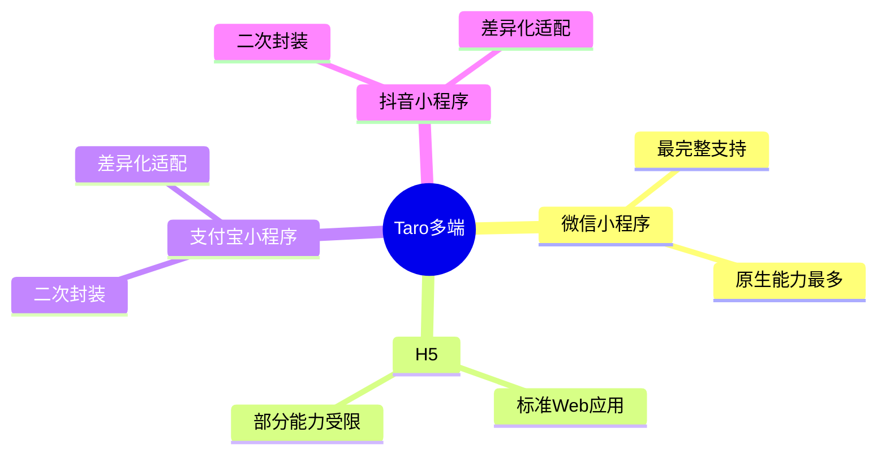

# 跨平台兼容性处理

## 1. 平台差异

### 1.1 支持平台



### 1.2 平台差异列表

| 能力 | 微信小程序 | H5 | 支付宝小程序 |
|------|-----------|-----|-------------|
| 扫码 | ✓ | ✗ | ✓ |
| 支付 | ✓ | 部分 | ✓ |
| 登录 | ✓ | OAuth | ✓ |
| 存储 | 10MB | 5MB | 10MB |
| 分享 | ✓ | ✓ | ✓ |

---

## 2. 平台判断

### 2.1 环境判断

```typescript
import Taro from '@tarojs/taro';

// 判断当前平台
const platform = {
  isWeapp: Taro.getEnv() === Taro.ENV_TYPE.WEAPP,
  isH5: Taro.getEnv() === Taro.ENV_TYPE.WEB,
  isAlipay: Taro.getEnv() === Taro.ENV_TYPE.ALIPAY,
  isTT: Taro.getEnv() === Taro.ENV_TYPE.TT,
};

// 使用示例
if (platform.isWeapp) {
  // 微信小程序特有逻辑
}
```

### 2.2 条件编译

```typescript
// 代码中条件编译
if (process.env.TARO_ENV === 'weapp') {
  // 仅在微信小程序执行
}

if (process.env.TARO_ENV === 'h5') {
  // 仅在H5执行
}

// 组件条件渲染
<View>
  {process.env.TARO_ENV === 'weapp' && <WeappOnlyComponent />}
  {process.env.TARO_ENV === 'h5' && <H5OnlyComponent />}
</View>
```

---

## 3. API 差异处理

### 3.1 统一封装

```typescript
// utils/platform.ts
import Taro from '@tarojs/taro';

/**
 * 扫码功能
 */
export const scanCode = (): Promise<string> => {
  return new Promise((resolve, reject) => {
    if (Taro.getEnv() === Taro.ENV_TYPE.WEAPP) {
      Taro.scanCode({
        success: (res) => resolve(res.result),
        fail: reject,
      });
    } else if (Taro.getEnv() === Taro.ENV_TYPE.WEB) {
      // H5 提示不支持
      Taro.showToast({
        title: 'H5不支持扫码',
        icon: 'none',
      });
      reject(new Error('H5不支持扫码'));
    } else {
      // 其他平台调用原生API
      Taro.scanCode({
        success: (res) => resolve(res.result),
        fail: reject,
      });
    }
  });
};

/**
 * 支付功能
 */
export const pay = (params: PayParams): Promise<void> => {
  const env = Taro.getEnv();
  
  if (env === Taro.ENV_TYPE.WEAPP) {
    return Taro.requestPayment({
      ...params,
      provider: 'wxpay',
    });
  } else if (env === Taro.ENV_TYPE.ALIPAY) {
    return Taro.requestPayment({
      ...params,
      provider: 'alipay',
    });
  } else {
    // H5 使用其他支付方式
    return h5Pay(params);
  }
};
```

### 3.2 登录差异处理

```typescript
// services/auth.ts
import Taro from '@tarojs/taro';

/**
 * 获取登录凭证
 */
export const login = async (): Promise<string> => {
  const env = Taro.getEnv();
  
  if (env === Taro.ENV_TYPE.WEAPP) {
    const { code } = await Taro.login();
    return code;
  } else if (env === Taro.ENV_TYPE.ALIPAY) {
    const { authCode } = await Taro.getAuthCode();
    return authCode;
  } else {
    // H5 使用 OAuth 登录
    return h5OAuthLogin();
  }
};
```

---

## 4. 样式差异处理

### 4.1 单位差异

```scss
// 使用px，Taro会自动转换
.title {
  font-size: 32px;  // 自动转换为对应平台的单位
}

// 需要固定单位时使用rpx（仅小程序）
.fixed-size {
  width: 100rpx;
  height: 100rpx;
}
```

### 4.2 样式条件编译

```scss
/* 样式条件编译 */
.title {
  font-size: 32px;
  
  /* #ifdef H5 */
  color: blue;
  /* #endif */
  
  /* #ifdef WEAPP */
  color: green;
  /* #endif */
}
```

---

## 5. 组件差异处理

### 5.1 条件组件

```typescript
// components/PlatformButton/index.tsx
import { View, Button, OpenData } from '@tarojs/components';
import Taro from '@tarojs/taro';

interface PlatformButtonProps {
  onGetUserInfo?: (userInfo: UserInfo) => void;
}

/**
 * 跨平台用户信息按钮
 */
const PlatformButton: React.FC<PlatformButtonProps> = ({ onGetUserInfo }) => {
  // 微信小程序使用 open-type
  if (Taro.getEnv() === Taro.ENV_TYPE.WEAPP) {
    return (
      <Button
        open-type="getUserInfo"
        onGetUserInfo={(e) => {
          onGetUserInfo?.(e.detail.userInfo);
        }}
      >
        获取用户信息
      </Button>
    );
  }
  
  // H5 使用其他方式
  if (Taro.getEnv() === Taro.ENV_TYPE.WEB) {
    return (
      <Button onClick={() => h5GetUserInfo(onGetUserInfo)}>
        获取用户信息
      </Button>
    );
  }
  
  // 默认按钮
  return <Button>获取用户信息</Button>;
};
```

### 5.2 平台适配器

```typescript
// adapters/platform.ts

interface PlatformAdapter {
  getUserInfo: () => Promise<UserInfo>;
  scanCode: () => Promise<string>;
  pay: (params: PayParams) => Promise<void>;
}

class WeappAdapter implements PlatformAdapter {
  async getUserInfo(): Promise<UserInfo> {
    const { userInfo } = await Taro.getUserInfo();
    return userInfo;
  }
  
  async scanCode(): Promise<string> {
    const { result } = await Taro.scanCode();
    return result;
  }
  
  async pay(params: PayParams): Promise<void> {
    await Taro.requestPayment({ provider: 'wxpay', ...params });
  }
}

class H5Adapter implements PlatformAdapter {
  async getUserInfo(): Promise<UserInfo> {
    // H5 获取用户信息逻辑
  }
  
  async scanCode(): Promise<string> {
    throw new Error('H5不支持扫码');
  }
  
  async pay(params: PayParams): Promise<void> {
    // H5 支付逻辑
  }
}

// 根据平台返回适配器
export const getPlatformAdapter = (): PlatformAdapter => {
  const env = Taro.getEnv();
  switch (env) {
    case Taro.ENV_TYPE.WEAPP:
      return new WeappAdapter();
    case Taro.ENV_TYPE.WEB:
      return new H5Adapter();
    default:
      return new WeappAdapter();
  }
};
```

---

## 6. 兼容性检查清单

### 6.1 功能兼容

- [ ] 所有API调用已做平台判断
- [ ] 不支持的API有降级方案
- [ ] 登录流程各平台可用
- [ ] 支付流程各平台可用

### 6.2 样式兼容

- [ ] 使用px单位自动转换
- [ ] 避免使用平台特有CSS
- [ ] 测试各平台显示效果

### 6.3 测试兼容

- [ ] 微信小程序测试通过
- [ ] H5测试通过
- [ ] 其他目标平台测试通过
