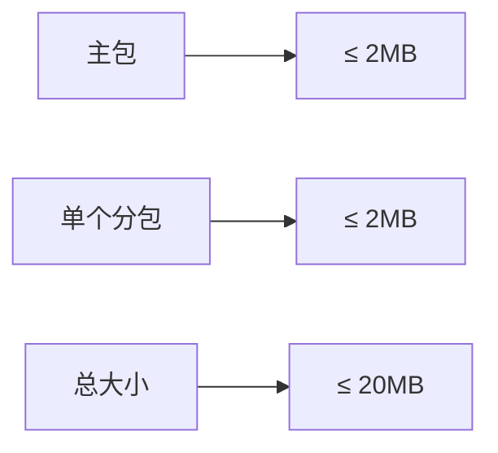
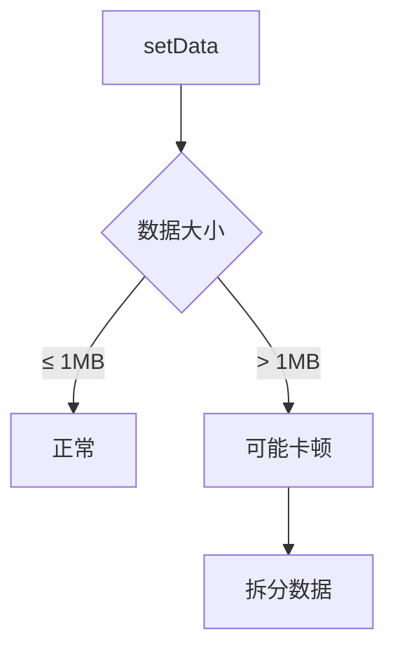

# 小程序限制与适配

## 1. 包大小限制

### 1.1 限制说明



| 类型 | 限制 | 说明 |
|------|------|------|
| 主包 | 2MB | 包含首页和公共资源 |
| 单个分包 | 2MB | 每个分包独立限制 |
| 总大小 | 20MB | 主包+所有分包 |

### 1.2 优化策略

```typescript
// 1. 分包加载
// app.config.ts
export default defineAppConfig({
  pages: [
    'pages/home/index',      // 主包
    'pages/alarm/index',     // 主包
  ],
  subpackages: [
    {
      root: 'subpackages/report',
      pages: ['list/index'],  // 分包
    },
  ],
});

// 2. 分包异步化
// 主包引用分包组件
const ReportPage = Taro.lazy(() => import('@/subpackages/report/list'));
```

### 1.3 静态资源处理

```typescript
// 静态资源使用CDN
const IMAGE_URL = 'https://cdn.example.com/images/';

// 不推荐：本地大图片
<Image src={require('@/assets/large-image.png')} />

// 推荐：使用CDN
<Image src={`${IMAGE_URL}icon.png`} />
```

---

## 2. 请求限制

### 2.1 并发限制

| 平台 | 并发限制 |
|------|----------|
| 微信小程序 | 10个 |
| H5 | 浏览器限制 |

### 2.2 请求优化

```typescript
// utils/requestQueue.ts

class RequestQueue {
  private queue: RequestTask[] = [];
  private running = 0;
  private maxConcurrent = 10;

  async request(options: RequestOption): Promise<any> {
    return new Promise((resolve, reject) => {
      const task = {
        options,
        resolve,
        reject,
      };

      this.queue.push(task);
      this.processQueue();
    });
  }

  private processQueue() {
    while (this.running < this.maxConcurrent && this.queue.length > 0) {
      const task = this.queue.shift()!;
      this.running++;

      Taro.request(task.options)
        .then(task.resolve)
        .catch(task.reject)
        .finally(() => {
          this.running--;
          this.processQueue();
        });
    }
  }
}

export const requestQueue = new RequestQueue();
```

### 2.3 域名配置

```json
// project.config.json
{
  "setting": {
    "urlCheck": true
  }
}

// 需要在小程序后台配置合法域名
// request合法域名
// uploadFile合法域名
// downloadFile合法域名
```

---

## 3. 存储限制

### 3.1 存储限制

| 平台 | 限制 |
|------|------|
| 微信小程序 | 10MB |
| 支付宝小程序 | 10MB |
| H5 | 5MB（localStorage） |

### 3.2 存储优化

```typescript
// utils/storage.ts

/**
 * 存储管理
 */
class StorageManager {
  private prefix = 'app_';

  /**
   * 设置存储（带过期时间）
   */
  set(key: string, value: any, expireTime?: number) {
    const data = {
      value,
      expireTime: expireTime ? Date.now() + expireTime : null,
    };
    Taro.setStorageSync(this.prefix + key, JSON.stringify(data));
  }

  /**
   * 获取存储（自动检查过期）
   */
  get<T>(key: string): T | null {
    const data = Taro.getStorageSync(this.prefix + key);
    if (!data) return null;

    try {
      const { value, expireTime } = JSON.parse(data);
      if (expireTime && Date.now() > expireTime) {
        this.remove(key);
        return null;
      }
      return value;
    } catch {
      return null;
    }
  }

  /**
   * 清理过期存储
   */
  clearExpired() {
    const info = Taro.getStorageInfoSync();
    info.keys.forEach((key) => {
      if (key.startsWith(this.prefix)) {
        this.get(key.replace(this.prefix, '')); // 自动清理过期
      }
    });
  }
}

export const storage = new StorageManager();
```

---

## 4. 渲染限制

### 4.1 setData 限制



### 4.2 数据优化

```typescript
// 不推荐：一次传输大量数据
this.setState({
  list: largeDataArray,  // 可能超过限制
});

// 推荐：分页加载
this.setState({
  list: currentPageData,
  hasMore: hasMoreData,
});

// 推荐：虚拟列表
import { VirtualList } from '@tarojs/components';

<VirtualList
  height={500}
  itemCount={list.length}
  itemSize={50}
  item={ItemComponent}
/>
```

---

## 5. API 限制

### 5.1 需要授权的API

| API | 授权方式 |
|-----|----------|
| getUserInfo | button open-type |
| getLocation | scope.userLocation |
| chooseAddress | scope.address |
| chooseImage | scope.album |

### 5.2 授权处理

```typescript
// utils/permission.ts

/**
 * 检查并请求授权
 */
export const checkPermission = async (scope: string): Promise<boolean> => {
  try {
    const { authSetting } = await Taro.getSetting();
    
    if (authSetting[scope] === false) {
      // 用户拒绝过，引导去设置页
      await Taro.showModal({
        title: '提示',
        content: '需要您授权才能使用该功能',
        confirmText: '去授权',
      });
      await Taro.openSetting();
      return false;
    }
    
    if (authSetting[scope] === true) {
      return true;
    }
    
    // 未授权，请求授权
    return true;
  } catch {
    return false;
  }
};

// 使用示例
const canUseLocation = await checkPermission('scope.userLocation');
if (canUseLocation) {
  const location = await Taro.getLocation();
}
```

---

## 6. 性能优化

### 6.1 首屏优化

```typescript
// 1. 减少首屏数据
useEffect(() => {
  // 只加载首屏必要数据
  fetchEssentialData();
}, []);

// 2. 延迟加载非必要数据
useEffect(() => {
  setTimeout(() => {
    fetchSecondaryData();
  }, 1000);
}, []);

// 3. 骨架屏
{loading ? <Skeleton /> : <Content />}
```

### 6.2 图片优化

```typescript
// 1. 使用webp格式
<Image src={`${imageUrl}.webp`} />

// 2. 图片懒加载
<Image lazyLoad src={imageUrl} />

// 3. 使用CDN图片处理
// 按需加载合适尺寸
const thumbUrl = `${imageUrl}?x-oss-process=image/resize,w_200`;
```

---

## 7. 限制检查清单

### 7.1 包大小

- [ ] 主包小于2MB
- [ ] 分包独立小于2MB
- [ ] 总大小小于20MB
- [ ] 静态资源使用CDN

### 7.2 请求

- [ ] 并发不超过10个
- [ ] 配置合法域名
- [ ] 请求有超时处理

### 7.3 存储

- [ ] 存储数据小于限制
- [ ] 实现过期清理
- [ ] 敏感数据加密

### 7.4 渲染

- [ ] setData数据量合理
- [ ] 大列表使用虚拟列表
- [ ] 避免频繁setState
