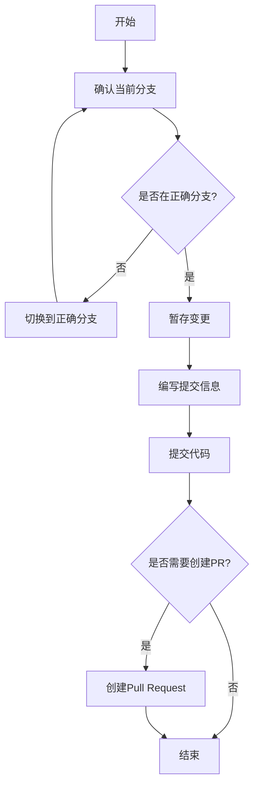
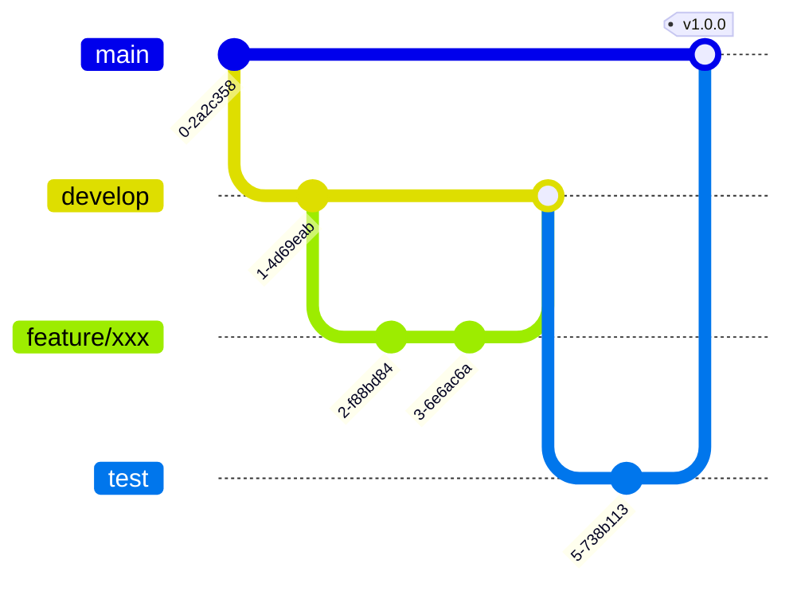
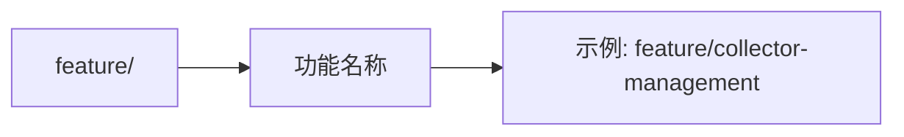
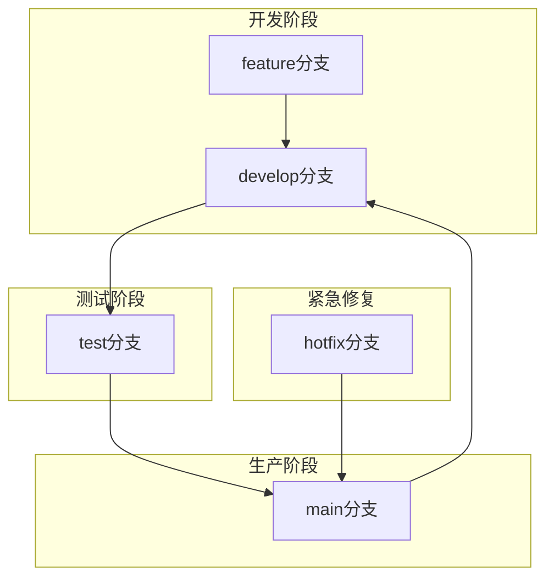

# 版本管理

> **触发场景**：需要进行代码提交或版本管理
> **前置条件**：代码已通过审查
> **输出工件**：提交记录、PR记录

---

## 1. 执行前检查

- [ ] 代码已通过审查
- [ ] 自测已通过
- [ ] 了解当前分支策略

---

## 2. 执行流程



---

## 3. 分支策略

### 3.1 分支类型



| 分支类型 | 命名规范 | 用途 | 生命周期 |
|----------|----------|------|----------|
| **master/main** | main | 生产主干分支 | 永久 |
| **test** | test | 测试环境集成分支 | 永久 |
| **develop** | develop | 开发环境集成分支 | 永久 |
| **feature** | feature/功能名 | 本地开发特性分支 | 临时 |
| **hotfix** | hotfix/问题描述 | 紧急修复分支 | 临时 |

### 3.2 分支命名规范



| 分支类型 | 命名格式 | 示例 |
|----------|----------|------|
| feature | feature/功能名称 | feature/collector-management |
| hotfix | hotfix/问题描述 | hotfix/fix-login-bug |
| bugfix | bugfix/问题描述 | bugfix/fix-query-error |

### 3.3 分支流转规则



**流转规则**：
1. feature → develop：功能开发完成，合并到开发环境
2. develop → test：开发测试完成，合并到测试环境
3. test → main：测试通过，合并到生产环境
4. hotfix → main → develop：紧急修复，同步到各环境

---

## 4. 提交规范

### 4.1 Commit Message 格式

```
<type>(<scope>): <subject>

<body>

<footer>
```

### 4.2 Type 类型

| Type | 说明 | 示例 |
|------|------|------|
| feat | 新功能 | feat(collector): 新增采集器管理功能 |
| fix | Bug修复 | fix(auth): 修复登录失败问题 |
| docs | 文档更新 | docs: 更新README |
| style | 代码格式 | style: 格式化代码 |
| refactor | 重构 | refactor(collector): 重构采集逻辑 |
| test | 测试 | test: 添加单元测试 |
| chore | 构建/工具 | chore: 更新构建脚本 |

### 4.3 Scope 范围

| 模块 | Scope |
|------|-------|
| 采集模块 | collector |
| 报警引擎 | alarm-engine |
| 报警执行 | alarm-execution |
| 工单模块 | workorder |
| 权限模块 | permission |
| Web前端 | web |
| 移动端 | mobile |

### 4.4 提交示例

```
feat(collector): 新增采集器CRUD功能

- 新增采集器创建接口
- 新增采集器查询接口
- 新增采集器更新接口
- 新增采集器删除接口

Closes #123
```

---

## 5. PR 规范

### 5.1 PR 标题格式

```
<type>(<scope>): <简短描述>
```

### 5.2 PR 描述模板

```markdown
## 变更说明
[简要描述本次变更的内容]

## 变更类型
- [ ] 新功能 (feature)
- [ ] Bug修复 (fix)
- [ ] 重构 (refactor)
- [ ] 文档更新 (docs)

## 涉及模块
- [ ] 后端
- [ ] Web前端
- [ ] 移动端

## 测试情况
- [ ] 单元测试已通过
- [ ] 自测已通过
- [ ] 代码审查已完成

## 关联Issue
Closes #xxx
```

### 5.3 PR 合并规则

- 必须通过代码审查
- 必须通过CI构建
- 必须解决所有冲突
- 必须Squash合并（保持提交历史整洁）

---

## 6. References 文档索引

| 文档 | 路径 | 内容侧重 |
|------|------|----------|
| 提交规范 | `./references/commit_convention.md` | 详细提交信息规范 |
| 分支策略 | `./references/branch_strategy.md` | 分支管理详细规则 |
| PR模板 | `./references/pr_template.md` | PR描述模板 |

---

## 7. 输出示例

```
代码已提交：
- 分支：feature/collector-management
- 提交：feat(collector): 新增采集器CRUD功能
- 文件变更：12个文件

PR已创建：
- 标题：feat(collector): 新增采集器管理模块
- 目标分支：develop
- 状态：等待审查

下一步：
1. 等待代码审查
2. 合并到develop分支
3. 部署到开发环境验证
```
