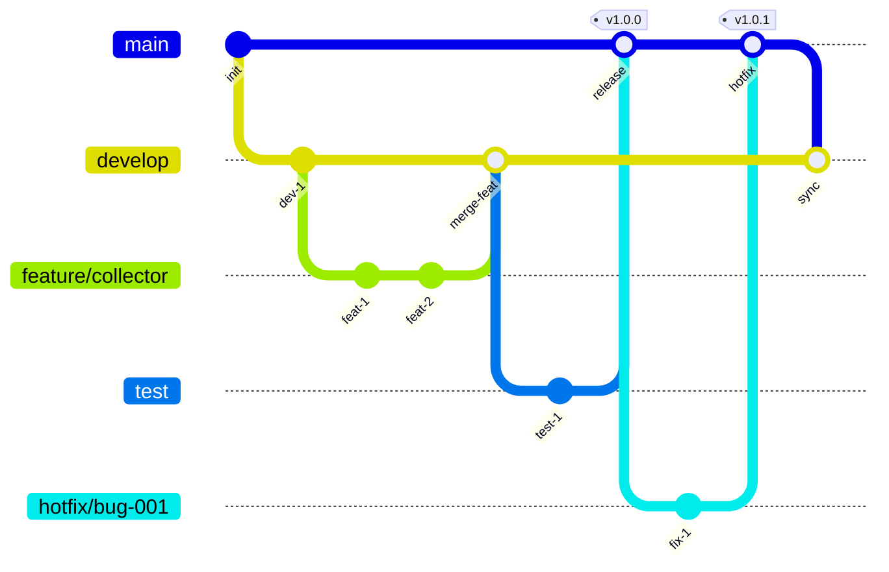
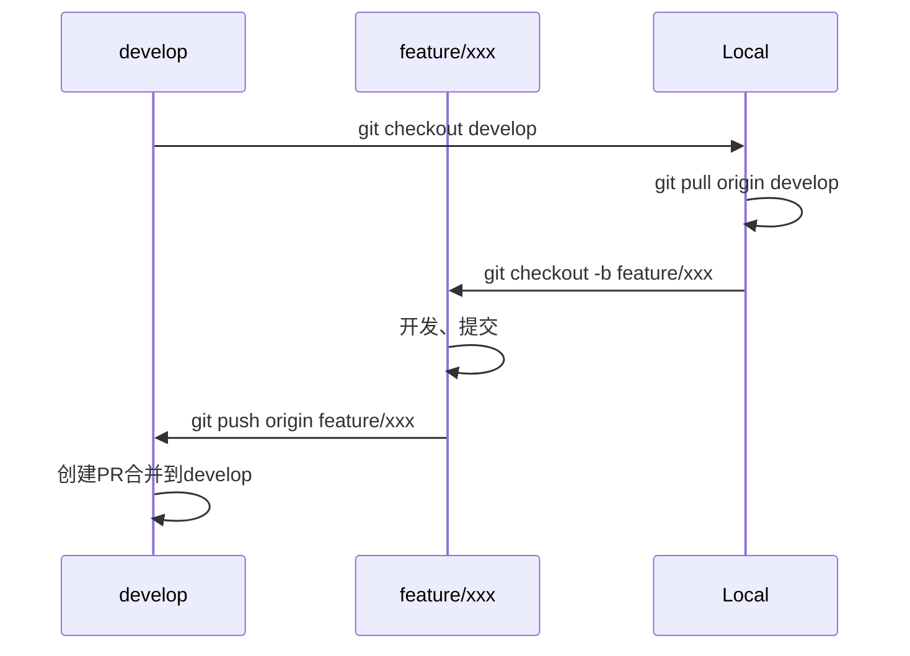
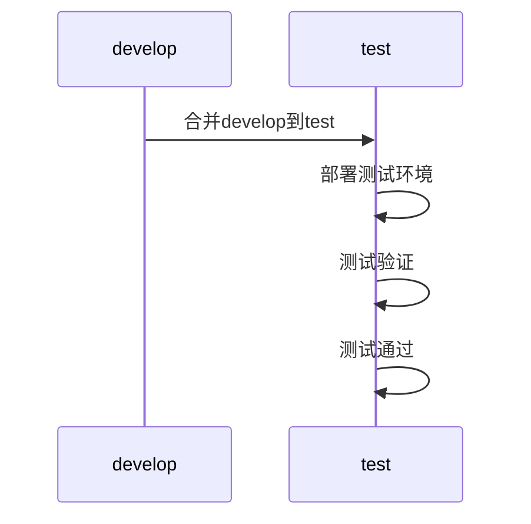
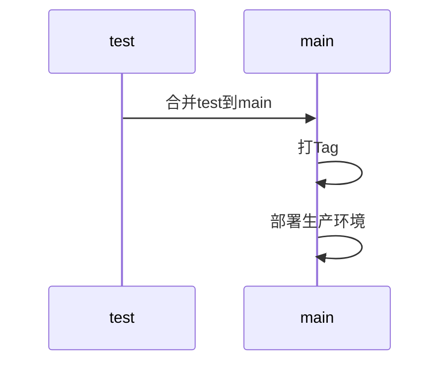
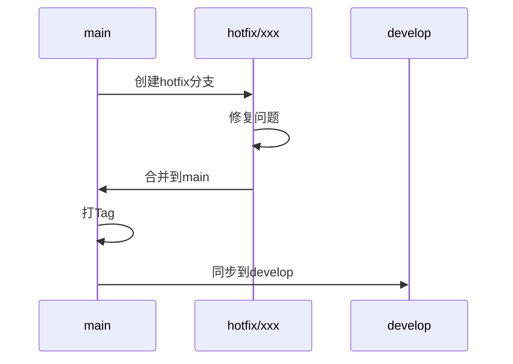

# 分支管理策略

## 1. 分支模型

### 1.1 分支结构



### 1.2 分支说明

| 分支 | 类型 | 说明 | 保护 |
|------|------|------|------|
| **main/master** | 永久分支 | 生产环境代码，只接受test分支合并 | 是 |
| **test** | 永久分支 | 测试环境代码，只接受develop分支合并 | 是 |
| **develop** | 永久分支 | 开发环境代码，接受feature分支合并 | 是 |
| **feature/** | 临时分支 | 功能开发分支，从develop创建 | 否 |
| **hotfix/** | 临时分支 | 紧急修复分支，从main创建 | 否 |

---

## 2. 分支命名规范

### 2.1 Feature 分支

```
feature/<功能名称>

示例：
feature/collector-management    # 采集器管理功能
feature/alarm-rule              # 报警规则功能
feature/user-auth               # 用户认证功能
```

**命名规则**：
- 全部小写字母
- 多个单词用连字符(-)连接
- 简洁明了，能体现功能

### 2.2 Hotfix 分支

```
hotfix/<问题描述>

示例：
hotfix/fix-login-error          # 修复登录错误
hotfix/fix-memory-leak          # 修复内存泄漏
hotfix/fix-sql-injection        # 修复SQL注入
```

### 2.3 Bugfix 分支

```
bugfix/<问题描述>

示例：
bugfix/fix-query-performance    # 修复查询性能
bugfix/fix-validation           # 修复校验问题
```

---

## 3. 分支操作流程

### 3.1 功能开发流程



**操作步骤**：
```bash
# 1. 更新develop分支
git checkout develop
git pull origin develop

# 2. 创建feature分支
git checkout -b feature/collector-management

# 3. 开发并提交
git add .
git commit -m "feat(collector): 新增采集器管理功能"

# 4. 推送到远程
git push origin feature/collector-management

# 5. 创建PR合并到develop
```

### 3.2 测试发布流程



**操作步骤**：
```bash
# 1. 更新test分支
git checkout test
git pull origin test

# 2. 合并develop
git merge develop

# 3. 推送到远程
git push origin test
```

### 3.3 生产发布流程



**操作步骤**：
```bash
# 1. 更新main分支
git checkout main
git pull origin main

# 2. 合并test
git merge test

# 3. 打Tag
git tag -a v1.0.0 -m "Release v1.0.0"

# 4. 推送到远程
git push origin main --tags
```

### 3.4 紧急修复流程



**操作步骤**：
```bash
# 1. 从main创建hotfix分支
git checkout main
git checkout -b hotfix/fix-login-error

# 2. 修复问题并提交
git add .
git commit -m "fix(auth): 修复登录验证问题"

# 3. 合并回main
git checkout main
git merge hotfix/fix-login-error
git tag -a v1.0.1 -m "Hotfix v1.0.1"
git push origin main --tags

# 4. 同步到develop
git checkout develop
git merge main
git push origin develop
```

---

## 4. 分支保护规则

### 4.1 保护分支

| 分支 | 保护规则 |
|------|----------|
| main | 禁止直接推送，必须通过PR合并 |
| test | 禁止直接推送，必须通过PR合并 |
| develop | 禁止直接推送，必须通过PR合并 |

### 4.2 PR 合并要求

- [ ] 通过代码审查（至少1人批准）
- [ ] 通过CI构建
- [ ] 无合并冲突
- [ ] 使用Squash合并

---

## 5. 注意事项

### 5.1 提交前检查

- 确认当前分支正确
- 确认已拉取最新代码
- 确认无遗漏文件

### 5.2 合并前检查

- 确认代码已通过审查
- 确认测试已通过
- 确认无冲突

### 5.3 禁止操作

- 禁止强制推送到保护分支
- 禁止直接修改保护分支
- 禁止删除保护分支
