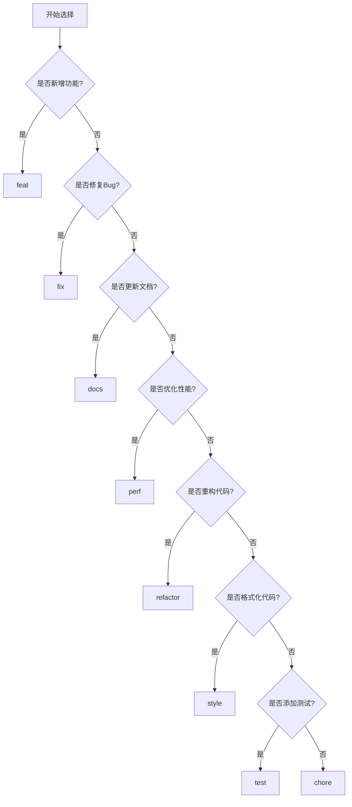

# Commit Message 规范

## 1. 规范概述

### 1.1 规范目的


### 1.2 格式定义

```
<type>(<scope>): <subject>

<body>

<footer>
```

---

## 2. Type 类型说明

### 2.1 类型列表

| Type | 说明 | 是否产生新功能/修复 |
|------|------|---------------------|
| **feat** | 新功能 | 是 |
| **fix** | Bug修复 | 是 |
| **docs** | 文档更新 | 否 |
| **style** | 代码格式（不影响功能） | 否 |
| **refactor** | 重构（不是新功能也不是修复） | 否 |
| **perf** | 性能优化 | 是 |
| **test** | 测试相关 | 否 |
| **chore** | 构建过程或辅助工具变动 | 否 |
| **revert** | 回滚之前的commit | 是 |
| **build** | 构建系统或外部依赖变更 | 否 |
| **ci** | CI配置文件和脚本变更 | 否 |

### 2.2 类型选择指南



---

## 3. Scope 范围说明

### 3.1 后端模块 Scope

| 模块 | Scope |
|------|-------|
| 采集模块 | collector |
| 报警引擎 | alarm-engine |
| 报警执行 | alarm-execution |
| 工单模块 | workorder |
| 权限模块 | permission |
| 报表模块 | report |
| 基础设施 | infrastructure |
| 通用模块 | common |

### 3.2 前端 Scope

| 模块 | Scope |
|------|-------|
| Web端 | web |
| 移动端 | mobile |
| 公共组件 | components |

### 3.3 其他 Scope

| 范围 | Scope |
|------|-------|
| 构建配置 | build |
| 部署配置 | deploy |
| 依赖管理 | deps |

---

## 4. Subject 主题说明

### 4.1 编写规则

1. 使用祈使句，现在时态
2. 首字母小写
3. 结尾不加句号
4. 简洁明了，不超过50个字符

### 4.2 示例对比

| 正确 ✅ | 错误 ❌ |
|---------|---------|
| feat(collector): 新增采集器管理功能 | feat(collector): 新增了采集器管理功能。 |
| fix(auth): 修复登录失败问题 | fix(auth): Fixed login failure issue |
| refactor(service): 重构报警处理逻辑 | refactor(service): 重构报警处理逻辑。。。 |

---

## 5. Body 正文说明

### 5.1 编写规则

1. 使用祈使句，现在时态
2. 说明代码变更的动机和内容
3. 与Subject区分，提供更多细节

### 5.2 示例

```
feat(collector): 新增采集器CRUD功能

- 新增采集器创建接口，支持配置采集参数
- 新增采集器查询接口，支持分页和条件筛选
- 新增采集器更新接口，支持部分字段更新
- 新增采集器删除接口，使用逻辑删除

Closes #123
```

---

## 6. Footer 页脚说明

### 6.1 关联Issue

```
Closes #123
Fixes #456
Refs #789
```

| 关键字 | 说明 |
|--------|------|
| Closes | 关闭Issue |
| Fixes | 修复Issue |
| Refs | 关联Issue但不关闭 |

### 6.2 Breaking Changes

```
BREAKING CHANGE: 采集器配置格式变更

旧配置格式不再支持，需要迁移到新格式。
迁移指南：...
```

---

## 7. 完整示例

### 7.1 新功能

```
feat(collector): 新增采集器健康检查功能

- 新增定时健康检查任务
- 新增健康状态计算逻辑
- 新增健康状态查询接口
- 更新采集器列表显示健康状态

Closes #100
```

### 7.2 Bug修复

```
fix(alarm-engine): 修复报警规则匹配失败问题

问题：当规则条件包含特殊字符时，正则匹配失败
原因：未对特殊字符进行转义处理
解决：添加特殊字符转义逻辑

Fixes #200
```

### 7.3 重构

```
refactor(service): 重构报警事件处理流程

- 抽取事件处理接口，支持多种处理策略
- 优化事件队列处理逻辑
- 添加事件处理耗时监控

Refs #300
```

### 7.4 性能优化

```
perf(collector): 优化采集数据批量插入性能

- 使用批量插入替代单条插入
- 优化事务边界，减少锁持有时间
- 添加批量大小配置项

性能提升：插入速度提升约300%
```

---

## 8. Commit Message 检查清单

- [ ] Type 类型正确
- [ ] Scope 范围准确
- [ ] Subject 简洁明了
- [ ] Body 说明清晰（如需要）
- [ ] Footer 关联正确（如需要）
- [ ] 无错别字
- [ ] 格式符合规范
