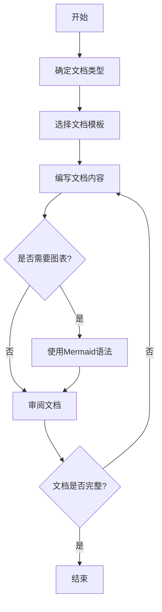

# 文档编写

> **触发场景**：需要编写或更新文档
> **输出工件**：README、API文档、设计文档等
> **路径基准**：本文档中所有路径均相对于 `ai_collaboration/` 目录

---

## 1. 执行前检查

- [ ] 明确文档类型和目标读者
- [ ] 了解文档存放位置规范
- [ ] 准备好文档所需信息

---

## 2. 执行流程



---

## 3. 文档类型

### 3.1 项目文档

| 文档类型 | 文件名 | 存放位置 | 说明 |
|----------|--------|----------|------|
| 项目说明 | README.md | 项目根目录 | 项目概述、快速开始 |
| 架构设计 | arch_solutions.md | docs/ | 架构设计文档 |
| 详细设计 | xxx_design.md | docs/detail_solutions/ | 模块详细设计 |
| 接口文档 | xxx_api.md | docs/api_docs/ | API接口定义 |

### 3.2 规范文档

| 文档类型 | 存放位置 | 说明 |
|----------|----------|------|
| 技术规范 | rules/common/ | 各端技术规范 |
| Skill文档 | rules/skills/ | AI协作Skill定义 |

---

## 4. 文档规范

### 4.1 Mermaid 图例规范

**强制要求**：所有文档中的流程图/架构图/时序图等，统一使用 Mermaid 语法。

**支持的图表类型**：

| 图表类型 | Mermaid语法 | 适用场景 |
|----------|-------------|----------|
| 流程图 | flowchart | 业务流程、决策流程 |
| 时序图 | sequenceDiagram | 接口调用、模块交互 |
| 类图 | classDiagram | 类结构、继承关系 |
| 状态图 | stateDiagram | 状态流转 |
| ER图 | erDiagram | 数据库设计 |
| Git图 | gitGraph | 分支策略 |
| 甘特图 | gantt | 项目计划 |

### 4.2 文档结构规范

```markdown
# 文档标题

> 文档简介（可选）

---

## 1. 章节1

### 1.1 子章节

内容...


---

## 2. 章节2

内容...
```

---

## 5. References 文档索引

| 文档 | 路径 | 内容侧重 |
|------|------|----------|
| 文档结构规范 | `./references/doc_structure.md` | 文档目录结构 |
| API文档格式 | `./references/api_doc_format.md` | 接口文档格式 |
| README模板 | `./references/readme_template.md` | README模板 |

---

## 6. 输出示例

```
文档已生成：ai_collaboration/docs/api_docs/collector_api.md

文档结构：
- 1. 概述
- 2. 接口列表
  - 2.1 创建采集器
  - 2.2 查询采集器列表
  - 2.3 更新采集器
  - 2.4 删除采集器
- 3. 数据模型
- 4. 错误码

包含图表：
- 接口调用流程图 (Mermaid)
- 数据模型ER图 (Mermaid)
```
