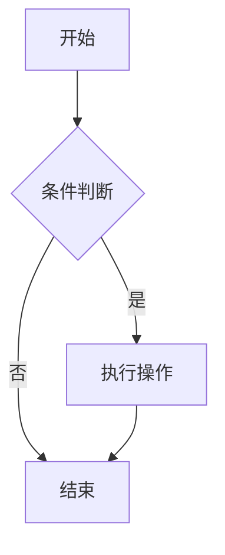

# 文档结构规范

## 1. 文档目录结构

### 1.1 项目文档目录

```
ops_center/
├── docs/                          # 文档根目录
│   ├── detail_solutions/          # 详细技术方案
│   │   ├── collector_management.md
│   │   └── alarm_rule_design.md
│   ├── api_docs/                  # 接口定义文档
│   │   ├── collector_api.md
│   │   └── alarm_api.md
│   ├── sprints/                   # 冲刺需求说明
│   │   ├── sprint_2026_0304.md
│   │   └── sprint_2026_0311.md
│   └── architecture/              # 架构设计文档
│       └── system_architecture.md
├── README.md                      # 项目说明
└── CHANGELOG.md                   # 变更日志
```

### 1.2 规范文档目录

```
rules/
├── base_rules.md                  # 规则入口
├── workflow.md                    # 工作流定义
├── common/                        # 公共规范
│   ├── arch_solutions.md          # 架构规范
│   ├── tech_structure_*.md        # 技术规范
│   └── product.md                 # 产品定义
└── skills/                        # Skill工作区
    └── skill_xxx/
        ├── SKILL.md               # Skill主文档
        └── references/            # 参考文档
```

---

## 2. 文档命名规范

### 2.1 命名规则

| 文档类型 | 命名规则 | 示例 |
|----------|----------|------|
| 技术方案 | 模块名_design.md | collector_design.md |
| 接口文档 | 模块名_api.md | collector_api.md |
| 需求文档 | sprint_日期.md | sprint_2026_0304.md |
| 规范文档 | 功能名.md | coding_standard.md |
| README | README.md | README.md |

### 2.2 文件名规范

- 使用小写字母
- 多个单词用下划线连接
- 避免使用特殊字符
- 文件名具有描述性

---

## 3. 文档内容结构

### 3.1 标准结构模板

```markdown
# 文档标题

> 文档简介（可选，说明文档目的和范围）

---

## 1. 第一章节

### 1.1 子章节

内容...

### 1.2 子章节

内容...

---

## 2. 第二章节

内容...

---

## 参考资料
- [参考文档1](链接)
- [参考文档2](链接)

---

## 版本记录
| 版本 | 日期 | 作者 | 变更说明 |
|------|------|------|----------|
| v1.0 | 2026-03-04 | xxx | 初始版本 |
```

### 3.2 章节编号规则

| 层级 | 格式 | 示例 |
|------|------|------|
| 一级标题 | # | # 概述 |
| 二级标题 | ## 数字 | ## 1. 功能说明 |
| 三级标题 | ### 数字.数字 | ### 1.1 功能描述 |
| 四级标题 | #### 数字.数字.数字 | #### 1.1.1 详细说明 |

---

## 4. 图表使用规范

### 4.1 Mermaid 图表类型

| 图表类型 | 语法 | 适用场景 |
|----------|------|----------|
| 流程图 | flowchart | 业务流程、决策流程 |
| 时序图 | sequenceDiagram | 接口调用、模块交互 |
| 类图 | classDiagram | 类结构、继承关系 |
| 状态图 | stateDiagram | 状态流转 |
| ER图 | erDiagram | 数据库设计 |
| Git图 | gitGraph | 分支策略 |
| 甘特图 | gantt | 项目计划 |
| 思维导图 | mindmap | 知识结构 |

### 4.2 图表使用示例

````markdown

````

---

## 5. 代码块规范

### 5.1 代码块格式

````markdown
```java
// Java代码示例
public class Example {
    public void method() {
        // ...
    }
}
```
````

### 5.2 语言标识

| 语言 | 标识 |
|------|------|
| Java | java |
| TypeScript | typescript |
| JavaScript | javascript |
| SQL | sql |
| JSON | json |
| YAML | yaml |
| Shell | bash |
| Markdown | markdown |

---

## 6. 表格规范

### 6.1 表格格式

```markdown
| 列1 | 列2 | 列3 |
|-----|-----|-----|
| 内容1 | 内容2 | 内容3 |
| 内容4 | 内容5 | 内容6 |
```

### 6.2 表格对齐

```markdown
| 左对齐 | 居中 | 右对齐 |
|:-------|:----:|-------:|
| 内容 | 内容 | 内容 |
```

---

## 7. 文档维护规范

### 7.1 版本记录

每个重要文档应在末尾添加版本记录：

```markdown
---

## 版本记录

| 版本 | 日期 | 作者 | 变更说明 |
|------|------|------|----------|
| v1.0 | 2026-03-04 | 张三 | 初始版本 |
| v1.1 | 2026-03-10 | 李四 | 新增接口说明 |
```

### 7.2 文档更新原则

1. **及时更新**：代码变更后同步更新文档
2. **保持一致**：文档与代码保持一致
3. **删除过时**：删除不再使用的文档
4. **归档历史**：历史版本归档保存

### 7.3 文档审核

- 重要文档需经过审核后发布
- 审核人确认内容准确、格式规范
- 审核通过后标记版本号
