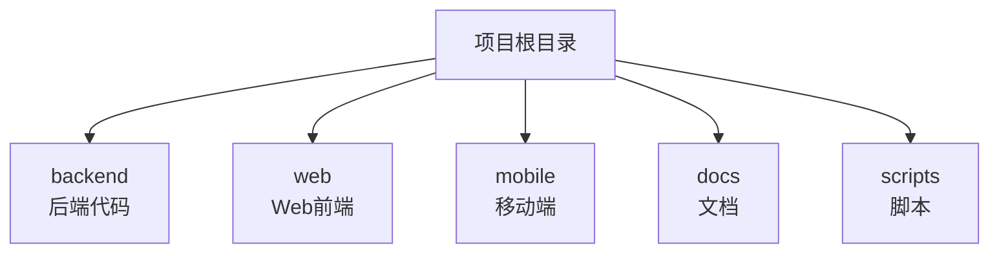

# README 模板

## 1. README 结构

```markdown
# 项目名称

简短的项目描述，一句话说明项目是什么。

---

## 功能特性

- 特性1：描述
- 特性2：描述
- 特性3：描述

---

## 快速开始

### 环境要求

- JDK 21+
- Node.js 20+
- MySQL 8.0+
- Redis 7.0+

### 安装步骤

1. 克隆项目
```bash
git clone https://github.com/xxx/project.git
cd project
```

2. 安装依赖
```bash
# 后端
cd backend
mvn install

# 前端
cd web
npm install
```

3. 配置文件
```bash
cp application.yml.example application.yml
# 编辑配置文件
```

4. 启动服务
```bash
# 后端
mvn spring-boot:run

# 前端
npm run dev
```

---

## 项目结构

```
project/
├── backend/          # 后端代码
├── web/              # Web前端
├── mobile/           # 移动端
├── docs/             # 文档
└── scripts/          # 脚本
```

---

## 技术栈

| 类型 | 技术 |
|------|------|
| 后端框架 | Spring Boot 3.4 |
| 数据库 | MySQL 8.0 |
| 缓存 | Redis 7.0 |
| 前端框架 | React 18 |
| UI组件库 | Ant Design 5 |

---

## 开发指南

### 分支管理

- main: 生产分支
- develop: 开发分支
- feature/*: 功能分支

### 提交规范

```
feat(module): 简短描述
fix(module): 简短描述
docs: 文档更新
```

---

## 部署说明

### Docker 部署

```bash
docker-compose up -d
```

### 手动部署

1. 构建项目
2. 上传文件
3. 启动服务

---

## 常见问题

### Q: 如何配置数据库连接？

A: 编辑 application.yml 文件，修改数据库配置。

### Q: 如何添加新的API接口？

A: 参考 ai_collaboration/docs/api_docs/ 目录下的接口文档。

---

## 贡献指南

1. Fork 项目
2. 创建功能分支
3. 提交代码
4. 创建 Pull Request

---

## 许可证

MIT License

---

## 联系方式

- 作者：xxx
- 邮箱：xxx@example.com
- 项目地址：https://github.com/xxx/project
```

---

## 2. 各部分说明

### 2.1 项目标题和描述

- 标题简洁明了
- 描述一句话说明项目价值
- 可添加项目徽章（版本、构建状态等）

```markdown
# 统一运维平台

一站式智能运维管理系统，实现监控、告警、工单全流程自动化。

[]()
[]()
[]()
```

### 2.2 功能特性

- 列出核心功能
- 每项功能一句话描述
- 突出项目亮点

### 2.3 快速开始

- 明确环境要求
- 步骤清晰可执行
- 提供配置示例

### 2.4 项目结构



### 2.5 技术栈

使用表格清晰列出技术栈：

| 类型 | 技术 | 版本 |
|------|------|------|
| 后端框架 | Spring Boot | 3.4.0 |
| 数据库 | MySQL | 8.0 |
| 缓存 | Redis | 7.0 |
| 前端框架 | React | 18.2 |
| UI组件库 | Ant Design | 5.26 |

### 2.6 开发指南

简要说明开发规范：
- 分支管理策略
- 提交信息规范
- 代码审查流程

### 2.7 部署说明

提供多种部署方式：
- Docker 部署（推荐）
- 手动部署
- 云平台部署

### 2.8 常见问题

收集常见问题及解决方案：
- 配置相关问题
- 运行相关问题
- 部署相关问题

---

## 3. README 最佳实践

### 3.1 应该包含

- [x] 项目简介
- [x] 功能特性
- [x] 快速开始
- [x] 环境要求
- [x] 项目结构
- [x] 技术栈
- [x] 部署说明
- [x] 许可证

### 3.2 应该避免

- [ ] 过于详细的技术实现
- [ ] 过时的信息
- [ ] 不必要的图片
- [ ] 冗长的安装步骤

### 3.3 更新维护

- 重大版本更新时同步更新README
- 新增功能时更新功能特性
- 修复安装问题时更新快速开始
