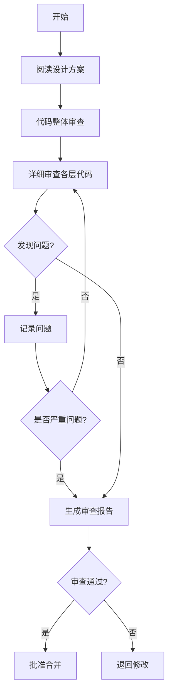

# 代码审查

> **触发场景**：需要进行代码审查
> **前置条件**：代码已提交，功能已完成自测
> **输出工件**：审查报告

---

## 1. 执行前检查

- [ ] 代码已提交到审查分支
- [ ] 自测已通过
- [ ] 了解变更范围

---

## 2. 执行流程



### Step 1: 阅读设计方案
1. 了解设计意图
2. 确认技术选型
3. 识别关键风险点

### Step 2: 代码整体审查
1. 检查代码结构
2. 检查分层调用
3. 检查模块划分

### Step 3: 详细审查
1. 逐层审查代码
2. 检查规范合规
3. 识别潜在问题

### Step 4: 生成报告
1. 汇总问题清单
2. 给出改进建议
3. 明确审查结论

---

## 3. 审查检查清单

### 3.1 架构合规检查

| 检查项 | 合规要求 | 问题等级 |
|--------|----------|----------|
| 分层调用 | 上层调用下层，禁止反向 | 严重 |
| 跨层访问 | API禁止直接调用DAO | 严重 |
| 模块边界 | 跨模块调用通过Service | 严重 |

### 3.2 代码规范检查

| 检查项 | 合规要求 | 问题等级 |
|--------|----------|----------|
| 命名规范 | 类/方法/变量命名符合规范 | 一般 |
| 注释规范 | 关键代码有注释 | 一般 |
| 代码格式 | 符合项目格式规范 | 轻微 |

### 3.3 安全检查

| 检查项 | 合规要求 | 问题等级 |
|--------|----------|----------|
| SQL注入 | 使用参数化查询 | 严重 |
| XSS | 前端输入过滤 | 严重 |
| 权限校验 | 接口有权限控制 | 严重 |
| 敏感数据 | 日志脱敏处理 | 严重 |

### 3.4 性能检查

| 检查项 | 合规要求 | 问题等级 |
|--------|----------|----------|
| N+1查询 | 避免循环查询 | 严重 |
| 连表查询 | 不超过3表 | 一般 |
| 缓存使用 | 合理使用缓存 | 一般 |

---

## 4. References 文档索引

| 文档 | 路径 | 内容侧重 |
|------|------|----------|
| 审查检查清单 | `./references/review_checklist.md` | 详细检查项 |
| 安全审查要点 | `./references/security_review.md` | 安全检查重点 |
| 性能审查要点 | `./references/performance_review.md` | 性能检查重点 |
| 代码坏味道 | `./references/code_smell_detection.md` | 常见问题识别 |

---

## 5. 问题等级定义

| 等级 | 定义 | 处理方式 |
|------|------|----------|
| **严重** | 影响功能、安全、性能 | 必须修改后才能合并 |
| **一般** | 影响代码质量、可维护性 | 建议修改后合并 |
| **轻微** | 代码风格、注释等问题 | 可后续优化 |

---

## 6. 输出示例

```markdown
# 代码审查报告

## 1. 审查概要
- 审查时间：2026-03-04
- 审查范围：采集器管理模块
- 审查人：xxx

## 2. 审查结论
❌ 不通过 - 存在严重问题需要修复

## 3. 问题清单

### 严重问题
1. [架构] CollectorController 直接调用 CollectorMapper
   - 位置：CollectorController.java:45
   - 建议：通过 Service 或 Manager 层调用

### 一般问题
1. [规范] 方法命名不规范
   - 位置：CollectorService.java:23
   - 建议：方法名以 get 开头

### 轻微问题
1. [注释] 缺少方法注释
   - 位置：CollectorManager.java:15
   - 建议：添加 JavaDoc 注释

## 4. 改进建议
1. 建议将公共逻辑抽取到 Manager 层
2. 建议增加单元测试覆盖核心逻辑
```
