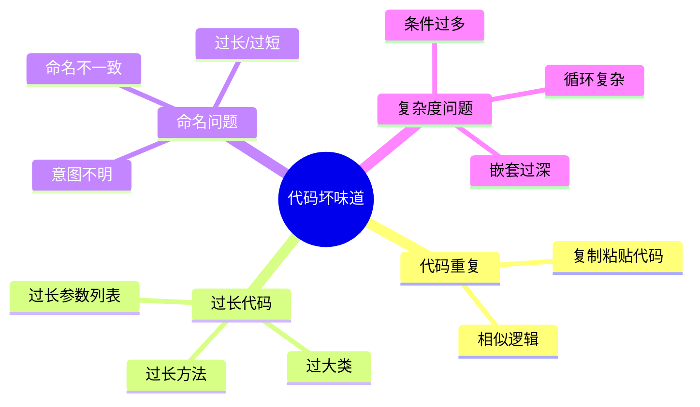
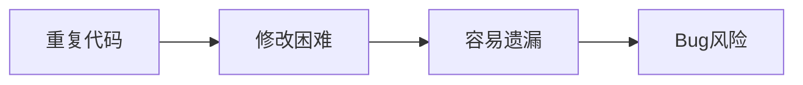
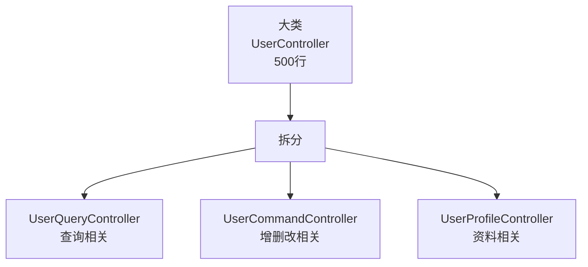

# 代码坏味道识别

## 1. 代码坏味道概述

### 1.1 什么是代码坏味道

代码坏味道（Code Smell）是指代码中存在的潜在问题迹象，虽然不一定导致错误，但会增加维护成本和引入Bug的风险。



---

## 2. 常见代码坏味道

### 2.1 重复代码 (Duplicated Code)

**问题描述**：相同或相似的代码出现在多个地方。



**坏代码示例**：
```java
// 类A中
public void validateUser(User user) {
    if (user.getName() == null || user.getName().isEmpty()) {
        throw new ValidationException("用户名不能为空");
    }
    if (user.getAge() < 0 || user.getAge() > 150) {
        throw new ValidationException("年龄不合法");
    }
}

// 类B中有相同代码
public void validateCustomer(Customer customer) {
    if (customer.getName() == null || customer.getName().isEmpty()) {
        throw new ValidationException("用户名不能为空");
    }
    if (customer.getAge() < 0 || customer.getAge() > 150) {
        throw new ValidationException("年龄不合法");
    }
}
```

**重构方案**：
```java
// 提取公共方法
public class ValidationUtils {
    public static void validateName(String name) {
        if (name == null || name.isEmpty()) {
            throw new ValidationException("用户名不能为空");
        }
    }
    
    public static void validateAge(Integer age) {
        if (age == null || age < 0 || age > 150) {
            throw new ValidationException("年龄不合法");
        }
    }
}
```

---

### 2.2 过长方法 (Long Method)

**问题描述**：方法过长，难以理解和维护。

**坏代码示例**：
```java
// 150行的方法，难以理解
public void processOrder(Order order) {
    // 校验逻辑 20行
    // 计算价格 30行
    // 库存处理 25行
    // 支付处理 30行
    // 通知处理 25行
    // 日志记录 20行
}
```

**重构方案**：
```java
// 拆分为多个小方法
public void processOrder(Order order) {
    validateOrder(order);
    calculatePrice(order);
    processInventory(order);
    processPayment(order);
    sendNotification(order);
    logOrder(order);
}

private void validateOrder(Order order) { /* ... */ }
private void calculatePrice(Order order) { /* ... */ }
// ...
```

**建议**：单个方法不超过50行代码。

---

### 2.3 过大类 (Large Class)

**问题描述**：类承担了过多职责，违反单一职责原则。

**判断标准**：
- 类代码超过500行
- 类字段超过10个
- 类方法超过15个

**重构方案**：


---

### 2.4 过长参数列表 (Long Parameter List)

**问题描述**：方法参数过多，难以使用和理解。

**坏代码示例**：
```java
public void createUser(String name, Integer age, String phone, 
                       String email, String address, Integer status,
                       String remark, Date birthday) {
    // ...
}
```

**重构方案**：
```java
// 使用参数对象
@Data
public class UserCreateRequest {
    private String name;
    private Integer age;
    private String phone;
    private String email;
    private String address;
    private Integer status;
    private String remark;
    private Date birthday;
}

public void createUser(UserCreateRequest request) {
    // ...
}
```

**建议**：方法参数不超过4个。

---

### 2.5 嵌套过深 (Deeply Nested Code)

**问题描述**：代码嵌套层次过深，难以阅读。

**坏代码示例**：
```java
public void process(User user) {
    if (user != null) {
        if (user.getStatus() == 1) {
            if (user.getRole() != null) {
                if (user.getRole().equals("admin")) {
                    // 处理逻辑
                } else {
                    throw new Exception("非管理员");
                }
            } else {
                throw new Exception("角色为空");
            }
        } else {
            throw new Exception("用户已禁用");
        }
    } else {
        throw new Exception("用户为空");
    }
}
```

**重构方案（卫语句）**：
```java
public void process(User user) {
    if (user == null) {
        throw new Exception("用户为空");
    }
    if (user.getStatus() != 1) {
        throw new Exception("用户已禁用");
    }
    if (user.getRole() == null) {
        throw new Exception("角色为空");
    }
    if (!user.getRole().equals("admin")) {
        throw new Exception("非管理员");
    }
    
    // 处理逻辑
}
```

**建议**：嵌套层次不超过3层。

---

### 2.6 魔法数字 (Magic Numbers)

**问题描述**：代码中出现未解释的数字常量。

**坏代码示例**：
```java
if (status == 1) {
    // ...
}
if (hours > 8) {
    // ...
}
double price = amount * 0.85;
```

**重构方案**：
```java
// 使用常量或枚举
public class UserStatus {
    public static final int ACTIVE = 1;
    public static final int INACTIVE = 0;
}

public class WorkHours {
    public static final int STANDARD_HOURS = 8;
}

public class Discount {
    public static final double MEMBER_DISCOUNT = 0.85;
}

// 使用后
if (status == UserStatus.ACTIVE) {
    // ...
}
```

---

### 2.7 注释过多/过少

**问题描述**：
- 过多：代码本身不够清晰，需要大量注释解释
- 过少：复杂逻辑没有注释说明

**判断标准**：

| 情况 | 建议 |
|------|------|
| 简单代码 | 无需注释 |
| 复杂业务逻辑 | 添加注释说明 |
| 公共API | 必须有JavaDoc |
| 已废弃代码 | 添加@Deprecated |

---

## 3. 代码坏味道检测清单

### 3.1 结构问题

- [ ] 无重复代码
- [ ] 方法长度合理（<50行）
- [ ] 类大小合理（<500行）
- [ ] 参数数量合理（<4个）
- [ ] 嵌套层次合理（<3层）

### 3.2 命名问题

- [ ] 命名清晰表达意图
- [ ] 命名风格一致
- [ ] 无缩写或无意义命名
- [ ] 无数字后缀命名

### 3.3 代码质量

- [ ] 无魔法数字
- [ ] 注释合理
- [ ] 无死代码
- [ ] 无过度设计

---

## 4. 重构建议

### 4.1 重构原则

1. **小步重构**：每次只做一个小改动
2. **测试保障**：重构前确保有测试覆盖
3. **持续重构**：发现即处理，不要积累

### 4.2 常用重构手法

| 手法 | 适用场景 |
|------|----------|
| 提取方法 | 消除重复、简化长方法 |
| 提取类 | 分解大类 |
| 引入参数对象 | 简化参数列表 |
| 以多态取代条件 | 简化复杂条件 |
| 分解条件表达式 | 简化嵌套条件 |
