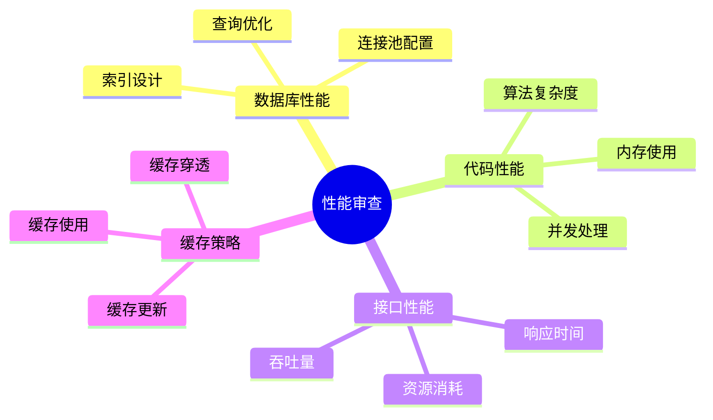
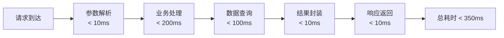

# 性能审查要点

## 1. 性能审查概述

### 1.1 审查维度



### 1.2 性能指标

| 指标 | 目标值 | 说明 |
|------|--------|------|
| 接口响应时间 | <500ms | P95响应时间 |
| 数据库查询 | <100ms | 单次查询时间 |
| 内存使用 | <80% | JVM堆内存使用率 |
| CPU使用 | <70% | 平均CPU使用率 |

---

## 2. 数据库性能审查

### 2.1 N+1 查询问题


**风险代码**：
```java
// 危险：N+1查询
List<Order> orders = orderMapper.selectList();
for (Order order : orders) {
    User user = userMapper.selectById(order.getUserId()); // N次查询
    order.setUserName(user.getName());
}
```

**优化方案**：
```java
// 优化：批量查询
List<Order> orders = orderMapper.selectList();
Set<Long> userIds = orders.stream()
    .map(Order::getUserId)
    .collect(Collectors.toSet());
Map<Long, User> userMap = userMapper.selectBatchIds(userIds)
    .stream()
    .collect(Collectors.toMap(User::getId, Function.identity()));
```

### 2.2 索引使用审查

| 检查项 | 检查方式 | 风险等级 |
|--------|----------|----------|
| WHERE条件字段是否有索引 | EXPLAIN分析 | 高危 |
| JOIN字段是否有索引 | EXPLAIN分析 | 高危 |
| ORDER BY字段是否有索引 | EXPLAIN分析 | 中危 |
| LIKE查询是否使用前缀匹配 | SQL审查 | 中危 |

**审查方法**：
```sql
-- 使用EXPLAIN分析查询计划
EXPLAIN SELECT * FROM ops_collector WHERE status = 1;

-- 检查是否使用索引
-- type: ALL 表示全表扫描（危险）
-- type: ref/const 表示使用索引（良好）
```

### 2.3 查询优化检查

| 问题 | 风险等级 | 优化方案 |
|------|----------|----------|
| SELECT * | 中危 | 只查询需要的字段 |
| 无分页查询 | 高危 | 添加LIMIT |
| 大事务 | 高危 | 拆分事务 |
| 连表过多 | 中危 | 限制在3表以内 |

---

## 3. 代码性能审查

### 3.1 算法复杂度

```java
// 危险：O(n²)复杂度
for (Order order : orders) {
    for (Product product : products) {
        if (order.getProductId().equals(product.getId())) {
            // ...
        }
    }
}

// 优化：O(n)复杂度
Map<Long, Product> productMap = products.stream()
    .collect(Collectors.toMap(Product::getId, Function.identity()));
for (Order order : orders) {
    Product product = productMap.get(order.getProductId());
}
```

### 3.2 内存使用审查

| 检查项 | 风险等级 | 说明 |
|--------|----------|------|
| 大对象循环创建 | 高危 | 可能导致OOM |
| 集合未设置初始容量 | 中危 | 频繁扩容影响性能 |
| 流未关闭 | 高危 | 资源泄露 |
| 静态集合无限增长 | 高危 | 内存泄露 |

**优化示例**：
```java
// 危险：未设置初始容量
List<Order> list = new ArrayList<>();
for (int i = 0; i < 10000; i++) {
    list.add(new Order());
}

// 优化：设置初始容量
List<Order> list = new ArrayList<>(10000);
```

### 3.3 并发处理审查

```java
// 危险：同步代码块影响性能
public synchronized void process() {
    // 耗时操作
}

// 优化：缩小同步范围
public void process() {
    // 非同步操作
    synchronized(this) {
        // 只对必要的代码同步
    }
}
```

---

## 4. 接口性能审查

### 4.1 响应时间分析



### 4.2 接口优化检查

| 检查项 | 要求 | 说明 |
|--------|------|------|
| 分页查询 | 必须有分页 | 避免大数据量返回 |
| 列表字段 | 只返回必要字段 | 减少数据传输 |
| 批量操作 | 支持批量处理 | 减少请求次数 |
| 异步处理 | 耗时操作异步 | 提升响应速度 |

### 4.3 慢接口识别

```java
// 添加性能监控注解
@PerformanceMonitor(threshold = 500)
@GetMapping("/api/orders")
public Response listOrders() {
    // ...
}

// 日志记录慢接口
@Aspect
public class PerformanceAspect {
    @Around("@annotation(PerformanceMonitor)")
    public Object monitor(ProceedingJoinPoint pjp) {
        long start = System.currentTimeMillis();
        Object result = pjp.proceed();
        long cost = System.currentTimeMillis() - start;
        if (cost > threshold) {
            log.warn("慢接口: {}, 耗时: {}ms", pjp.getSignature(), cost);
        }
        return result;
    }
}
```

---

## 5. 缓存使用审查

### 5.1 缓存使用场景

| 场景 | 是否使用缓存 | 说明 |
|------|--------------|------|
| 高频读取数据 | ✓ 使用 | 如配置信息 |
| 实时性要求低的数据 | ✓ 使用 | 如统计数据 |
| 频繁变更的数据 | ✗ 不使用 | 缓存收益低 |
| 大对象数据 | ⚠️ 谨慎使用 | 考虑内存压力 |

### 5.2 缓存问题检查

| 问题 | 风险等级 | 解决方案 |
|------|----------|----------|
| 缓存穿透 | 高危 | 布隆过滤器/空值缓存 |
| 缓存击穿 | 高危 | 互斥锁/永不过期 |
| 缓存雪崩 | 高危 | 随机过期时间 |
| 缓存与数据库不一致 | 中危 | 延迟双删/消息通知 |

### 5.3 缓存使用示例

```java
// 推荐的缓存使用模式
public User getUserById(Long id) {
    String key = "user:" + id;
    
    // 1. 查询缓存
    User user = redisTemplate.opsForValue().get(key);
    if (user != null) {
        return user;
    }
    
    // 2. 加锁防止缓存击穿
    String lockKey = "lock:" + key;
    try {
        boolean locked = redisTemplate.opsForValue()
            .setIfAbsent(lockKey, "1", 10, TimeUnit.SECONDS);
        if (locked) {
            // 3. 查询数据库
            user = userMapper.selectById(id);
            if (user != null) {
                // 4. 写入缓存
                redisTemplate.opsForValue()
                    .set(key, user, 30, TimeUnit.MINUTES);
            }
        }
    } finally {
        redisTemplate.delete(lockKey);
    }
    
    return user;
}
```

---

## 6. 性能审查清单

### 6.1 数据库性能

- [ ] 无N+1查询问题
- [ ] 关键字段有索引
- [ ] 查询有分页限制
- [ ] 连表不超过3个

### 6.2 代码性能

- [ ] 无明显性能瓶颈
- [ ] 内存使用合理
- [ ] 无资源泄露风险
- [ ] 并发处理正确

### 6.3 接口性能

- [ ] 响应时间达标
- [ ] 无慢查询日志
- [ ] 合理使用缓存
- [ ] 有性能监控
