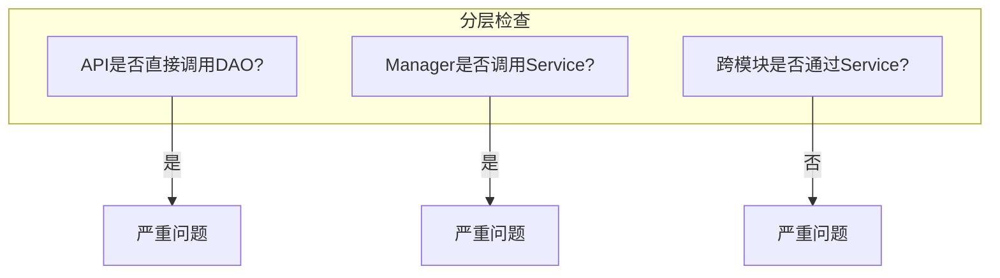

# 代码审查检查清单

## 1. 功能正确性

### 1.1 业务逻辑

- [ ] 业务规则实现是否正确
- [ ] 边界条件是否处理
- [ ] 异常情况是否处理
- [ ] 数据转换是否正确

### 1.2 数据处理

- [ ] 数据校验是否完整
- [ ] 数据格式是否正确
- [ ] 数据转换是否有遗漏

---

## 2. 架构合规性

### 2.1 分层架构



| 检查项 | 合规 | 违规 | 问题等级 |
|--------|------|------|----------|
| API → Service | ✓ | | 合规 |
| API → Manager | ✓ | | 合规（简单场景）|
| API → DAO | | ✗ | 严重 |
| Manager → Service | | ✗ | 严重 |
| 跨模块 → Service | ✓ | | 合规 |
| 跨模块 → DAO | | ✗ | 严重 |

### 2.2 模块边界

- [ ] 模块职责是否单一
- [ ] 模块间是否低耦合
- [ ] 是否有循环依赖

---

## 3. 代码规范

### 3.1 命名规范

| 类型 | 规范 | 检查要点 |
|------|------|----------|
| 类名 | 大驼峰 | XXXController, XXXService |
| 方法名 | 小驼峰 | getAlarmRule, createAlarmRule |
| 变量名 | 小驼峰 | alarmRuleName, isActive |
| 常量名 | 全大写+下划线 | MAX_RETRY_COUNT |
| 包名 | 全小写 | com.zjnut.ops.collector |

### 3.2 注释规范

- [ ] 类是否有注释说明职责
- [ ] 公共方法是否有JavaDoc
- [ ] 复杂逻辑是否有行内注释
- [ ] 是否有过时注释需要删除

### 3.3 代码格式

- [ ] 缩进是否正确
- [ ] 空格使用是否规范
- [ ] 换行是否合理
- [ ] 代码行是否过长

---

## 4. 安全检查

### 4.1 输入校验

| 检查项 | 要求 |
|--------|------|
| 参数非空校验 | @NotBlank, @NotNull |
| 参数格式校验 | @Pattern, @Email |
| 参数范围校验 | @Min, @Max |
| 参数长度校验 | @Size, @Length |

### 4.2 SQL安全

- [ ] 是否使用参数化查询
- [ ] 是否存在字符串拼接SQL
- [ ] 是否对输入进行过滤

### 4.3 权限控制

- [ ] 接口是否有权限注解
- [ ] 敏感操作是否有审计日志
- [ ] 数据访问是否有权限过滤

### 4.4 敏感数据处理

- [ ] 日志是否脱敏
- [ ] 密码是否加密存储
- [ ] 敏感数据是否加密传输

---

## 5. 性能检查

### 5.1 数据库性能

| 检查项 | 问题 | 建议 |
|--------|------|------|
| N+1查询 | 循环内查询数据库 | 批量查询或JOIN |
| 缺少索引 | 全表扫描 | 添加合适索引 |
| 连表过多 | 超过3表关联 | 拆分查询 |
| 大数据量查询 | 无分页 | 添加分页 |

### 5.2 内存使用

- [ ] 是否有内存泄漏风险
- [ ] 大对象是否及时释放
- [ ] 集合是否设置合理初始容量

### 5.3 并发处理

- [ ] 是否有线程安全问题
- [ ] 锁使用是否合理
- [ ] 是否有死锁风险

---

## 6. 可维护性

### 6.1 代码复杂度

- [ ] 方法是否过长（>50行）
- [ ] 类是否过大（>500行）
- [ ] 嵌套是否过深（>3层）
- [ ] 条件分支是否过多

### 6.2 重复代码

- [ ] 是否有重复代码块
- [ ] 是否有可抽取的公共方法
- [ ] 是否有可复用的组件

### 6.3 硬编码

- [ ] 是否有硬编码的配置
- [ ] 是否有硬编码的常量
- [ ] 是否有魔法数字

---

## 7. 测试覆盖

- [ ] 核心逻辑是否有单元测试
- [ ] 测试覆盖率是否达标
- [ ] 边界条件是否有测试
- [ ] 异常场景是否有测试

---

## 8. 检查结果记录

```markdown
## 审查结果

### 通过项
- [x] 分层架构合规
- [x] 命名规范正确
- [x] 无SQL注入风险

### 问题项
- [ ] N+1查询问题（严重）
- [ ] 缺少方法注释（一般）
- [ ] 代码行过长（轻微）

### 建议
1. ...
2. ...
```
