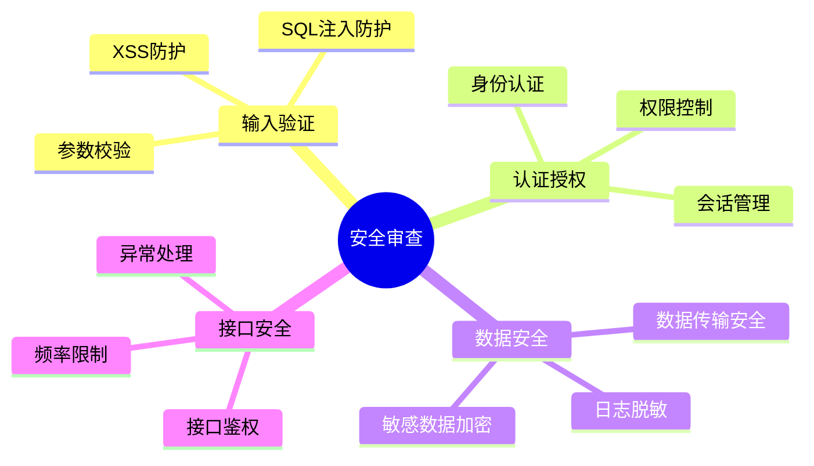
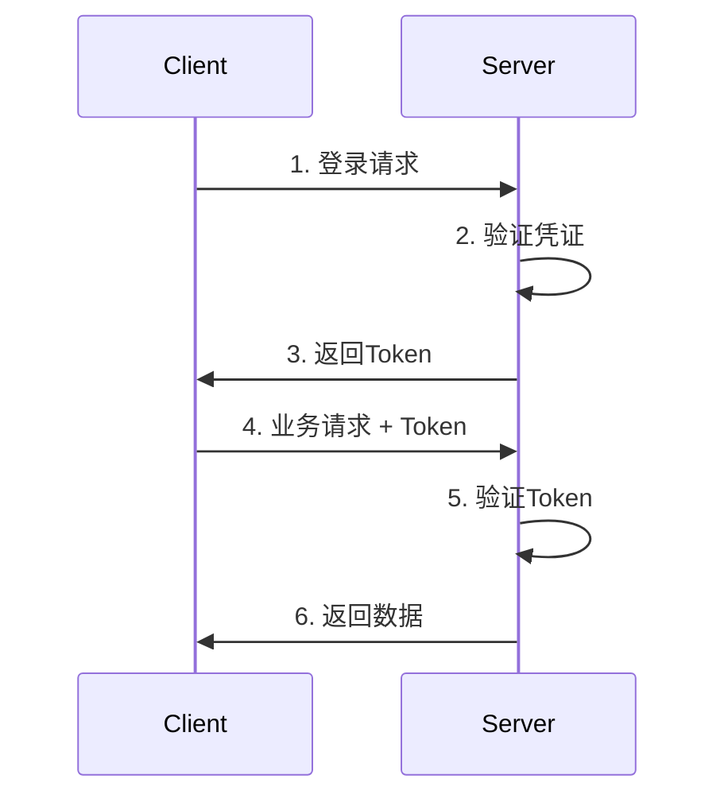

# 安全审查要点

## 1. 安全审查概述

### 1.1 审查范围



### 1.2 审查等级

| 等级 | 定义 | 处理方式 |
|------|------|----------|
| **高危** | 可能导致数据泄露、系统入侵 | 立即修复，禁止上线 |
| **中危** | 可能被利用的潜在风险 | 必须修复后上线 |
| **低危** | 最佳实践建议 | 建议修复 |

---

## 2. SQL 注入防护

### 2.1 风险代码识别

```java
// 危险：字符串拼接SQL
String sql = "SELECT * FROM user WHERE name = '" + name + "'";
jdbcTemplate.query(sql, ...);

// 危险：MyBatis使用 ${}
SELECT * FROM user WHERE name = '${name}'
```

### 2.2 安全代码示例

```java
// 安全：使用参数化查询
String sql = "SELECT * FROM user WHERE name = ?";
jdbcTemplate.query(sql, new Object[]{name}, ...);

// 安全：MyBatis使用 #{}
SELECT * FROM user WHERE name = #{name}
```

### 2.3 审查检查点

| 检查项 | 检查方式 | 风险等级 |
|--------|----------|----------|
| 是否使用字符串拼接SQL | 代码审查 | 高危 |
| MyBatis是否使用 ${} | XML文件检查 | 高危 |
| 是否使用参数化查询 | 代码审查 | - |
| 动态SQL是否安全 | XML文件检查 | 中危 |

---

## 3. XSS 防护

### 3.1 风险代码识别

```java
// 危险：直接输出用户输入
response.getWriter().write("<div>" + userInput + "</div>");

// 危险：前端直接渲染HTML
<div dangerouslySetInnerHTML={{__html: userInput}} />
```

### 3.2 安全代码示例

```java
// 安全：使用HTML转义
String safeOutput = HtmlUtils.htmlEscape(userInput);

// 安全：前端使用React默认转义
<div>{userInput}</div>
```

### 3.3 审查检查点

| 检查项 | 检查方式 | 风险等级 |
|--------|----------|----------|
| 后端是否转义用户输入 | 代码审查 | 高危 |
| 前端是否使用dangerouslySetInnerHTML | 代码审查 | 高危 |
| 富文本是否使用安全过滤 | 代码审查 | 中危 |
| URL参数是否验证 | 代码审查 | 中危 |

---

## 4. 权限控制

### 4.1 风险代码识别

```java
// 危险：无权限校验
@GetMapping("/user/{id}")
public User getUser(@PathVariable Long id) {
    return userService.getById(id);
}

// 危险：只校验登录，不校验数据权限
@GetMapping("/user/{id}")
@PreAuthorize("isAuthenticated()")
public User getUser(@PathVariable Long id) {
    return userService.getById(id);
}
```

### 4.2 安全代码示例

```java
// 安全：添加权限校验
@GetMapping("/user/{id}")
@PreAuthorize("hasPermission(#id, 'user', 'read')")
public User getUser(@PathVariable Long id) {
    return userService.getById(id);
}

// 安全：数据权限过滤
public User getById(Long id) {
    User user = userMapper.selectById(id);
    // 校验当前用户是否有权限访问该数据
    if (!securityService.hasDataAccess(user)) {
        throw new ForbiddenException("无权访问该数据");
    }
    return user;
}
```

### 4.3 审查检查点

| 检查项 | 检查方式 | 风险等级 |
|--------|----------|----------|
| 接口是否有权限注解 | 代码审查 | 高危 |
| 数据访问是否校验权限 | 代码审查 | 高危 |
| 敏感操作是否有审计日志 | 代码审查 | 中危 |
| 是否有越权访问风险 | 安全测试 | 高危 |

---

## 5. 敏感数据处理

### 5.1 敏感数据识别

| 数据类型 | 示例 | 加密要求 |
|----------|------|----------|
| 密码 | 用户密码 | 不可逆加密 |
| 身份证号 | 330102199001011234 | 可逆加密存储 |
| 手机号 | 13800138000 | 脱敏显示 |
| 银行卡号 | 6222021234567890 | 可逆加密存储 |
| 地址 | 浙江省杭州市... | 按需加密 |

### 5.2 日志脱敏

```java
// 危险：日志输出敏感信息
log.info("用户登录: phone={}, password={}", phone, password);

// 安全：日志脱敏
log.info("用户登录: phone={}", maskPhone(phone));

// 脱敏工具方法
public String maskPhone(String phone) {
    if (phone == null || phone.length() < 7) {
        return phone;
    }
    return phone.substring(0, 3) + "****" + phone.substring(phone.length() - 4);
}
```

### 5.3 审查检查点

| 检查项 | 检查方式 | 风险等级 |
|--------|----------|----------|
| 密码是否加密存储 | 数据库检查 | 高危 |
| 敏感字段是否加密 | 数据库检查 | 高危 |
| 日志是否脱敏 | 日志检查 | 中危 |
| 返回数据是否脱敏 | 接口测试 | 中危 |

---

## 6. 接口安全

### 6.1 认证机制



### 6.2 接口防护检查

| 检查项 | 要求 | 风险等级 |
|--------|------|----------|
| Token有效期 | 设置合理过期时间 | 中危 |
| Token刷新 | 支持Token刷新机制 | 中危 |
| 登录失败处理 | 限制失败次数，增加延迟 | 中危 |
| 会话管理 | 单点登录，异地登录提醒 | 中危 |

### 6.3 频率限制

```java
// 使用注解实现限流
@RateLimiter(limit = 100, period = 60)
@PostMapping("/api/login")
public Response login(@RequestBody LoginRequest request) {
    // ...
}
```

---

## 7. 安全审查清单

### 7.1 代码审查清单

- [ ] 所有用户输入都经过校验
- [ ] SQL使用参数化查询
- [ ] 无XSS漏洞风险
- [ ] 接口有权限控制
- [ ] 敏感数据已加密
- [ ] 日志已脱敏
- [ ] 无硬编码密码/密钥
- [ ] 异常信息不泄露敏感信息

### 7.2 配置审查清单

- [ ] 数据库连接加密
- [ ] Redis连接加密
- [ ] HTTPS已启用
- [ ] CORS配置正确
- [ ] 安全头已配置

### 7.3 依赖审查清单

- [ ] 无已知漏洞的依赖
- [ ] 依赖版本为最新稳定版
- [ ] 移除不必要的依赖
