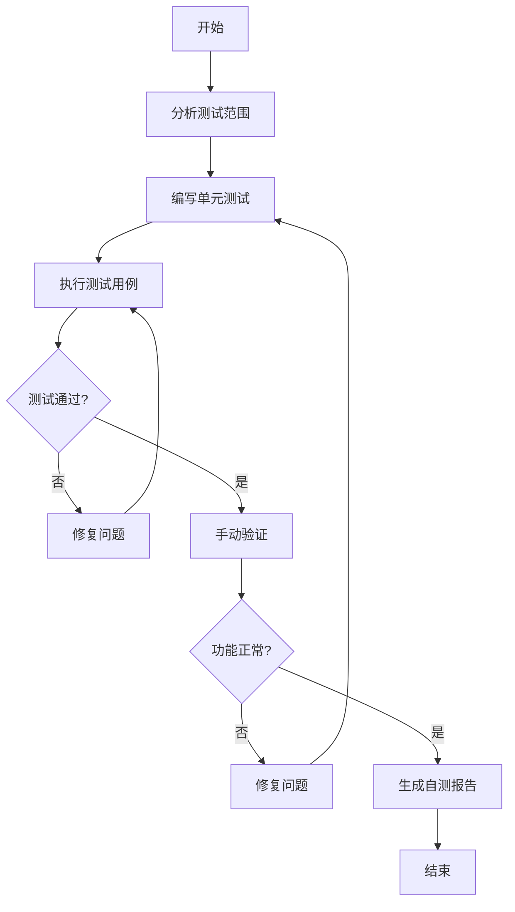

# 开发自测

> **触发场景**：编码完成后进行开发自测
> **前置条件**：功能代码已完成
> **输出工件**：测试代码、自测报告

---

## 1. 执行前检查

- [ ] 功能代码已完成
- [ ] 代码已通过基础检查（无编译错误）
- [ ] 了解测试范围和重点

---

## 2. 执行流程



### Step 1: 分析测试范围
1. 识别核心业务逻辑
2. 确定测试优先级
3. 规划测试用例

### Step 2: 编写单元测试
1. 对核心逻辑编写测试
2. 覆盖正常和异常场景
3. 覆盖边界条件

### Step 3: 执行测试
1. 运行所有测试用例
2. 确保测试通过
3. 修复发现的问题

### Step 4: 手动验证
1. 启动应用
2. 手动测试主要功能
3. 验证边界场景

### Step 5: 输出自测报告
1. 记录测试结果
2. 记录发现和修复的问题
3. 提交自测报告

---

## 3. 测试范围定义

### 3.1 必须测试

| 场景 | 测试重点 | 覆盖率要求 |
|------|----------|------------|
| 核心业务逻辑 | 业务规则正确性 | ≥80% |
| 数据处理逻辑 | 数据转换、校验 | ≥80% |
| 接口契约 | 请求/响应格式 | ≥60% |

### 3.2 可选测试

| 场景 | 说明 |
|------|------|
| 简单CRUD | 可通过手动验证 |
| 配置读取 | 可跳过单元测试 |
| 日志输出 | 可跳过 |

### 3.3 不需要测试

| 场景 | 说明 |
|------|------|
| Getter/Setter | 简单访问器 |
| 第三方库调用 | 依赖库已测试 |
| 框架代码 | Spring等框架代码 |

---

## 4. References 文档索引

| 文档 | 路径 | 内容侧重 |
|------|------|----------|
| 自测策略 | `./references/test_strategy.md` | 测试类型选择、优先级判断 |
| 单元测试规范 | `./references/unit_test_guide.md` | 测试命名、AAA模式、断言规范 |
| Mock策略 | `./references/mock_strategy.md` | Mock数据生成规则、Mockito使用 |

---

## 5. 质量检查点

- [ ] 核心逻辑有单元测试
- [ ] 测试覆盖正常和异常场景
- [ ] 边界条件已测试
- [ ] 手动验证功能正常

---

## 6. 输出示例

```
自测报告已生成：

测试统计：
- 单元测试用例：12个
- 测试通过：12个
- 测试覆盖率：85%

手动验证：
- [x] 新增功能正常
- [x] 编辑功能正常
- [x] 删除功能正常
- [x] 列表查询正常
- [x] 分页正常

发现并修复的问题：
1. 参数校验遗漏 - 已修复
2. 异常提示不准确 - 已修复

自测结论：通过，可进入代码审查阶段。
```
