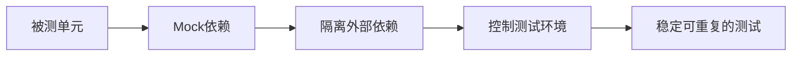

# Mock 数据策略

## 1. Mock 数据原则

### 1.1 Mock 的目的



### 1.2 何时使用 Mock

| 场景 | 是否Mock | 说明 |
|------|----------|------|
| 数据库操作 | ✓ Mock | 使用内存数据库或Mock Mapper |
| 外部API调用 | ✓ Mock | 避免网络依赖 |
| 文件系统操作 | ✓ Mock | 使用内存文件系统 |
| 时间相关操作 | ✓ Mock | 控制时间流逝 |
| 纯业务逻辑 | ✗ 不需要 | 直接测试 |
| 简单数据转换 | ✗ 不需要 | 直接测试 |

---

## 2. Mockito 使用规范

### 2.1 创建 Mock 对象

```java
// 方式1：使用 @Mock 注解
@ExtendWith(MockitoExtension.class)
class AlarmServiceTest {
    @Mock
    private AlarmRuleMapper alarmRuleMapper;
    
    @Mock
    private NotificationManager notificationManager;
    
    @InjectMocks
    private AlarmServiceImpl alarmService;
}

// 方式2：手动创建
AlarmRuleMapper mapper = mock(AlarmRuleMapper.class);
```

### 2.2 定义 Mock 行为

```java
// 返回指定值
when(mapper.selectById(1L)).thenReturn(createTestEntity());

// 返回 null
when(mapper.selectById(999L)).thenReturn(null);

// 抛出异常
when(mapper.insert(any())).thenThrow(new RuntimeException("数据库异常"));

// 无返回值方法
doNothing().when(notificationManager).sendNotification(any());

// 基于参数条件返回
when(mapper.selectByCondition(argThat(dto -> dto.getStatus() == 1)))
    .thenReturn(entityList);
```

### 2.3 验证 Mock 调用

```java
// 验证调用次数
verify(mapper, times(1)).insert(any());
verify(mapper, never()).delete(any());
verify(mapper, atLeast(1)).selectById(any());

// 验证调用参数
verify(mapper).insert(argThat(entity -> 
    entity.getName().equals("测试规则")
));

// 验证调用顺序
InOrder inOrder = inOrder(service, mapper);
inOrder.verify(service).validate(any());
inOrder.verify(mapper).insert(any());
```

---

## 3. 测试数据构建策略

### 3.1 Builder 模式

```java
// 使用 Lombok @Builder
@Data
@Builder
public class AlarmRuleTestBuilder {
    @Builder.Default
    private Long id = 1L;
    
    @Builder.Default
    private String name = "测试规则";
    
    @Builder.Default
    private Double threshold = 80.0;
    
    @Builder.Default
    private String level = "warning";
    
    public AlarmRuleEntity build() {
        AlarmRuleEntity entity = new AlarmRuleEntity();
        entity.setId(id);
        entity.setName(name);
        entity.setThreshold(threshold);
        entity.setLevel(level);
        return entity;
    }
}

// 使用示例
AlarmRuleEntity entity = AlarmRuleTestBuilder.builder()
    .name("自定义规则名")
    .build();
```

### 3.2 测试数据工厂

```java
public class TestDataFactory {
    
    /**
     * 创建默认报警规则
     */
    public static AlarmRuleEntity createDefaultAlarmRule() {
        AlarmRuleEntity entity = new AlarmRuleEntity();
        entity.setId(1L);
        entity.setName("默认规则");
        entity.setThreshold(80.0);
        entity.setLevel("warning");
        entity.setCreateTime(LocalDateTime.now());
        entity.setDelFlag(0);
        return entity;
    }
    
    /**
     * 创建指定ID的报警规则
     */
    public static AlarmRuleEntity createAlarmRuleWithId(Long id) {
        AlarmRuleEntity entity = createDefaultAlarmRule();
        entity.setId(id);
        return entity;
    }
    
    /**
     * 创建报警规则列表
     */
    public static List<AlarmRuleEntity> createAlarmRuleList(int count) {
        return IntStream.rangeClosed(1, count)
            .mapToObj(i -> {
                AlarmRuleEntity entity = createDefaultAlarmRule();
                entity.setId((long) i);
                entity.setName("规则" + i);
                return entity;
            })
            .collect(Collectors.toList());
    }
}
```

### 3.3 预定义测试数据

```java
public class TestConstants {
    // ID常量
    public static final Long VALID_ID = 1L;
    public static final Long INVALID_ID = 999L;
    public static final Long NON_EXISTENT_ID = -1L;
    
    // 名称常量
    public static final String VALID_NAME = "测试规则";
    public static final String EMPTY_NAME = "";
    public static final String LONG_NAME = "这是一个非常非常非常长的规则名称...";
    
    // 阈值常量
    public static final Double VALID_THRESHOLD = 80.0;
    public static final Double MIN_THRESHOLD = 0.0;
    public static final Double MAX_THRESHOLD = 100.0;
    public static final Double NEGATIVE_THRESHOLD = -1.0;
}
```

---

## 4. Mock 数据生成规则

### 4.1 字段生成规则

| 字段类型 | 生成规则 | 示例 |
|----------|----------|------|
| ID | 使用固定值或序列 | 1L, 2L, 3L |
| 名称 | 描述性名称 | "测试规则", "示例配置" |
| 时间 | 固定时间或当前时间 | LocalDateTime.of(2024, 1, 1, 0, 0) |
| 状态 | 使用枚举值 | Status.ACTIVE |
| 金额 | 合理业务值 | 100.00 |
| 标识 | 固定格式 | "TEST_001" |

### 4.2 边界值生成

```java
public class BoundaryDataFactory {
    
    // 字符串边界
    public static final String EMPTY_STRING = "";
    public static final String MAX_LENGTH_STRING = "x".repeat(255);
    public static final String OVER_MAX_LENGTH_STRING = "x".repeat(256);
    
    // 数值边界
    public static final Integer ZERO = 0;
    public static final Integer NEGATIVE_ONE = -1;
    public static final Integer MAX_INT = Integer.MAX_VALUE;
    public static final Integer MIN_INT = Integer.MIN_VALUE;
    
    // 集合边界
    public static final <T> List<T> emptyList() {
        return Collections.emptyList();
    }
    
    public static <T> List<T> singleElementList(T element) {
        return Collections.singletonList(element);
    }
    
    public static <T> List<T> largeList(Supplier<T> supplier, int size) {
        return Stream.generate(supplier)
            .limit(size)
            .collect(Collectors.toList());
    }
}
```

---

## 5. 特殊场景 Mock

### 5.1 Mock 时间

```java
// 使用 Mockito
@Test
void testWithMockedTime() {
    LocalDateTime fixedTime = LocalDateTime.of(2024, 1, 1, 12, 0);
    
    try (MockedStatic<LocalDateTime> mockedStatic = mockStatic(LocalDateTime.class)) {
        mockedStatic.when(LocalDateTime::now).thenReturn(fixedTime);
        
        // 测试代码
        LocalDateTime result = service.getCurrentTime();
        assertEquals(fixedTime, result);
    }
}
```

### 5.2 Mock 静态方法

```java
@Test
void testWithStaticMock() {
    try (MockedStatic<IdGenerator> mockedStatic = mockStatic(IdGenerator.class)) {
        mockedStatic.when(IdGenerator::nextId).thenReturn(12345L);
        
        // 测试代码
        Long id = service.generateId();
        assertEquals(12345L, id);
    }
}
```

### 5.3 Mock Spring Bean

```java
@SpringBootTest
class IntegrationTest {
    
    @MockBean
    private ExternalApiService externalApiService;
    
    @Test
    void testWithMockedBean() {
        when(externalApiService.callExternal(any()))
            .thenReturn(new ApiResponse(200, "success"));
        
        // 测试代码会使用Mock的Bean
    }
}
```

---

## 6. Mock 数据管理最佳实践

### 6.1 数据隔离

```java
// 每个测试方法使用独立的Mock数据
@BeforeEach
void setUp() {
    // 重置Mock
    reset(mapper);
    
    // 设置默认行为
    when(mapper.selectById(any())).thenReturn(null);
}
```

### 6.2 数据清理

```java
@AfterEach
void tearDown() {
    // 验证没有遗漏的调用
    verifyNoMoreInteractions(mapper);
}
```

### 6.3 避免 Mock 过度

```java
// 错误：Mock了所有依赖，测试变得脆弱
when(a.getName()).thenReturn("test");
when(b.getValue()).thenReturn(1);
when(c.calculate(any())).thenReturn(100);

// 正确：只Mock外部依赖，内部逻辑直接测试
when(externalApi.getData()).thenReturn(testData);
// 内部逻辑通过真实调用验证
```
