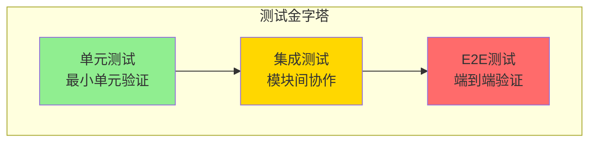
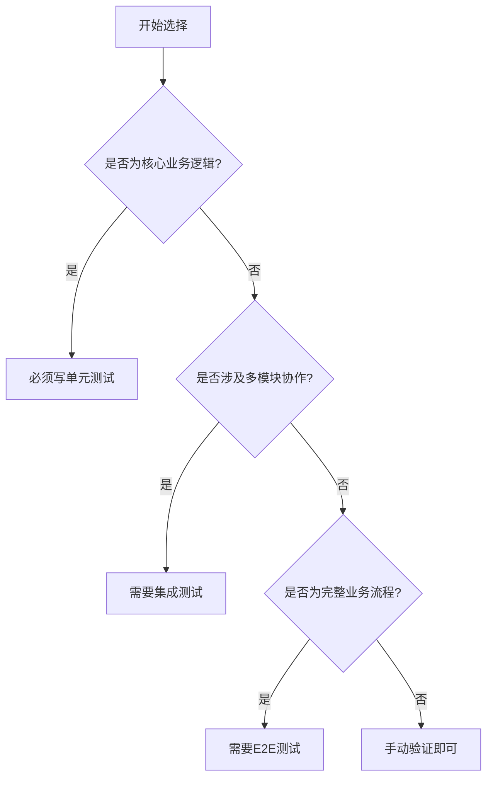
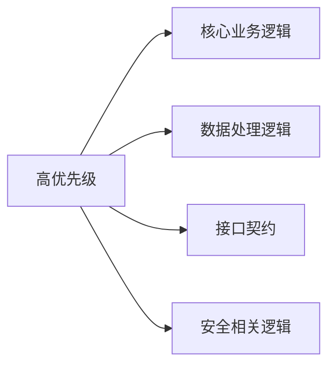

# 开发自测策略

## 1. 测试类型选择

### 1.1 测试金字塔



### 1.2 测试类型对比

| 测试类型 | 适用场景 | 执行速度 | 维护成本 |
|----------|----------|----------|----------|
| 单元测试 | 核心业务逻辑 | 快（毫秒级） | 低 |
| 集成测试 | 模块间协作 | 中（秒级） | 中 |
| E2E测试 | 完整流程验证 | 慢（分钟级） | 高 |

### 1.3 选择原则



---

## 2. 测试优先级

### 2.1 高优先级（必须测试）



| 场景 | 测试重点 | 原因 |
|------|----------|------|
| 核心业务逻辑 | 业务规则正确性 | 影响主要功能 |
| 数据处理逻辑 | 数据转换、校验 | 数据一致性关键 |
| 接口契约 | 请求/响应格式 | 前后端协作基础 |
| 安全相关 | 权限校验、数据加密 | 安全风险 |

### 2.2 中优先级（建议测试）

| 场景 | 测试重点 | 说明 |
|------|----------|------|
| 工具类方法 | 各种输入输出 | 提高复用可靠性 |
| 复杂条件分支 | 各分支逻辑 | 确保分支覆盖 |
| 边界条件 | 边界值处理 | 防止边界问题 |

### 2.3 低优先级（可跳过）

| 场景 | 说明 | 替代方案 |
|------|------|----------|
| 简单CRUD | 逻辑简单 | 手动验证 |
| 配置读取 | 框架已验证 | 手动验证 |
| 日志输出 | 非关键路径 | 可跳过 |

---

## 3. 覆盖率标准

### 3.1 行覆盖率要求

| 代码类型 | 覆盖率要求 | 说明 |
|----------|------------|------|
| 核心业务逻辑 | ≥80% | Service/Manager层核心方法 |
| 工具类 | ≥60% | 通用工具方法 |
| Controller | ≥40% | 主要是调用转发 |
| 简单POJO | 可不测 | Getter/Setter |

### 3.2 分支覆盖率要求

| 场景 | 覆盖率要求 |
|------|------------|
| 条件分支 | 100% |
| 异常处理 | 100% |
| 边界条件 | 100% |

---

## 4. 测试时机

### 4.1 开发自测阶段


### 4.2 代码审查阶段

- 审查测试用例是否完整
- 审查测试覆盖是否足够
- 审查测试代码质量

### 4.3 提交代码前

- 确保所有测试通过
- 确保覆盖率达标
- 确保无新增警告

---

## 5. 测试数据管理

### 5.1 测试数据策略

| 策略 | 适用场景 | 说明 |
|------|----------|------|
| 硬编码数据 | 简单测试 | 直接在测试代码中定义 |
| 测试数据文件 | 复杂数据 | 使用JSON/YAML文件 |
| Mock数据 | 外部依赖 | 模拟外部系统响应 |
| 随机生成 | 大数据量 | 使用数据生成工具 |

### 5.2 数据隔离原则

- 测试数据与生产数据隔离
- 每个测试用例数据独立
- 测试后清理数据

---

## 6. 自测报告模板

```markdown
# 开发自测报告

## 1. 测试概要
- 测试时间：YYYY-MM-DD
- 测试范围：xxx模块
- 测试人员：xxx

## 2. 单元测试
- 测试用例数：xx个
- 通过数：xx个
- 失败数：xx个
- 覆盖率：xx%

## 3. 手动验证
- [ ] 功能1：正常
- [ ] 功能2：正常
- [ ] 功能3：正常

## 4. 问题记录
| 序号 | 问题描述 | 修复状态 |
|------|----------|----------|
| 1 | xxx | 已修复 |

## 5. 结论
[自测结论：通过/不通过]
```
