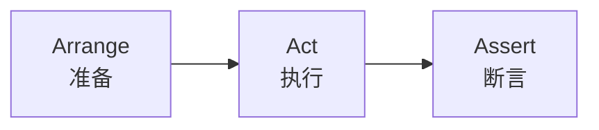

# 单元测试规范

## 1. 测试命名规范

### 1.1 测试类命名

| 规则 | 示例 |
|------|------|
| 测试类以Test结尾 | AlarmRuleServiceTest |
| 与被测试类对应 | AlarmRuleService → AlarmRuleServiceTest |

### 1.2 测试方法命名

**格式**：`方法名_测试场景_预期结果`

```java
// 示例
@Test
void createAlarmRule_WithValidParams_ShouldSuccess() { }

@Test
void createAlarmRule_WithDuplicateName_ShouldThrowException() { }

@Test
void getAlarmRuleById_WithNonExistentId_ShouldReturnNull() { }
```

### 1.3 命名风格对比

| 风格 | 示例 | 推荐度 |
|------|------|--------|
| 中文风格 | 创建报警规则_参数有效_应成功 | ✗ 不推荐 |
| 下划线风格 | createAlarmRule_validParams_success | ✓ 推荐 |
| 驼峰风格 | createAlarmRuleValidParamsSuccess | ✗ 不推荐 |
| Given-When-Then | shouldSuccessWhenCreateAlarmRuleWithValidParams | ✓ 推荐 |

---

## 2. AAA 模式

### 2.1 模式说明



| 阶段 | 说明 | 内容 |
|------|------|------|
| Arrange | 准备测试数据 | 构造输入参数、Mock对象 |
| Act | 执行被测试方法 | 调用目标方法 |
| Assert | 验证执行结果 | 断言返回值、状态变化 |

### 2.2 代码示例

```java
@Test
void createAlarmRule_WithValidParams_ShouldSuccess() {
    // Arrange - 准备
    AlarmRuleCreateRequest request = AlarmRuleCreateRequest.builder()
        .name("测试规则")
        .threshold(80.0)
        .level("warning")
        .build();
    
    when(alarmRuleMapper.insert(any())).thenReturn(1);
    
    // Act - 执行
    Long ruleId = alarmRuleService.createAlarmRule(request);
    
    // Assert - 断言
    assertNotNull(ruleId);
    verify(alarmRuleMapper, times(1)).insert(any());
}
```

### 2.3 多断言场景

```java
@Test
void getAlarmRuleById_WithValidId_ShouldReturnRule() {
    // Arrange
    Long ruleId = 1L;
    AlarmRuleEntity entity = new AlarmRuleEntity();
    entity.setId(ruleId);
    entity.setName("测试规则");
    when(alarmRuleMapper.selectById(ruleId)).thenReturn(entity);
    
    // Act
    AlarmRuleDTO result = alarmRuleService.getAlarmRuleById(ruleId);
    
    // Assert
    assertNotNull(result);
    assertEquals(ruleId, result.getId());
    assertEquals("测试规则", result.getName());
}
```

---

## 3. 断言规范

### 3.1 常用断言

| 断言方法 | 用途 | 示例 |
|----------|------|------|
| assertEquals | 相等断言 | assertEquals(expected, actual) |
| assertNotEquals | 不等断言 | assertNotEquals(value1, value2) |
| assertTrue | 真值断言 | assertTrue(result) |
| assertFalse | 假值断言 | assertFalse(result) |
| assertNull | 空值断言 | assertNull(result) |
| assertNotNull | 非空断言 | assertNotNull(result) |
| assertThrows | 异常断言 | assertThrows(Exception.class, () -> {...}) |

### 3.2 异常测试

```java
@Test
void createAlarmRule_WithDuplicateName_ShouldThrowException() {
    // Arrange
    AlarmRuleCreateRequest request = new AlarmRuleCreateRequest();
    request.setName("已存在的规则名");
    
    when(alarmRuleMapper.selectByName("已存在的规则名"))
        .thenReturn(new AlarmRuleEntity());
    
    // Act & Assert
    BusinessException exception = assertThrows(
        BusinessException.class,
        () -> alarmRuleService.createAlarmRule(request)
    );
    
    assertEquals("规则名称已存在", exception.getMessage());
}
```

### 3.3 集合断言

```java
@Test
void listAlarmRules_ShouldReturnRuleList() {
    // Arrange
    List<AlarmRuleEntity> entities = Arrays.asList(
        createTestRule(1L, "规则1"),
        createTestRule(2L, "规则2")
    );
    when(alarmRuleMapper.selectList(any())).thenReturn(entities);
    
    // Act
    List<AlarmRuleDTO> result = alarmRuleService.listAlarmRules();
    
    // Assert
    assertNotNull(result);
    assertEquals(2, result.size());
    assertEquals("规则1", result.get(0).getName());
}
```

---

## 4. Mock 规范

### 4.1 Mock 对象创建

```java
@ExtendWith(MockitoExtension.class)
class AlarmRuleServiceTest {
    
    @Mock
    private AlarmRuleMapper alarmRuleMapper;
    
    @Mock
    private AlarmEventManager alarmEventManager;
    
    @InjectMocks
    private AlarmRuleServiceImpl alarmRuleService;
    
    // 测试方法...
}
```

### 4.2 Mock 行为定义

```java
// 返回值
when(mapper.selectById(1L)).thenReturn(entity);

// 抛出异常
when(mapper.selectById(1L)).thenThrow(new RuntimeException("测试异常"));

// 无返回值方法
doNothing().when(mapper).insert(any());

// 验证调用
verify(mapper, times(1)).insert(any());
verify(mapper, never()).delete(any());
```

### 4.3 参数匹配

```java
// 任意参数
when(mapper.selectById(anyLong())).thenReturn(entity);

// 具体参数
when(mapper.selectById(1L)).thenReturn(entity);

// 参数条件
when(mapper.selectByName(argThat(name -> name.startsWith("test"))))
    .thenReturn(entity);
```

---

## 5. 测试数据构建

### 5.1 Builder 模式

```java
// 使用 Lombok @Builder
AlarmRuleEntity entity = AlarmRuleEntity.builder()
    .id(1L)
    .name("测试规则")
    .threshold(80.0)
    .level("warning")
    .build();
```

### 5.2 测试数据工厂

```java
public class TestDataFactory {
    
    public static AlarmRuleEntity createDefaultRule() {
        return AlarmRuleEntity.builder()
            .name("默认规则")
            .threshold(80.0)
            .level("warning")
            .build();
    }
    
    public static AlarmRuleEntity createRuleWithId(Long id) {
        AlarmRuleEntity entity = createDefaultRule();
        entity.setId(id);
        return entity;
    }
}
```

---

## 6. 测试覆盖检查

### 6.1 必须覆盖的场景

- [ ] 正常路径
- [ ] 异常路径
- [ ] 边界条件
- [ ] 空值/null值
- [ ] 集合为空

### 6.2 覆盖率检查命令

```bash
# Maven
mvn test jacoco:report

# Gradle
gradle test jacocoTestReport
```
