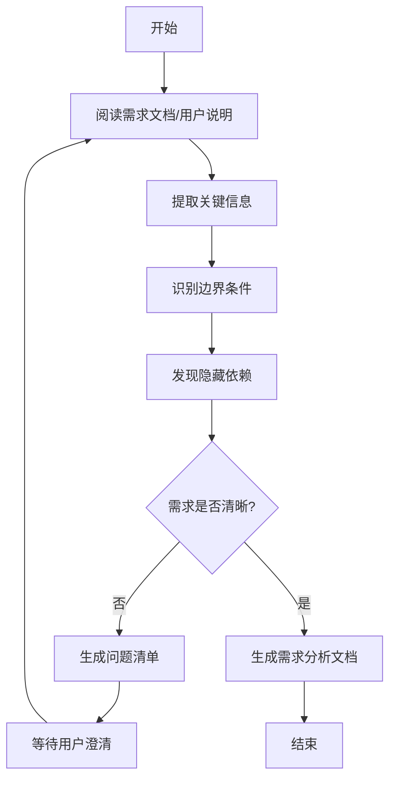

# 冲刺需求理解与分析

> **触发场景**：需要进行冲刺需求理解与分析
> **输出工件**：需求分析文档、问题清单
> **路径基准**：本文档中所有路径均相对于 `ai_collaboration/` 目录

---

## 1. 执行前检查

- [ ] 确认需求来源文档（`ai_collaboration/docs/sprints/` 或用户说明）
- [ ] 阅读产品定义：`ai_collaboration/rules/common/product.md`
- [ ] 了解架构设计规范：`ai_collaboration/rules/common/arch_solutions.md`

---

## 2. 执行流程



### Step 1: 需求理解
1. 阅读需求文档或用户说明
2. 明确功能边界和约束条件
3. 识别技术风险点

### Step 2: 需求澄清
1. 整理待澄清问题
2. 生成问题清单
3. 等待用户确认

### Step 3: 文档输出
1. 按模板生成需求分析文档
2. 输出摘要供用户确认

---

## 3. 文档模板

需求分析文档应包含以下章节：

```markdown
# {需求名称} 需求分析

## 1. 需求概述
- 功能描述
- 业务价值
- 目标用户

## 2. 功能边界
- 包含的功能点
- 不包含的功能点
- 边界条件

## 3. 技术约束
- 性能要求
- 兼容性要求
- 安全要求

## 4. 依赖关系
- 外部系统依赖
- 内部模块依赖
- 数据依赖

## 5. 风险评估
- 技术风险
- 业务风险
- 缓解措施

## 6. 待确认问题
- 问题列表
```

---

## 4. References 文档索引

| 文档 | 路径 | 内容侧重 |
|------|------|----------|
| 需求分析方法论 | `./references/requirement_analysis.md` | 如何从模糊需求提取关键信息 |
| 问题清单模板 | `./references/question_checklist.md` | 需求澄清的标准问题列表 |
| 验收标准规范 | `./references/acceptance_criteria.md` | 如何定义可测试的验收标准 |
| 示例案例 | `./references/examples/` | 实际需求分析案例 |

---

## 5. 质量检查点

- [ ] 功能边界是否明确
- [ ] 依赖关系是否识别完整
- [ ] 风险点是否已识别
- [ ] 待确认问题是否已整理

---

## 6. 输出示例

```
需求分析已生成：

摘要：
- 需求名称：采集器管理模块
- 功能范围：采集器CRUD、状态监控
- 涉及端侧：后端、Web端
- 主要依赖：权限模块、通知模块
- 风险点：大文件上传性能

待确认问题：
1. 采集器配置项的具体字段？
2. 是否需要支持批量导入？
3. 历史数据保留策略？

请确认或澄清上述问题后，进入设计方案阶段。
```
