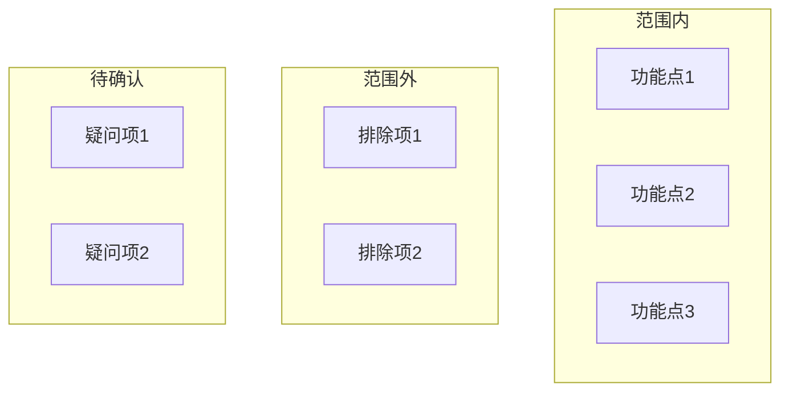
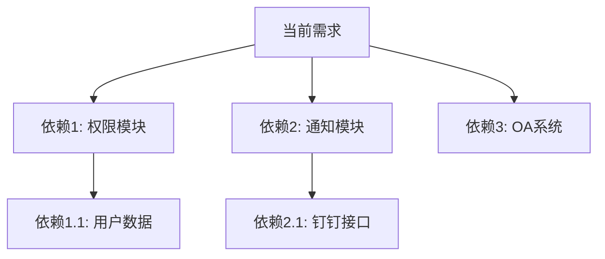
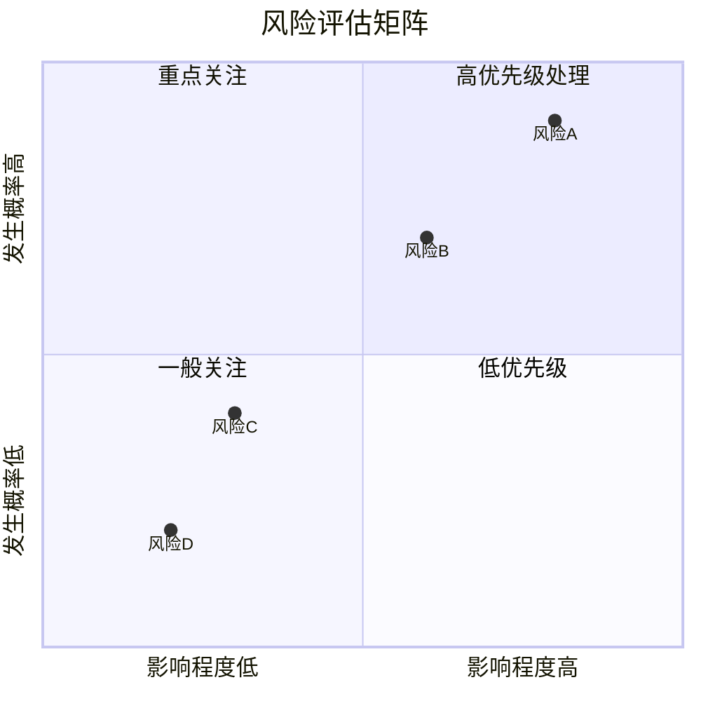

# 需求分析方法论

## 1. 需求理解的核心步骤


---

## 2. 信息提取方法

### 2.1 关键信息类型

| 信息类型 | 关注点 | 示例问题 |
|----------|--------|----------|
| **功能信息** | 做什么 | 系统需要提供什么功能？ |
| **数据信息** | 处理什么数据 | 输入输出是什么？数据量多大？ |
| **用户信息** | 谁来用 | 目标用户是谁？使用场景是什么？ |
| **约束信息** | 限制条件 | 有什么技术/业务限制？ |
| **质量信息** | 质量要求 | 性能要求？安全要求？ |

### 2.2 信息提取技巧

1. **5W1H分析法**：Who、What、When、Where、Why、How
2. **用户故事**：作为[角色]，我想[功能]，以便[价值]
3. **场景分析法**：识别典型使用场景

---

## 3. 边界识别方法

### 3.1 功能边界



### 3.2 边界识别清单

- [ ] 明确包含的功能点
- [ ] 明确不包含的功能点
- [ ] 识别模糊不清的需求点
- [ ] 确认边界条件（数据边界、时间边界等）

---

## 4. 依赖分析方法

### 4.1 依赖类型

| 依赖类型 | 说明 | 示例 |
|----------|------|------|
| **数据依赖** | 需要的数据来源 | 用户信息来自权限模块 |
| **接口依赖** | 需要调用的外部接口 | 需要调用OA系统接口 |
| **模块依赖** | 需要的其他模块支持 | 需要通知模块推送消息 |
| **环境依赖** | 运行环境要求 | 需要Redis集群 |

### 4.2 依赖关系图



---

## 5. 风险识别方法

### 5.1 风险分类

| 风险类型 | 关注点 | 示例 |
|----------|--------|------|
| **技术风险** | 技术实现难度 | 性能瓶颈、技术选型 |
| **业务风险** | 业务影响范围 | 业务流程变更、用户习惯改变 |
| **时间风险** | 开发周期压力 | 依赖交付时间、资源不足 |
| **集成风险** | 外部系统对接 | 第三方接口稳定性 |

### 5.2 风险评估矩阵



---

## 6. 结构化输出模板

需求分析结果应结构化输出，便于后续设计和开发参考：

```markdown
# 需求分析报告

## 元信息
- 需求名称：
- 分析日期：
- 分析人员：

## 功能概述
[一句话描述需求核心]

## 功能清单
| 功能点 | 优先级 | 复杂度 | 说明 |
|--------|--------|--------|------|
| ... | P1/P2/P3 | 高/中/低 | ... |

## 边界条件
- 数据边界：
- 时间边界：
- 权限边界：

## 依赖清单
| 依赖项 | 类型 | 是否已就绪 | 说明 |
|--------|------|------------|------|
| ... | 数据/接口/模块 | 是/否/部分 | ... |

## 风险清单
| 风险项 | 类型 | 影响 | 概率 | 缓解措施 |
|--------|------|------|------|----------|
| ... | 技术/业务 | 高/中/低 | 高/中/低 | ... |

## 待确认问题
1. ...
2. ...
```
