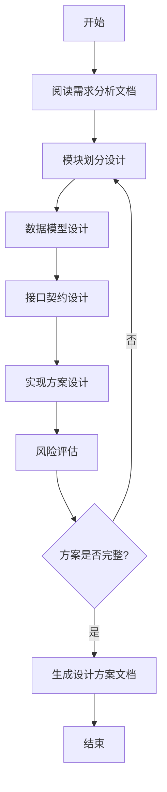
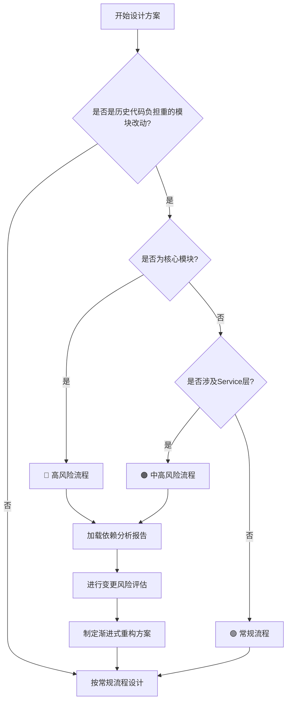
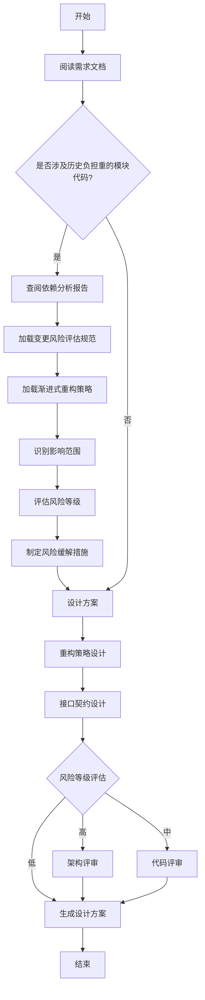
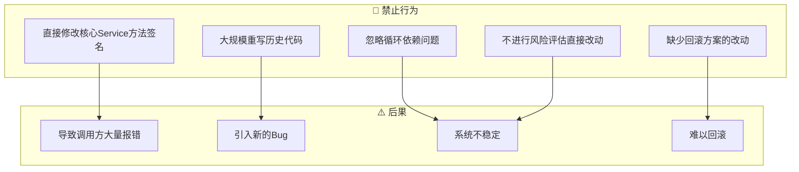

# 技术方案设计

> **触发场景**：需要进行模块级或需求级的详细技术方案设计
> **输出工件**：`ai_collaboration/docs/detail_solutions/{module_name}.md`
> **路径基准**：本文档中所有路径均相对于 `ai_collaboration/` 目录

---

## 1. 执行前检查

- [ ] 确认需求来源文档（需求分析文档或用户说明）
- [ ] 阅读顶层架构设计规范：`./rules/common/arch_solutions.md`
- [ ] 确认涉及的端侧，按需加载技术规范

---

## 2. 执行流程



### Step 1: 需求理解
1. 阅读需求文档或用户说明
2. 明确功能边界和约束条件
3. 识别技术风险点

### Step 2: 方案设计
1. 遵循架构设计规范进行模块划分
2. 设计数据模型和接口定义
3. 规划技术选型和实现路径

### Step 3: 文档输出
1. 按模板生成设计方案文档
2. 写入 `ai_collaboration/docs/detail_solutions/{module_name}.md`
3. 输出摘要供用户确认

---

## 3. 文档模板

设计方案文档应包含以下章节：

```markdown
# {模块名称} 详细设计方案

## 文档版本信息
| 项目 | 内容 |
|------|------|
| 文档版本 | v1.0 |
| 创建日期 | 创建日期 |
| 适用任务 | TASK-识别标志 |
| 涉及模块 | 涉及影响的前后端模块 |
| 预估工作量 | x人日 |
| 优先级 | P1(高) / P2(中高) / P3(低) |

## 一、设计目标与原则
## 二、整体设计概述
## 三、功能点详细设计
## 四、优化方案
## 五、监控与故障处理
## 六、安全设计
## 七、实施计划
```

完整模板参考：`./rules/common/templates/detail_solution_template.md`

---

## 4. 公共规范引用

本 Skill 直接引用公共规范文档，无需额外拆分：

| 规范类型 | 引用路径 | 内容说明 |
|----------|----------|----------|
| **架构设计规范** | `./rules/common/arch_solutions.md` | 模块划分原则、分层架构规范 |
| **后端技术规范** | `./rules/common/tech_structure_backend.md` | API设计规范、数据库设计规范 |
| **Web端技术规范** | `./rules/common/tech_structure_web.md` | 前后端接口契约、组件设计规范 |
| **移动端技术规范** | `./rules/common/tech_structure_mobile.md` | 移动端适配规范 |

**说明**：设计时按需加载对应端侧的技术规范文档，直接引用其中的规则和要求。

---

## 5. References 文档索引

| 文档 | 路径 | 内容侧重 |
|------|------|----------|
| 设计原则指南 | `./references/design_principles.md` | 本项目设计原则的具体应用 |
| 风险评估模板 | `./references/risk_assessment.md` | 技术风险评估方法 |
| **变更风险评估规范** | `./references/dependency_analysis.md` | 历史代码修改的风险评估流程和标准 |
| **渐进式重构策略** | `./references/legacy_refactor_strategy.md` | 历史代码重构的原则、策略和约束 |
| 示例案例 | `./references/examples/` | 实际设计案例参考 |

---

## 6. 历史负担重的模块改动场景的特殊要求

### 6.1 适用场景判断

当出现以下情况时，**必须**执行历史代码改动流程：



**核心模块识别标准**：
- 被多个模块直接依赖（依赖数 ≥ 3）
- 代码行数超过 3000 行
- 涉及核心业务流程（订单、库存、结算等）

### 6.2 前置条件：依赖分析报告

在进行历史代码改动设计前，**必须确认**以下依赖分析报告已存在：

| 报告类型 | 存放位置 | 用途 |
|----------|----------|------|
| 模块依赖关系分析报告 | `ai_collaboration/docs/reports/模块依赖关系分析报告*.md` | 了解模块间依赖关系 |
| 关键模块依赖影响分析 | `ai_collaboration/docs/reports/关键模块依赖影响分析*.md` | 评估改动影响范围 |
| 循环依赖分析报告 | `ai_collaboration/docs/reports/循环依赖分析*.md` | 识别循环依赖风险 |

**如果报告不存在**，应：
1. 先执行依赖分析，生成报告
2. （推荐）或中断流程，并明确告知用户需要先进行依赖分析

### 6.3 执行流程（历史负担重的模块代码改动）



### 6.4 必须加载的参考文档

**针对历史负担重的模块代码改动场景**，必须按顺序加载以下文档：

#### Step 1: 加载变更风险评估规范
```
参考：./references/dependency_analysis.md
重点内容：
- 风险评估流程
- 风险等级判断标准
- 高风险模块清单
- 变更检查清单
```

#### Step 2: 加载渐进式重构策略
```
参考：./references/legacy_refactor_strategy.md
重点内容：
- 最小侵入原则
- 向后兼容原则
- 可测试原则
- 循环依赖处理方案
- 大型Service拆分策略
- 数据库变更规范
```

### 6.5 设计方案文档要求

针对历史负担重的模块代码改动的设计方案文档，**必须额外包含**以下章节：

```markdown
## 八、历史代码改动风险评估

### 8.1 影响范围分析
- 直接依赖模块：[列出直接依赖该代码的模块]
- 间接依赖模块：[列出间接依赖的模块]
- 数据影响范围：[涉及的数据库表和字段]
- 接口影响范围：[受影响的API接口]

### 8.2 风险等级
- 评估等级：🔴 极高 / 🔴 高 / 🟠 中高 / 🟡 中 / 🟢 低
- 判断依据：[说明为何是该风险等级]

### 8.3 风险缓解措施
- [ ] 详细设计方案评审
- [ ] 架构层面评审（高风险必须）
- [ ] 全量回归测试用例
- [ ] 测试环境充分验证
- [ ] 制定回滚方案

### 8.4 重构策略
- 采用的重构方案：[最小侵入 / 向后兼容 / 渐进式迁移]
- 循环依赖处理：[如有循环依赖，说明解决方案]
- 数据迁移方案：[如涉及数据库变更，说明迁移方案]

### 8.5 验证计划
- 测试覆盖范围：[说明需要测试的范围]
- 回归测试重点：[核心业务流程]
- 性能验证点：[如涉及性能敏感代码]
```

### 6.6 禁止事项

在涉及历史负担重的模块代码改动时，**严禁**以下行为：



---

## 7. 质量检查点

### 7.1 常规检查项

- [ ] 方案是否符合架构规范
- [ ] 接口定义是否完整
- [ ] 数据模型是否合理
- [ ] 风险点是否已识别

### 7.2 历史负担重的模块代码改动检查项

**当涉及历史负担重的模块代码修改时，额外检查**：

- [ ] 是否查阅了依赖分析报告
- [ ] 是否评估了风险等级
- [ ] 是否制定了风险缓解措施
- [ ] 是否遵循渐进式重构原则
- [ ] 是否有循环依赖处理方案
- [ ] 是否有数据迁移方案（如涉及）
- [ ] 是否有回滚方案
- [ ] 是否安排了架构评审（高风险必须）

---

## 8. 输出示例

### 8.1 常规新增功能

```
设计方案已生成：ai_collaboration/docs/detail_solutions/collector_management.md

摘要：
- 模块：采集器管理
- 涉及端侧：后端、Web端
- 主要变更：新增采集器CRUD接口，前端管理页面
- 风险点：大文件上传性能优化

请确认设计方案后，进入编码落地阶段。
```

### 8.2 历史负担重的模块代码改动

```
设计方案已生成：ai_collaboration/docs/detail_solutions/order_refactor.md

摘要：
- 模块：订单服务改动
- 涉及端侧：后端
- 风险等级：🔴 高风险
  - 涉及核心模块：OrderService (被15个模块依赖)
  - 存在循环依赖：OrderService ↔ DistributionService
  
依赖分析：
- 已查阅：ai_collaboration/docs/reports/模块依赖关系分析报告-2026Q1.md
- 影响范围：15个直接依赖模块，3个间接依赖模块

重构策略：
- 采用渐进式迁移，保留旧方法并标记 @Deprecated
- 通过提取 CommonService 解决循环依赖
- 新增接口采用新Service，逐步迁移调用方

风险缓解措施：
- [x] 详细设计方案评审已完成
- [ ] 架构层面评审（待安排）
- [ ] 全量回归测试用例（待编写）
- [ ] 测试环境验证（待执行）
- [ ] 回滚方案（已制定）

请先安排架构评审，评审通过后进入编码落地阶段。
```
