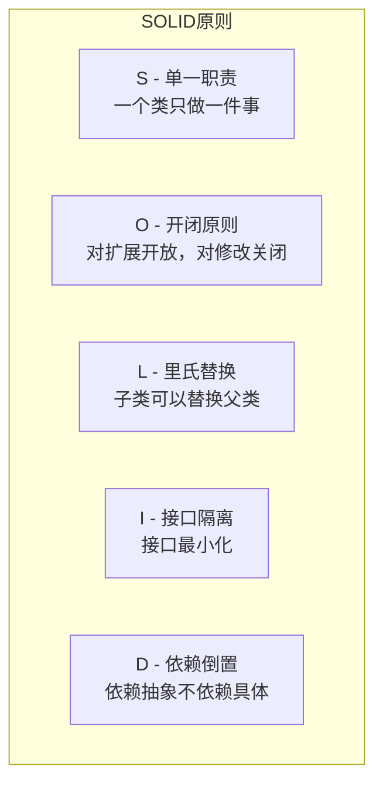
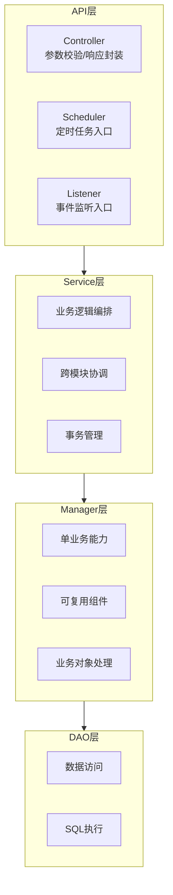
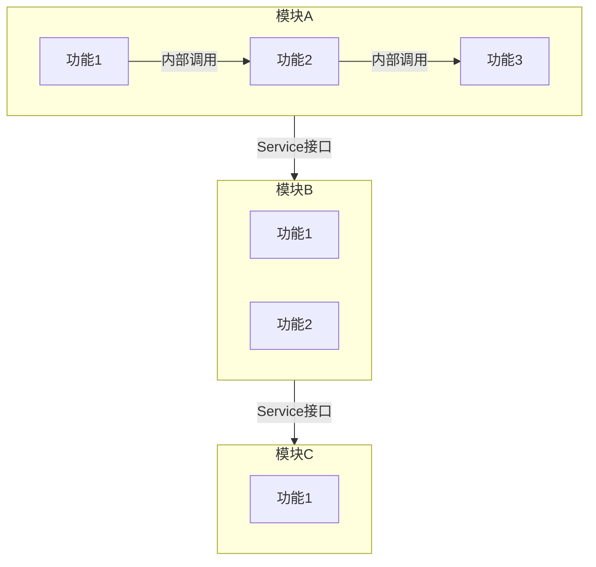
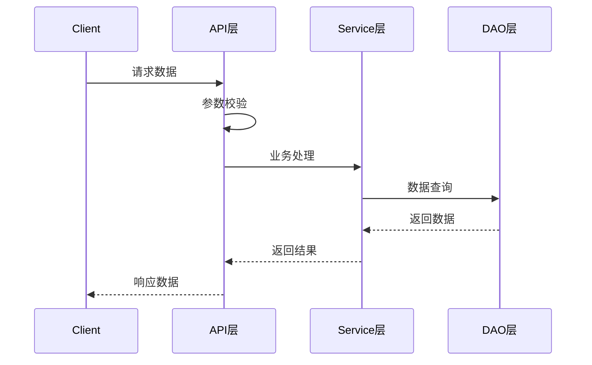

# 设计原则指南

## 1. 核心设计原则

### 1.1 SOLID 原则在项目中的应用



#### 在本项目中的具体应用

| 原则 | 应用场景 | 示例 |
|------|----------|------|
| **单一职责** | 类/方法设计 | Controller只负责参数校验和响应，Service负责业务逻辑 |
| **开闭原则** | 扩展设计 | 规则引擎支持插件扩展，新增规则类型无需修改核心代码 |
| **里氏替换** | 继承设计 | 不同通知渠道的实现可以互相替换 |
| **接口隔离** | 接口设计 | 采集器接口与处理器接口分离 |
| **依赖倒置** | 依赖注入 | 通过Spring IOC注入依赖，降低耦合 |

---

## 2. 分层架构设计原则

### 2.1 分层职责



### 2.2 调用规则

| 规则 | 说明 | 禁止行为 |
|------|------|----------|
| **单向调用** | 上层调用下层 | 禁止反向调用 |
| **跨层访问** | API层可跳过Service直接调用Manager（简单场景） | 禁止API直接调用DAO |
| **模块隔离** | 跨模块调用通过Service层 | 禁止直接调用其他模块的DAO |

---

## 3. 高内聚低耦合设计

### 3.1 模块边界划分



### 3.2 模块间通信规则

| 通信方式 | 适用场景 | 说明 |
|----------|----------|------|
| **同步调用** | 需要立即返回结果 | 通过Service接口调用 |
| **异步事件** | 无需立即响应，解耦场景 | 通过Spring Event |
| **消息队列** | 高并发、削峰填谷 | 通过Redis队列 |

---

## 4. 接口设计原则

### 4.1 RESTful 设计规范

| 操作 | HTTP方法 | URL示例 | 说明 |
|------|----------|---------|------|
| 查询列表 | GET | /api/collectors | 获取列表 |
| 查询详情 | GET | /api/collectors/{id} | 获取详情 |
| 新增 | POST | /api/collectors | 创建资源 |
| 更新 | PUT | /api/collectors/{id} | 全量更新 |
| 部分更新 | PATCH | /api/collectors/{id} | 部分更新 |
| 删除 | DELETE | /api/collectors/{id} | 删除资源 |

### 4.2 接口命名规范

- **使用名词**：URL中使用名词，不使用动词
- **使用复数**：资源名称使用复数形式
- **层次清晰**：通过URL路径表达资源层次关系
- **版本控制**：通过Header或URL路径管理版本

---

## 5. 数据设计原则

### 5.1 数据库设计原则

| 原则 | 说明 |
|------|------|
| **范式设计** | 遵循第三范式，避免数据冗余 |
| **适度反范式** | 高频查询场景可适当冗余 |
| **索引设计** | 根据查询条件创建合适索引 |
| **分表策略** | 大表按时间或业务分表 |

### 5.2 字段设计规范

```sql
-- 标准字段（必需）
id BIGINT AUTO_INCREMENT PRIMARY KEY,
create_time TIMESTAMP(3) DEFAULT CURRENT_TIMESTAMP(3) NOT NULL COMMENT '创建时间',
modify_time TIMESTAMP(3) DEFAULT CURRENT_TIMESTAMP(3) NOT NULL ON UPDATE CURRENT_TIMESTAMP(3) COMMENT '修改时间',
del_flag TINYINT DEFAULT 0 NULL COMMENT '删除标识 (0:正常, 1:删除)'
```

---

## 6. 设计文档规范

### 6.1 统一使用 Mermaid 语法

**强制要求**：所有设计文档中的流程图、架构图、时序图等，统一使用 Mermaid 语法。

**支持的图表类型**：
- 流程图（flowchart）
- 时序图（sequenceDiagram）
- 类图（classDiagram）
- 状态图（stateDiagram）
- ER图（erDiagram）

### 6.2 示例


