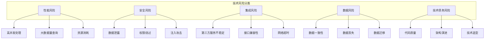
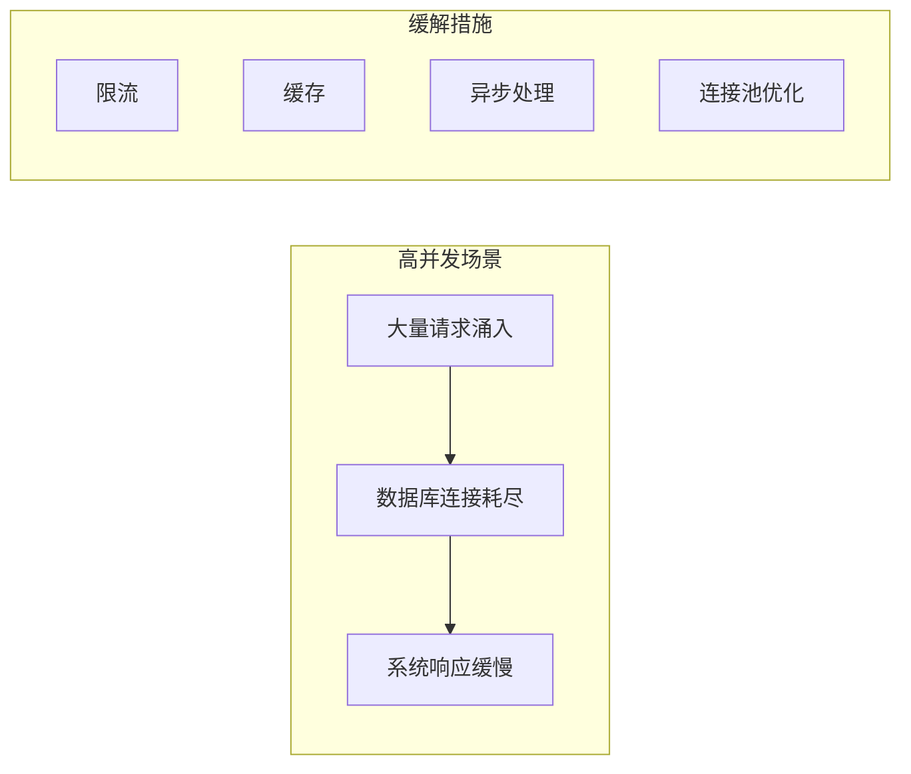
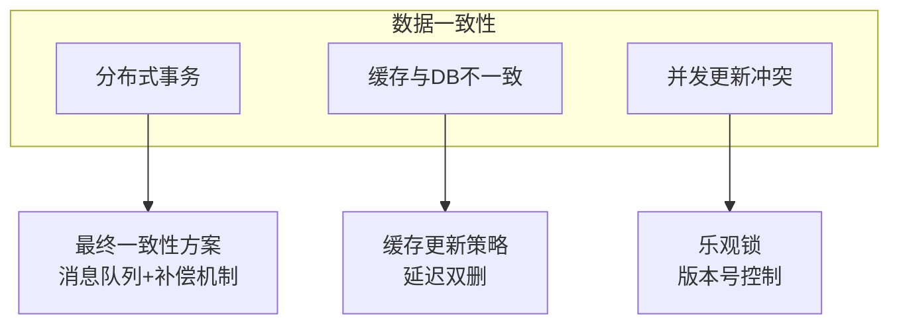
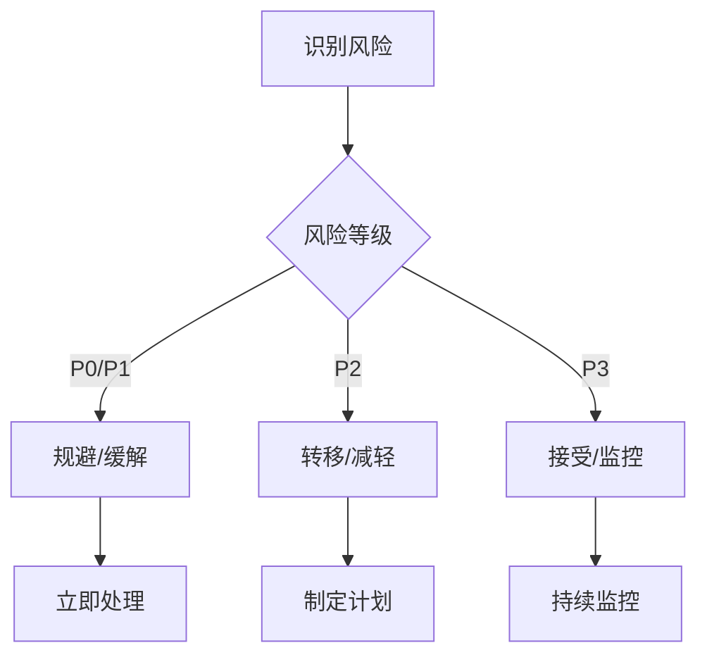

# 技术风险评估模板

## 1. 风险识别方法

### 1.1 风险分类



### 1.2 风险识别清单

| 风险类别 | 识别问题 | 关注点 |
|----------|----------|--------|
| **性能风险** | 是否有高并发场景？数据量多大？ | 并发数、数据量、响应时间要求 |
| **安全风险** | 是否涉及敏感数据？权限如何控制？ | 数据加密、权限校验、审计日志 |
| **集成风险** | 是否依赖外部系统？接口是否稳定？ | 第三方服务、超时处理、降级方案 |
| **数据风险** | 数据如何保证一致性？如何备份？ | 事务管理、数据备份、恢复方案 |

---

## 2. 风险评估矩阵

### 2.1 风险等级定义

| 等级 | 影响程度 | 发生概率 | 处理优先级 |
|------|----------|----------|------------|
| **P0-严重** | 系统崩溃/数据丢失 | 高概率(>50%) | 立即处理 |
| **P1-高** | 核心功能不可用 | 中高概率(30-50%) | 优先处理 |
| **P2-中** | 部分功能受影响 | 中等概率(10-30%) | 计划处理 |
| **P3-低** | 影响较小 | 低概率(<10%) | 监控观察 |

### 2.2 风险评估表模板

| 风险项 | 风险描述 | 影响程度 | 发生概率 | 风险等级 | 缓解措施 | 责任人 |
|--------|----------|----------|----------|----------|----------|--------|
| ... | ... | 高/中/低 | 高/中/低 | P0/P1/P2/P3 | ... | ... |

---

## 3. 常见风险场景

### 3.1 性能风险场景



| 场景 | 风险点 | 缓解措施 |
|------|--------|----------|
| 高并发请求 | 数据库连接耗尽 | 连接池优化、限流、异步处理 |
| 大数据量查询 | 查询超时 | 分页、索引优化、缓存 |
| 复杂计算 | CPU占用过高 | 异步处理、队列削峰 |

### 3.2 数据风险场景



| 场景 | 风险点 | 缓解措施 |
|------|--------|----------|
| 分布式事务 | 数据不一致 | 最终一致性、补偿机制 |
| 缓存更新 | 数据不一致 | 延迟双删、消息通知 |
| 并发更新 | 数据覆盖 | 乐观锁、分布式锁 |

### 3.3 集成风险场景

| 场景 | 风险点 | 缓解措施 |
|------|--------|----------|
| 第三方服务不可用 | 业务中断 | 降级方案、熔断机制 |
| 接口超时 | 用户等待 | 超时设置、异步处理 |
| 数据格式变更 | 解析失败 | 版本控制、兼容性处理 |

---

## 4. 风险应对策略

### 4.1 风险处理方式



### 4.2 缓解措施模板

| 措施类型 | 适用场景 | 实施方式 |
|----------|----------|----------|
| **技术方案** | 性能/安全风险 | 优化代码、引入中间件 |
| **流程机制** | 操作风险 | 制定规范、加强Review |
| **监控预警** | 所有风险 | 设置监控指标、告警规则 |
| **应急预案** | 严重风险 | 制定回滚方案、降级方案 |

---

## 5. 风险报告模板

```markdown
# 技术风险评估报告

## 1. 风险概述
[简述本次评估的范围和目标]

## 2. 风险清单
| 风险项 | 风险描述 | 影响程度 | 发生概率 | 风险等级 | 缓解措施 |
|--------|----------|----------|----------|----------|----------|
| ... | ... | ... | ... | ... | ... |

## 3. 高优先级风险详述
### 风险1: xxx
- 风险描述：
- 影响范围：
- 缓解措施：
- 应急预案：

## 4. 风险监控计划
| 监控项 | 监控指标 | 告警阈值 | 响应措施 |
|--------|----------|----------|----------|
| ... | ... | ... | ... |

## 5. 结论
[风险整体评估结论和建议]
```
