# AI协作工作流编排

> 本文档作为**动态编排层**，定义多 Skill 协作的执行顺序和条件分支。
> 单 Skill 场景无需加载本文档。

---

## 1. 工作流概览

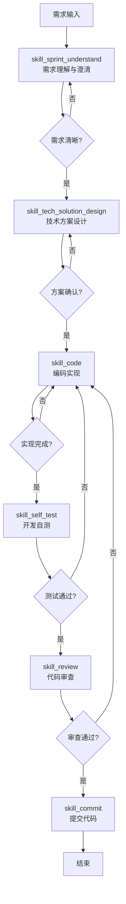

---

## 2. 标准工作流定义

### WF-1: 新功能开发（完整流程）

**适用场景**：从零开发新模块/功能

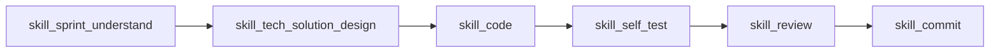

**执行顺序**：
1. `skill_sprint_understand` → 需求理解与澄清
2. `skill_tech_solution_design` → 生成设计方案
3. `skill_code` → 任务拆解 + 编码实现
4. `skill_self_test` → 开发自测
5. `skill_review` → 代码审查
6. `skill_commit` → 提交代码

**工件流转**：

```mermaid
flowchart LR
    A[需求文档] -->|skill_sprint_understand| B[需求分析文档 + 问题清单]
    B -->|skill_tech_solution_design| C[docs/detail_solutions/module.md]
    C -->|skill_code| D[tasks/task.md + 代码实现]
    D -->|skill_self_test| E[测试代码]
    E -->|skill_review| F[审查报告]
    F -->|skill_commit| G[Git提交记录]
```

---

### WF-2: 小范围改动（简化流程）

**适用场景**：Bug修复、小优化、配置调整

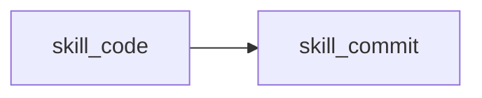

**执行顺序**：
```
1. skill_code    → 直接编码（跳过设计和测试阶段）
2. skill_commit  → 提交代码
```

**前置条件**：
- 用户已提供明确的修改说明
- 改动范围可控（单文件或少量文件）
- 不涉及架构变更

---

### WF-3: 方案评审（仅设计）

**适用场景**：只需要设计方案，不涉及编码

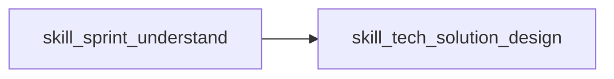

**执行顺序**：
```
1. skill_sprint_understand  → 需求理解
2. skill_tech_solution_design → 生成设计方案
```

**输出**：设计方案文档，供团队评审

---

### WF-4: 自测补充（仅测试）

**适用场景**：已有代码，需要补充测试用例

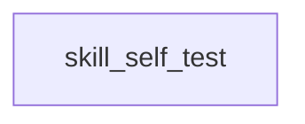

**前置条件**：功能代码已完成

---

### WF-5: 代码审查（仅审查）

**适用场景**：检查已有代码质量

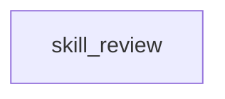

**输出**：审查报告，包含问题清单和改进建议

---

## 3. 条件分支规则

### 3.1 是否需要设计阶段？

| 场景 | 需要 design | 说明 |
|------|------------|------|
| 新模块开发 | ✅ 必需 | 涉及架构决策 |
| 大型功能迭代 | ✅ 必需 | 影响范围大 |
| 新增API接口 | ✅ 建议 | 需要接口契约 |
| Bug修复 | ❌ 可跳过 | 改动范围明确 |
| 配置调整 | ❌ 可跳过 | 无架构影响 |
| 样式修改 | ❌ 可跳过 | 仅前端表现层 |

### 3.2 是否需要自测阶段？

| 场景 | 需要 self_test | 说明 |
|------|----------------|------|
| 核心业务逻辑 | ✅ 必需 | 关键路径必须测试 |
| 工具类/通用组件 | ✅ 建议 | 提高复用可靠性 |
| 数据转换逻辑 | ✅ 建议 | 边界情况多 |
| 配置修改 | ❌ 可跳过 | 风险低 |
| 文档更新 | ❌ 可跳过 | 无代码变更 |
| UI样式调整 | ❌ 可跳过 | 视觉验证即可 |

### 3.3 是否需要审查阶段？

| 场景 | 需要 review | 说明 |
|------|-------------|------|
| 合并到主分支 | ✅ 必需 | 质量门槛 |
| 生产环境部署前 | ✅ 必需 | 安全检查 |
| 个人开发分支 | ❌ 可选 | 自主决定 |
| 紧急修复 | ⚠️ 简化 | 快速通道 |

---

## 4. 回退与迭代机制

### 4.1 设计阶段回退

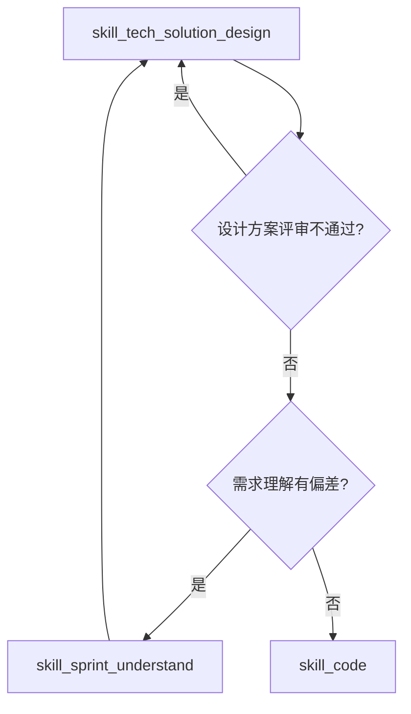

### 4.2 编码阶段回退

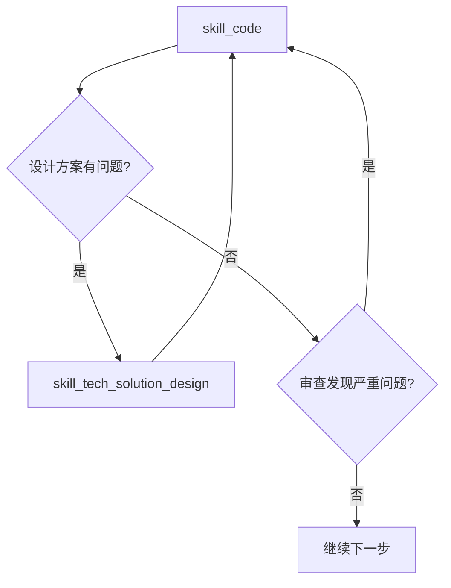

### 4.3 提交阶段回退

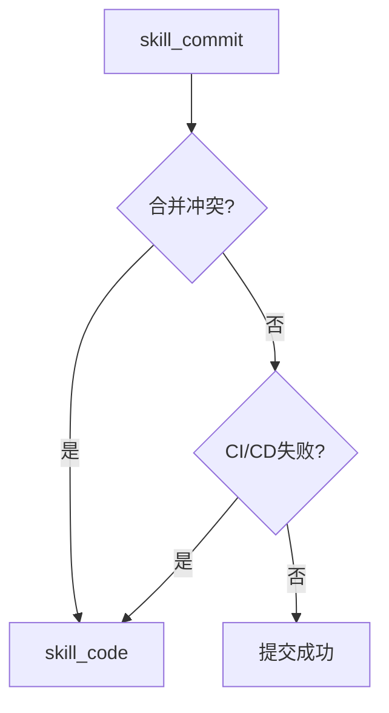

---

## 5. 并行执行支持

以下操作可并行执行（不同端侧）：

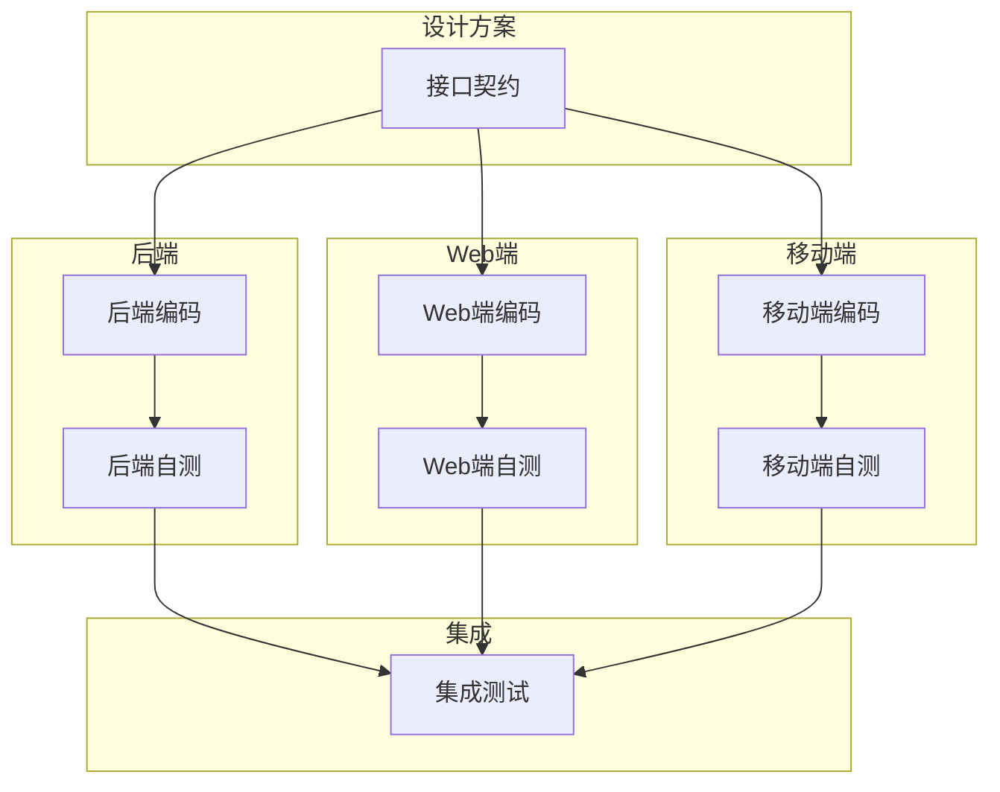

**并行前提条件**：
1. 接口契约已确定且稳定
2. 各端侧独立开发，无相互依赖
3. 有明确的接口Mock数据

---

## 6. 工作流状态跟踪

每个工作流实例应记录状态：

```yaml
workflow_instance:
  id: WF-2026-0304-001
  type: new_feature
  status: in_progress
  current_step: skill_code
  completed_steps:
    - skill_sprint_understand
    - skill_tech_solution_design
  artifacts:
    - ai_collaboration/docs/detail_solutions/collector_management.md
    - ai_collaboration/tasks/collector_task.md
  next_step: skill_self_test
```

---

## 7. 最佳实践

1. **严格遵循顺序**：设计 → 编码 → 自测 → 审查 → 提交
2. **每步确认**：关键节点输出供用户确认后再继续
3. **工件归档**：所有输出工件统一管理，便于追溯
4. **持续优化**：根据实际执行效果调整工作流
5. **记录状态**：跟踪工作流进度，支持断点续传
